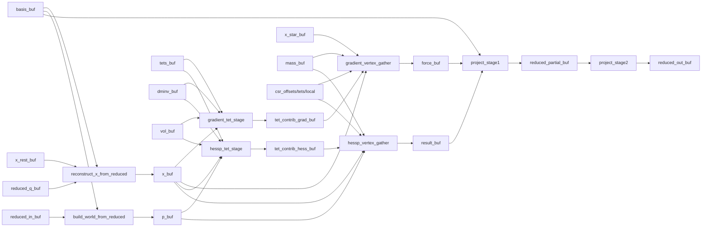

# Vulkan + Compute Shader 协同流程图（中文注释版）

本文档给出当前项目的完整协同流程图，重点强调：

1. CPU 与 GPU 的职责边界  
2. Shader 调度顺序  
3. 资源读写依赖与同步点（barrier）  

---

## 1. 主流程图（初始化 + 每个 substep）

```mermaid
flowchart TD
    %% =========================
    %% 初始化阶段（CPU 主导）
    %% =========================
    A[CPU: 加载 mesh / basis / 参数] --> B[CPU: 预处理<br/>统一 tet 朝向、构建 DmInv/体积/质量/CSR]
    B --> C[CPU: VulkanContext 初始化<br/>实例/物理设备/逻辑设备/Compute 队列]
    C --> D[CPU: 创建并上传静态缓冲<br/>basis/x_rest/mass/tets/dminv/vol/csr]
    D --> E[CPU: 创建动态缓冲<br/>x/x_star/x_n/v_n/p/force/result/reduced*]
    E --> F[CPU: 创建 Compute Pipelines + Descriptor 绑定]
    F --> G[CPU: UploadState 初始状态]

    %% =========================
    %% 每帧循环
    %% =========================
    G --> H{Frame 循环}
    H --> I{Substep 循环}

    %% 预测步
    I --> J[GPU: predict_state.comp<br/>注: 从 x_n,v_n 预测 x_star 与 x]

    %% Newton 外循环
    J --> K{Newton 迭代循环}
    K --> L[CPU->GPU: 写 reduced_q]
    L --> M[GPU: reconstruct_x_from_reduced.comp<br/>注: x = x_rest + Uq]
    M --> M1[[Barrier<br/>中文注释: x 写完后才可用于梯度计算]]
    M1 --> N[GPU: gradient_tet_stage.comp<br/>注: 每个 tet 写 4 个局部贡献]
    N --> N1[[Barrier<br/>中文注释: tetContrib 写完后再做顶点聚合]]
    N1 --> O[GPU: gradient_vertex_gather.comp<br/>注: 按 CSR 对顶点聚合贡献]
    O --> O1[[Barrier<br/>中文注释: force 写完后才能做投影]]
    O1 --> P[GPU: project_stage1(force).comp<br/>注: 分块并行部分和]
    P --> P1[[Barrier<br/>中文注释: partial 写完再做 stage2]]
    P1 --> Q[GPU: project_stage2.comp<br/>注: 得到 reduced 梯度 g_r]
    Q --> R[GPU->CPU: 读 g_r]
    R --> S{CPU: 收敛判定?}

    %% 收敛分支
    S -- 否 --> T[CPU: 构造 rhs = -g_r]
    T --> U{线性求解路径}

    %% Direct 路径
    U -- Direct 可选 --> U1[CPU+GPU: 多次调用 H_r * e_j<br/>组装 H_r 后 CPU Cholesky]
    U1 --> V[CPU: q += Δq]

    %% GPU-CG 路径
    U -- GPU-CG 默认 --> U2[CPU->GPU: 写 rhs 到 reduced_out]
    U2 --> U3[GPU: reduced_cg_init.comp<br/>注: 初始化 x/r/p 与控制块]
    U3 --> U4[[Barrier Compute->Indirect<br/>中文注释: 确保间接调度参数可见]]
    U4 --> U5[GPU: 间接调度循环<br/>build_world -> hess_tet -> hess_vertex -> project1 -> project2 -> cg_update]
    U5 --> U6[GPU->CPU: 读 reduced_cg_x 与 ctrl]
    U6 --> V

    %% 回到 Newton
    V --> K

    %% 收敛后更新速度与历史
    S -- 是 --> W[CPU->GPU: 写 q]
    W --> X[GPU: reconstruct_x_from_reduced.comp]
    X --> X1[[Barrier<br/>中文注释: x 重建完成后再更新速度]]
    X1 --> Y[GPU: update_velocity_state.comp<br/>注: 更新 v_n 与 x_n]
    Y --> I

    %% 帧末输出
    I --> Z{是否需要回读/输出/渲染}
    Z -- 是 --> AA[GPU->CPU: DownloadX]
    AA --> AB[CPU: 写 OBJ / SDL 渲染]
    AB --> H
    Z -- 否 --> H
```

---

## 2. GPU-CG 子流程图（中文注释）

```mermaid
flowchart TD
    A0[CPU 写入 rhs] --> A1[reduced_cg_init.comp]
    A1 --> A2[[Barrier Compute->Indirect<br/>注: 让 dispatch 参数对间接调度可见]]

    A2 --> B0{固定轮数循环}
    B0 --> B1[DispatchIndirect: build_world_from_reduced<br/>注: p_r -> p_w]
    B1 --> B2[[Barrier]]
    B2 --> B3[DispatchIndirect: hessp_tet_stage]
    B3 --> B4[[Barrier]]
    B4 --> B5[DispatchIndirect: hessp_vertex_gather<br/>注: 得到 world Ap 中间结果]
    B5 --> B6[[Barrier]]
    B6 --> B7[DispatchIndirect: project_stage1(result)]
    B7 --> B8[[Barrier]]
    B8 --> B9[DispatchIndirect: project_stage2<br/>注: 得到 reduced Ap]
    B9 --> B10[[Barrier]]
    B10 --> B11[reduced_cg_update.comp<br/>注: 更新 x/r/p 与收敛标志]
    B11 --> B12[[Barrier Compute->Indirect<br/>注: 下一轮读取新 dispatch 参数]]
    B12 --> B0

    B0 --> C0[CPU 读回 reduced_cg_x 与迭代计数]
```

---

## 3. 资源依赖图（谁读谁写）



---

## 4. 同步点中文说明（面试可直接背）

1. `tet_stage -> vertex_gather` 之间必须 barrier  
注释：保证 `tetContrib` 写后可见。  

2. `vertex_gather -> project_stage1` 之间必须 barrier  
注释：保证 `force/result` 写后可见。  

3. `project_stage1 -> project_stage2` 之间必须 barrier  
注释：保证 `partial` 写后可见。  

4. `reconstruct_x -> 后续读取 x` 之间必须 barrier  
注释：避免读取到旧位置。  

5. `reduced_cg_update -> DispatchIndirect` 之间必须 compute-to-indirect barrier  
注释：确保 GPU 刚写的调度参数被下一轮间接调度读取。  
