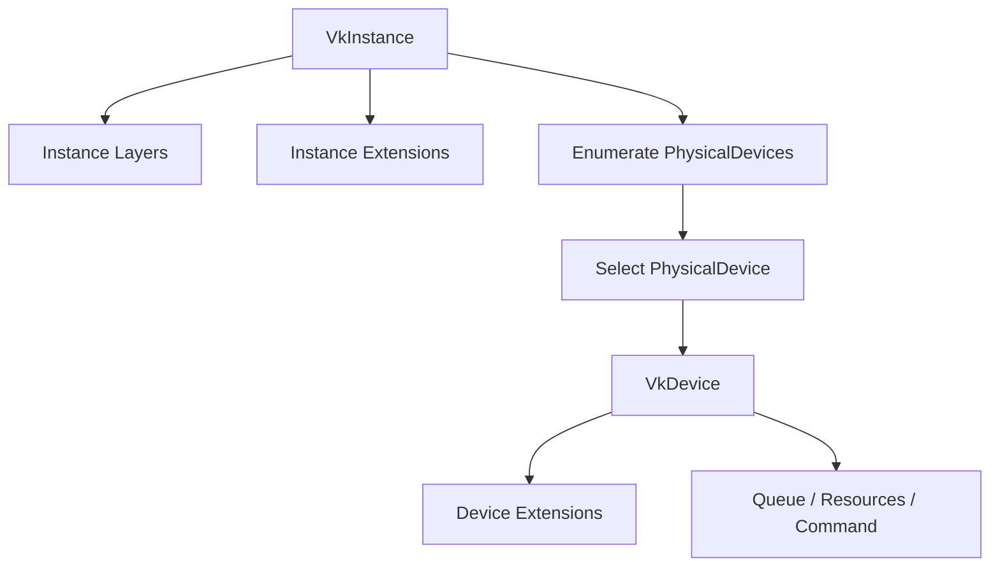

# Vulkan 3.1：Instance / Layer / Extension 面试详解

适用目标：
1. 彻底理解 Vulkan 初始化最前面的三件套：`Instance`、`Layer`、`Extension`。
2. 能回答“是什么、为什么、怎么用、常见坑、平台差异、面试追问”。
3. 能写出最小可用初始化代码框架并解释每一步。

---

## 0. 一句话总览（先背）

- `Instance`：Vulkan 世界入口，负责“全局能力声明与对象创建起点”。
- `Layer`：调用拦截与增强机制，最常见是 Validation Layer。
- `Extension`：核心规范外的可选能力包（平台、调试、功能增强）。

面试一句话：
`Instance决定你能进入哪个Vulkan运行环境，Layer决定你怎么检查和增强调用，Extension决定你额外能用哪些能力。`

---

## 1. Instance（实例）

## 1.1 通俗解释

把 `VkInstance` 理解成“Vulkan 程序的总入口上下文”。
你必须先有它，后续才能枚举 GPU、创建 Surface、建立设备和资源。

它有点像：
1. 程序向 Vulkan 运行时“报备身份”（应用信息）。
2. 声明“我要启用哪些全局扩展和层”。
3. 拿到后续所有 Vulkan 全局操作的句柄。

## 1.2 标准解释

`VkInstance` 是 Vulkan 的顶层对象，生命周期通常覆盖整个应用运行期。
它承载：
1. 实例级扩展启用（instance extensions）。
2. 实例级 Layer 启用（instance layers）。
3. 调试回调入口（常借助 `VK_EXT_debug_utils`）。

注意：
- `VkInstance` 不是 `VkDevice`。
- 设备相关对象（Queue、Buffer、Image）都在 Device 层创建。

## 1.3 创建 Instance 的关键结构

1. `VkApplicationInfo`
- 应用名称、引擎名称、版本号。
- `apiVersion`（如 `VK_API_VERSION_1_3`）。

2. `VkInstanceCreateInfo`
- 指向 `VkApplicationInfo`。
- 启用的 layer 名称数组。
- 启用的 extension 名称数组。

3. 可选 `pNext` 链
- 比如在创建实例时就挂调试 messenger create info，便于最早捕获报错。

## 1.4 最小创建流程（标准步骤）

1. 查询可用 layer 列表与 extension 列表。
2. 计算“我需要的”和“平台必须的”扩展。
3. Debug 模式启用 validation layer。
4. 组装 `VkApplicationInfo` + `VkInstanceCreateInfo`。
5. 调用 `vkCreateInstance`。
6. 失败时按错误码排查（扩展缺失、层缺失、版本不兼容）。

## 1.5 常见面试追问

### Q1：为什么 `apiVersion` 重要？
A：它声明你期望使用的 Vulkan 版本语义。驱动实际支持不足时，功能与行为可能受限。

### Q2：`Instance` 和 `Device` 的边界？
A：Instance 负责全局初始化和硬件发现；Device 负责具体 GPU 资源和命令执行。

### Q3：能创建多个 Instance 吗？
A：可以，但通常不建议。一个进程大多只用一个 Instance，简化生命周期和调试。

---

## 2. Layer（层）

## 2.1 通俗解释

Layer 就像 Vulkan API 调用链上的“插件拦截器”。
当你的代码调用 Vulkan API 时，Layer 可以：
1. 检查参数是否合法。
2. 检查对象生命周期是否正确。
3. 检查同步和资源状态是否违反规范。
4. 输出高质量诊断信息。

最常见就是 `VK_LAYER_KHRONOS_validation`。

## 2.2 标准解释

Layer 是规范定义的可插拔中间层机制。
历史上有 instance layer / device layer 概念，现代实践中以统一 validation layer 为主。
Validation Layer 能检测：
1. API misuse（错误调用方式）。
2. Vulkan Spec 违规。
3. 常见性能警告。
4. 同步 hazard（配合同步验证选项）。

## 2.3 为什么必须开 Validation Layer

1. Vulkan 显式 API 容易写出“看似可跑但逻辑违规”的代码。
2. 不开层时，问题经常表现为：黑屏、随机闪烁、跨平台不一致、偶发崩溃。
3. 开层后能在错误发生点给你具体对象和调用栈信息，定位效率大幅提升。

## 2.4 生产环境要不要开

1. 开发 / 测试：必须开。
2. 发布版本：通常关闭，避免性能开销和日志噪音。
3. 线上疑难问题：可做“诊断版”按需开启。

## 2.5 常见面试追问

### Q1：Validation Layer 能保证程序没 bug 吗？
A：不能。它能抓大量 API 级问题，但抓不到所有逻辑 bug 和美术逻辑错误。

### Q2：为什么开了 layer 还是黑屏？
A：可能是合法但错误的业务逻辑，比如相机矩阵错、剔除全丢、shader计算结果错误。

### Q3：Layer 和 RenderDoc 冲突吗？
A：通常不冲突，反而互补。Layer 负责规范检查，RenderDoc 负责帧级可视化验证。

---

## 3. Extension（扩展）

## 3.1 通俗解释

Extension 是“能力补丁包”。
Vulkan 核心规范只定义基础能力，很多能力通过扩展提供：
1. 窗口系统相关（surface）。
2. 调试工具相关。
3. 性能/功能增强（如 descriptor indexing、ray tracing）。

## 3.2 标准解释

扩展分：
1. 实例扩展（instance extension）
- 与 Instance 相关，比如 `VK_KHR_surface`、`VK_EXT_debug_utils`。

2. 设备扩展（device extension）
- 与 Device 相关，比如 `VK_KHR_swapchain`。

启用规则：
- 必须先枚举支持列表，再启用。
- 启用不存在扩展会导致创建失败。

## 3.3 你最常见会启用的扩展

## A. 实例扩展（高频）
1. `VK_KHR_surface`
- 所有显示呈现路径都离不开它。

2. 平台 surface 扩展（按系统）
- Windows: `VK_KHR_win32_surface`
- Linux/X11: `VK_KHR_xlib_surface` / `VK_KHR_xcb_surface`
- Linux/Wayland: `VK_KHR_wayland_surface`
- Android: `VK_KHR_android_surface`
- macOS 常通过 MoltenVK 路径（`VK_EXT_metal_surface`）

3. `VK_EXT_debug_utils`
- 提供 debug messenger、对象命名、标记区间等调试能力。

## B. 设备扩展（高频）
1. `VK_KHR_swapchain`
- 屏幕呈现必备，几乎桌面实时渲染必开。

## 3.4 面试高频点：核心版本 vs 扩展

1. 有些功能在新核心版本被“吸收”（promotion）。
2. 但为了兼容老驱动/多平台，工程上仍会做扩展路径判断。
3. 面试要体现“能力探测 + 条件启用”的工程思维。

## 3.5 常见面试追问

### Q1：为什么不能直接硬编码扩展名然后创建？
A：不同驱动/平台支持差异大，必须先枚举再启用，否则创建失败。

### Q2：扩展启用时机？
A：实例扩展在 `vkCreateInstance` 时启用；设备扩展在 `vkCreateDevice` 时启用。

### Q3：如何保证跨平台？
A：按平台收集所需扩展 + 运行时探测可用性 + fallback/禁用策略。

---

## 4. 三者关系图（面试时非常好用）



关键关系：
1. Layer/Extension 不是“平级替代”，而是附着在 Instance 或 Device 生命周期上的能力声明。
2. 先有 Instance，才能谈后续设备和资源。

---

## 5. 最小可用代码骨架（可直接讲）

```cpp
// 1) 查询可用 layer / extension（略）

VkApplicationInfo appInfo{};
appInfo.sType = VK_STRUCTURE_TYPE_APPLICATION_INFO;
appInfo.pApplicationName = "MyApp";
appInfo.applicationVersion = VK_MAKE_VERSION(1, 0, 0);
appInfo.pEngineName = "MyEngine";
appInfo.engineVersion = VK_MAKE_VERSION(1, 0, 0);
appInfo.apiVersion = VK_API_VERSION_1_3;

std::vector<const char*> layers;
#ifdef _DEBUG
layers.push_back("VK_LAYER_KHRONOS_validation");
#endif

std::vector<const char*> exts;
exts.push_back("VK_KHR_surface");
// + 平台surface扩展
// + VK_EXT_debug_utils(调试模式)

VkInstanceCreateInfo ci{};
ci.sType = VK_STRUCTURE_TYPE_INSTANCE_CREATE_INFO;
ci.pApplicationInfo = &appInfo;
ci.enabledLayerCount = static_cast<uint32_t>(layers.size());
ci.ppEnabledLayerNames = layers.data();
ci.enabledExtensionCount = static_cast<uint32_t>(exts.size());
ci.ppEnabledExtensionNames = exts.data();

VkInstance instance = VK_NULL_HANDLE;
VkResult r = vkCreateInstance(&ci, nullptr, &instance);
if (r != VK_SUCCESS) {
    // 打印错误并退出
}
```

面试表达重点：
1. “先枚举再启用”，而不是盲开。
2. Debug 和 Release 的 layer/extension 配置不同。
3. 版本、平台扩展、调试扩展要分层管理。

---

## 6. 典型踩坑与排错清单

## 6.1 Instance 创建失败

常见原因：
1. 启用了系统不存在的 layer 名。
2. 漏了平台必需 surface 扩展。
3. API 版本声明与 SDK/驱动能力不匹配。

排查顺序：
1. 打印枚举到的 layers/extensions。
2. 对比你要启用的名单。
3. 最小化启用项逐个加回。

## 6.2 Validation 没输出

常见原因：
1. 没启用 `VK_EXT_debug_utils`。
2. 没创建 debug messenger。
3. 过滤等级设置过高（只收 fatal）。

## 6.3 平台切换后不能跑

常见原因：
1. 仍在启用旧平台 surface 扩展。
2. 构建系统没区分平台宏。
3. 没做扩展探测 fallback。

---

## 7. 面试高频问答（可直接背）

### Q1：Instance、Layer、Extension 的关系？
A：Instance 是顶层上下文；Layer 是调用检查和增强机制；Extension 是可选能力集。实例创建时声明实例层/扩展，设备创建时再声明设备扩展。

### Q2：Validation Layer 放在生产环境吗？
A：通常开发开、发布关。发布版可能保留可切换诊断模式。

### Q3：为什么 Vulkan 要扩展机制？
A：为了核心规范稳定和向前兼容，把平台/厂商/新特性以可选能力方式提供。

### Q4：如果扩展不支持怎么办？
A：能力探测后做降级路径（功能关闭、替代实现或直接不支持提示）。

### Q5：VK_KHR_surface 与 VK_KHR_swapchain 区别？
A：`surface` 是实例级“呈现目标抽象”，`swapchain` 是设备级“可呈现图像队列”。

---

## 8. 一套“高分回答模板”

`Vulkan 初始化里 Instance/Layer/Extension 是第一层能力建模。Instance 是全局入口，负责承载实例级扩展和层；Layer（尤其 Validation）用于规范检查和调试增强；Extension 提供核心规范外能力，分实例扩展和设备扩展。工程上我会先枚举可用项，再按平台和构建模式决定启用列表，Debug 开验证层和 debug utils，Release 保持最小启用集，并为不支持扩展准备降级路径。`

---

## 9. 学习检查点（你是否真的掌握）

如果你能做到下面 8 条，就说明这部分已经“面试可用”：
1. 能解释 Instance 和 Device 的边界。
2. 能说出为什么要先枚举 Layer/Extension。
3. 能说出实例扩展和设备扩展的启用时机区别。
4. 能写出最小 `vkCreateInstance` 代码框架。
5. 能说出调试模式至少需要哪些配置。
6. 能解释 surface 和 swapchain 的关系。
7. 能描述一个跨平台扩展管理策略。
8. 能列出 2-3 个常见创建失败原因及排查顺序。

---

## 10. 一页速记（考前 1 分钟）

1. Instance：入口与全局能力声明。
2. Layer：调用拦截，Validation 是必备调试工具。
3. Extension：功能包，分实例扩展和设备扩展。
4. 先枚举再启用，别盲开。
5. `VK_KHR_surface`（实例）+ `VK_KHR_swapchain`（设备）是呈现核心组合。
6. Debug：`VK_LAYER_KHRONOS_validation` + `VK_EXT_debug_utils`。
7. Release：最小启用集 + 保留能力探测与降级策略。
