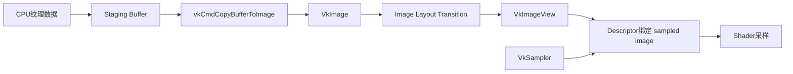

# Vulkan 3.4：Buffer / Image / ImageView / Sampler 面试详解

适用目标：
1. 彻底搞懂 Vulkan 里最核心的资源对象区别与联系。
2. 能解释“为什么同样是数据，Buffer 和 Image 要分开设计”。
3. 面试时能从概念讲到流程、从流程讲到排错。

---

## 0. 一句话总览（先背）

- `Buffer`：线性数据容器，偏“按字节地址访问”。
- `Image`：带像素语义的纹理/附件资源，偏“采样与格式语义访问”。
- `ImageView`：Image 的“解释视图”，告诉 GPU 读哪一层、哪几级 mip、按什么格式看。
- `Sampler`：采样规则集合（过滤、寻址、LOD、各向异性）。

面试一句话：
`Buffer用于结构化线性数据，Image用于像素语义资源，ImageView负责可访问子资源和格式解释，Sampler定义采样行为。四者共同构成纹理与渲染资源访问链路。`

---

## 1. Buffer（线性资源）

## 1.1 通俗解释

Buffer 就像一段线性内存条，适合放：
1. 顶点数据
2. 索引数据
3. Uniform 常量
4. SSBO 结构化数据
5. 间接绘制参数

它强调“地址和字节布局”，不强调像素含义。

## 1.2 标准解释

`VkBuffer` 是线性地址空间对象，创建时需声明：
1. 大小（size）
2. 使用位（usage flags）
3. sharing mode

高频 usage：
1. `VK_BUFFER_USAGE_VERTEX_BUFFER_BIT`
2. `VK_BUFFER_USAGE_INDEX_BUFFER_BIT`
3. `VK_BUFFER_USAGE_UNIFORM_BUFFER_BIT`
4. `VK_BUFFER_USAGE_STORAGE_BUFFER_BIT`
5. `VK_BUFFER_USAGE_TRANSFER_SRC_BIT / DST_BIT`
6. `VK_BUFFER_USAGE_INDIRECT_BUFFER_BIT`

## 1.3 常见面试追问

### Q1：UBO 和 SSBO 怎么选？
A：UBO 适合小而频繁读的常量数据；SSBO 适合更大、可随机访问甚至可写的数据。

### Q2：为什么上传纹理常先走 Buffer？
A：CPU 往线性 staging buffer 写最方便，再用 copy 命令搬到 image。

---

## 2. Image（像素语义资源）

## 2.1 通俗解释

Image 是“有像素规则的资源”。
它不仅是数据，还带：
1. 维度（1D/2D/3D）
2. 格式（如 RGBA8、R16G16B16A16）
3. mip 级别
4. array 层
5. sample count（MSAA）
6. layout（当前使用状态）

## 2.2 标准解释

`VkImage` 创建时重点参数：
1. `imageType` / `extent`
2. `format`
3. `mipLevels`
4. `arrayLayers`
5. `samples`
6. `tiling`（OPTIMAL/LINEAR）
7. `usage`
8. `initialLayout`

高频 usage：
1. `VK_IMAGE_USAGE_SAMPLED_BIT`
2. `VK_IMAGE_USAGE_COLOR_ATTACHMENT_BIT`
3. `VK_IMAGE_USAGE_DEPTH_STENCIL_ATTACHMENT_BIT`
4. `VK_IMAGE_USAGE_TRANSFER_SRC_BIT / DST_BIT`
5. `VK_IMAGE_USAGE_STORAGE_BIT`

## 2.3 为什么 Image 需要 layout

因为同一张图在不同阶段的访问方式不同：
1. 传输写入
2. 颜色附件写入
3. shader 采样读取

layout 是驱动和硬件优化/一致性的重要约束，不是可有可无。

---

## 3. ImageView（图像视图）

## 3.1 通俗解释

ImageView 就像“从整张图里切出一个可访问窗口”。
它定义：
1. 看哪几层 array
2. 看哪几级 mip
3. 以什么 view type（2D/2DArray/Cube）
4. 组件重映射（可选）

没有 ImageView，shader 或 framebuffer 通常无法直接使用 image。

## 3.2 标准解释

`VkImageViewCreateInfo` 核心字段：
1. `image`
2. `viewType`
3. `format`
4. `subresourceRange`（aspect、baseMip、levelCount、baseArray、layerCount）

常见 aspect：
1. `VK_IMAGE_ASPECT_COLOR_BIT`
2. `VK_IMAGE_ASPECT_DEPTH_BIT`
3. `VK_IMAGE_ASPECT_STENCIL_BIT`

---

## 4. Sampler（采样器）

## 4.1 通俗解释

Sampler 是“怎么取样”的规则，不是图像本身。
它定义：
1. 放大/缩小过滤（nearest/linear）
2. 地址越界策略（repeat/clamp）
3. mip 选择规则
4. 各向异性

## 4.2 标准解释

`VkSamplerCreateInfo` 核心字段：
1. `magFilter` / `minFilter`
2. `addressModeU/V/W`
3. `mipmapMode`
4. `anisotropyEnable` + `maxAnisotropy`
5. `minLod / maxLod / mipLodBias`
6. compare sampling（阴影贴图）

## 4.3 面试追问

### Q1：为什么 Sampler 可以复用？
A：它只描述采样行为，不绑定具体 image，多个纹理可共享同一 sampler。

### Q2：各向异性什么时候有收益？
A：斜视角纹理（地面、道路）能显著改善远处清晰度，但有一定采样成本。

---

## 5. 四者如何协作（完整链路）



关键理解：
1. 数据通常先到 Buffer（staging）。
2. 再拷贝到 Image。
3. 再通过 ImageView + Sampler 供 shader 使用。

---

## 6. 最常见流程：上传一张纹理

1. 创建 staging buffer（HOST_VISIBLE，TRANSFER_SRC）。
2. 把像素数据 memcpy 到 staging。
3. 创建 device-local image（TRANSFER_DST + SAMPLED）。
4. layout 转换：`UNDEFINED -> TRANSFER_DST_OPTIMAL`。
5. `vkCmdCopyBufferToImage`。
6. layout 转换：`TRANSFER_DST_OPTIMAL -> SHADER_READ_ONLY_OPTIMAL`。
7. 创建 image view。
8. 创建 sampler。
9. 更新 descriptor set，shader 开始采样。

---

## 7. 重点概念：Image Layout 转换

## 7.1 通俗解释

layout 不是“写给人看”的标签，而是告诉 GPU：
“这张图现在要按什么用途访问”。

## 7.2 标准解释

layout 转换由 barrier 完成，需声明：
1. 旧 layout 与新 layout
2. src/dst stage mask
3. src/dst access mask
4. subresource range

常见转换：
1. `UNDEFINED -> TRANSFER_DST_OPTIMAL`
2. `TRANSFER_DST_OPTIMAL -> SHADER_READ_ONLY_OPTIMAL`
3. `COLOR_ATTACHMENT_OPTIMAL -> SHADER_READ_ONLY_OPTIMAL`

---

## 8. 最小代码骨架（可直接讲）

```cpp
// 1) 创建Buffer（以vertex buffer为例）
CreateBuffer(size,
    VK_BUFFER_USAGE_VERTEX_BUFFER_BIT | VK_BUFFER_USAGE_TRANSFER_DST_BIT,
    DEVICE_LOCAL,
    vertexBuffer);

// 2) 创建Image（以纹理为例）
CreateImage(width, height, mipLevels, VK_FORMAT_R8G8B8A8_SRGB,
    VK_IMAGE_USAGE_TRANSFER_DST_BIT | VK_IMAGE_USAGE_SAMPLED_BIT,
    DEVICE_LOCAL,
    textureImage);

// 3) 创建ImageView
VkImageView textureView = CreateImageView(textureImage,
    VK_FORMAT_R8G8B8A8_SRGB,
    VK_IMAGE_ASPECT_COLOR_BIT,
    mipLevels);

// 4) 创建Sampler
VkSampler textureSampler = CreateSampler(/*filter/address/lod/aniso*/);
```

---

## 9. 高频踩坑与排错

## 9.1 纹理黑屏或纯白

常见原因：
1. 忘了 `TRANSFER_DST -> SHADER_READ_ONLY` 转换。
2. descriptor 没更新或绑定错 set/binding。
3. image view aspect/format 不匹配。

## 9.2 深度图采样异常

常见原因：
1. depth image 的 aspect 配置错误。
2. compare sampler 配置不对。
3. 深度格式和 pipeline 不匹配。

## 9.3 “看起来能跑但闪烁”

常见原因：
1. barrier 的 stage/access 写错，造成读写竞态。
2. 同一资源跨 pass 访问没有完整同步。

## 9.4 sRGB 颜色不对

常见原因：
1. image format 用了 UNORM 而不是 SRGB（或相反）。
2. Gamma 流程重复或遗漏。

---

## 10. 面试高频问答（可直接背）

### Q1：Buffer 和 Image 的本质区别？
A：Buffer 是线性地址资源，适合结构化数据；Image 是像素语义资源，带格式、维度、mip 和 layout，适合采样与附件读写。

### Q2：为什么不能直接用 Image 给 shader 采样，非要 ImageView？
A：ImageView 定义了具体可访问子资源与格式解释，是 shader/attachment 访问接口。

### Q3：Sampler 和 ImageView 为什么分开？
A：ImageView定义“看哪块图”，Sampler定义“怎么采样”，分离便于复用和灵活组合。

### Q4：什么时候 Buffer 更合适，什么时候 Image 更合适？
A：按线性地址读写和结构化数据选 Buffer；按纹理采样、像素格式和渲染附件语义选 Image。

### Q5：为什么 layout 转换是 Vulkan 常见 bug 源？
A：它涉及执行顺序、内存可见性和资源状态三者同时正确，任何一个不完整都会造成隐蔽错误。

---

## 11. 高分回答模板

`Vulkan把线性数据和像素语义数据分成Buffer与Image两类对象。Buffer用于顶点/索引/UBO等线性访问场景，Image用于纹理和附件场景并受layout约束。Image通常通过ImageView暴露可访问子资源，再结合Sampler定义采样行为，最后通过Descriptor绑定给shader。工程上常见纹理路径是staging buffer上传到device-local image，经过layout转换后供采样使用。`

---

## 12. 学习检查点

1. 能解释 Buffer/Image 的边界。
2. 能说清 ImageView 为什么必须存在。
3. 能说清 Sampler 与纹理对象解耦的价值。
4. 能完整讲出纹理上传 8 步流程。
5. 能解释常见 layout 转换及对应用途。
6. 能定位“纹理黑屏”三类高频原因。

---

## 13. 一页速记（考前 1 分钟）

1. Buffer：线性数据；Image：像素语义资源。
2. ImageView：访问子资源与格式解释；Sampler：采样规则。
3. 纹理典型链路：staging buffer -> copy to image -> layout transition -> view+sampler -> descriptor。
4. layout 转换是核心难点，必须写对 stage/access/old-new layout。
5. 纹理异常先查：layout、descriptor、view format/aspect、sRGB 配置。
