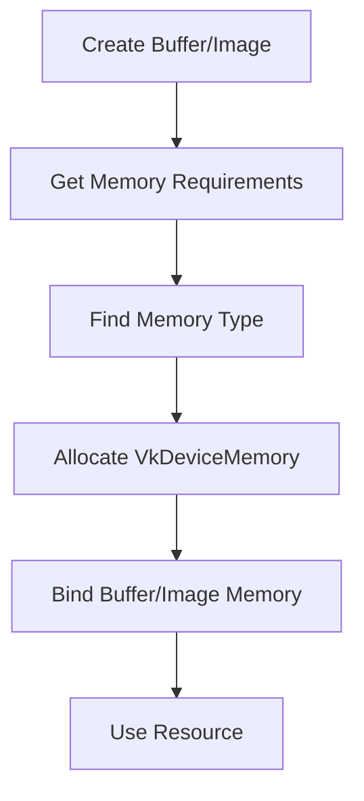

# Vulkan 3.5：Memory（Vulkan 显式内存）面试详解

适用目标：
1. 彻底理解 Vulkan 的“资源与内存分离”模型。
2. 能解释内存类型、分配策略、上传路径和碎片管理。
3. 面试时能从原理讲到工程实践与排错。

---

## 0. 一句话总览（先背）

- Vulkan 里 `Buffer/Image` 只是资源描述对象，真正内存是 `VkDeviceMemory`。
- 你必须自己做“选内存类型 -> 分配 -> 绑定 -> 生命周期管理”。

面试一句话：
`Vulkan内存管理是显式模型：资源与内存分离。工程上通常采用大块分配+子分配，并结合staging上传和按用途分池，平衡性能、碎片和可维护性。`

---

## 1. 为什么 Vulkan 要显式内存

## 1.1 通俗解释

OpenGL 像“司机帮你找车位”，Vulkan 像“你自己决定车停哪里”。
这样更复杂，但你能精确控制性能关键路径。

## 1.2 标准解释

资源对象与内存对象分离有三大收益：
1. 让应用按用途选择最优内存类型。
2. 允许自定义分配器降低碎片与分配开销。
3. 减少驱动隐式策略导致的不可预测性。

---

## 2. Vulkan 内存对象关系



关键点：
1. `vkCreateBuffer/vkCreateImage` 后还不能直接使用。
2. 必须查询需求并绑定内存后才完整可用。

---

## 3. 三步核心流程（必须会背）

## 3.1 查询需求

1. Buffer：`vkGetBufferMemoryRequirements`
2. Image：`vkGetImageMemoryRequirements`

返回核心信息：
1. `size`
2. `alignment`
3. `memoryTypeBits`

## 3.2 选择内存类型

从 `vkGetPhysicalDeviceMemoryProperties` 提供的 `memoryTypes` 中选择满足：
1. `memoryTypeBits` 兼容。
2. 属性位满足用途（如 DEVICE_LOCAL / HOST_VISIBLE）。

## 3.3 分配并绑定

1. `vkAllocateMemory`
2. `vkBindBufferMemory` 或 `vkBindImageMemory`

---

## 4. 常见内存属性怎么理解（详细版）

很多人卡在这里，是因为没分清两个层次：`Heap` 和 `Type`。

## 4.0 先搞懂：Heap 和 Type 的关系

### 通俗解释

可以把它理解成：
1. `Heap` 是“大仓库”（总容量、物理位置）。
2. `Type` 是“仓库里的货架规则”（支持哪些属性位）。

你真正分配内存时选的是 `memoryTypeIndex`（Type），但每个 Type 背后都指向某个 Heap。

### 标准解释

`vkGetPhysicalDeviceMemoryProperties` 返回：
1. `memoryHeaps[]`：容量与堆标志（如 DEVICE_LOCAL）。
2. `memoryTypes[]`：属性位集合（HOST_VISIBLE/COHERENT/CACHED...）+ 所属 heapIndex。

资源需求里的 `memoryTypeBits` 只是“这个资源允许用哪些 Type 的位图”。
最终必须在“允许集合”里再按属性目标筛选。

### 选型公式（最实用）

候选条件：
$
(memoryTypeBits \& (1 << i)) \ne 0
$
属性条件：
$
(memoryTypes[i].propertyFlags \& requiredFlags) = requiredFlags
$

## 4.1 `VK_MEMORY_PROPERTY_DEVICE_LOCAL_BIT`

### 通俗解释

这类内存通常离 GPU 核心更近，GPU 访问性能最好。
适合“GPU 高频读写、CPU 很少碰”的资源。

### 标准解释

`DEVICE_LOCAL` 表示该内存类型位于设备本地内存堆（或等价高性能区域）。
典型资源：
1. 纹理（sampled image）
2. 顶点/索引缓冲
3. 渲染目标、深度缓冲

### 工程重点

1. 常与 staging 上传组合使用。
2. 不代表一定不能 map，但多数离散显卡场景下 CPU 直写不友好。

## 4.2 `VK_MEMORY_PROPERTY_HOST_VISIBLE_BIT`

### 通俗解释

CPU 能 `map` 到这块内存，适合“CPU 要频繁写入”的数据路径。

### 标准解释

具备 `HOST_VISIBLE` 的内存可被主机地址空间映射访问（`vkMapMemory`）。
典型用途：
1. staging buffer
2. 每帧更新 UBO/SSBO
3. 读回缓冲（配合 CACHED）

### 工程重点

1. `HOST_VISIBLE` 不等于“GPU 访问也快”。
2. 高频采样资源仍建议落在 `DEVICE_LOCAL`。

## 4.3 `VK_MEMORY_PROPERTY_HOST_COHERENT_BIT`

### 通俗解释

有了它，CPU 写完内存后通常不用手动 `flush`，读之前通常不用手动 `invalidate`，代码更省事。

### 标准解释

`HOST_COHERENT` 表示主机缓存一致性由实现保证（在规范定义语义下）。
当内存非 coherent 时：
1. CPU 写后需要 `vkFlushMappedMemoryRanges`。
2. CPU 读前需要 `vkInvalidateMappedMemoryRanges`。

### 工程重点

1. coherent 更“易用”，不一定“最快”。
2. 大量更新时仍要关注写入模式和缓存行为。

## 4.4 `VK_MEMORY_PROPERTY_HOST_CACHED_BIT`

### 通俗解释

这类内存对 CPU 读更友好，适合回读数据，不一定适合大规模频繁写。

### 标准解释

`HOST_CACHED` 指主机侧缓存属性优化，常见于读回路径收益明显：
1. 截图回读
2. 统计结果回读
3. 调试抓取数据

### 工程重点

1. 读回优先考虑 `HOST_VISIBLE | HOST_CACHED`。
2. 若用于上传，写吞吐未必最佳，要实测。

## 4.5 常见属性组合怎么选（最实用）

1. `DEVICE_LOCAL`
- 典型：静态顶点/索引、纹理、RT。
- 路径：staging copy 过去。

2. `HOST_VISIBLE | HOST_COHERENT`
- 典型：每帧更新小常量、动态参数。
- 优点：代码简单，免 flush/invalidate（多数情况）。

3. `HOST_VISIBLE | HOST_CACHED`（有时还带 COHERENT）
- 典型：CPU 读回。

4. `HOST_VISIBLE` 但非 coherent
- 可用但要手动 flush/invalidate。
- 常见于一些平台实现，别假设一定 coherent。

## 4.6 桌面与移动差异（面试加分）

1. 离散显卡（dGPU）
- 常见“设备本地显存”和“主机可见内存”分离明显。
- staging 的收益通常更大。

2. 集显/统一内存架构（UMA）
- 可能出现同时 `DEVICE_LOCAL + HOST_VISIBLE` 的类型。
- 仍需按实际带宽与访问模式测试，不要想当然。

## 4.7 一个可落地的选型流程

1. 先确定资源用途（静态高频采样 / 动态更新 / 回读）。
2. 定 `requiredFlags` 和 `preferredFlags`。
3. 在 `memoryTypeBits` 允许集合中筛选。
4. 优先满足 required，再按 preferred 打分。
5. 建立资源类别到内存策略的固定映射，避免临时拍脑袋。

## 4.8 常见误区（你现在可以避免）

1. “HOST_VISIBLE 就一定慢”。
- 不绝对，取决于架构和用途。

2. “COHERENT 就一定性能最好”。
- 不绝对，它是易用性语义，不是性能承诺。

3. “只要能分配成功就行”。
- 分配成功不代表访问路径最优，性能可能差很多。

---

## 5. 典型资源放置策略（工程实战）

## 5.1 GPU 常驻资源（推荐）

对象：
1. 顶点缓冲
2. 索引缓冲
3. 纹理
4. 只读静态网格数据

策略：
- 放 `DEVICE_LOCAL`。
- 通过 staging 进行一次性或批量上传。

## 5.2 动态更新小数据

对象：
1. 每帧相机矩阵
2. 每对象变换参数

策略：
- host-visible ring buffer。
- 按帧切片避免 GPU/CPU 读写冲突。

## 5.3 读回场景

对象：
1. 截图
2. 统计结果

策略：
- 结果先写到可读目标，再拷到 host-visible 缓冲回读。

---

## 6. Staging 上传路径（高频必考）

## 6.1 为什么要 staging

因为“CPU 可写”和“GPU 高速本地”往往不是同一块内存。

## 6.2 标准流程

1. 创建 host-visible staging buffer。
2. map + memcpy 把数据写入 staging。
3. 用 `vkCmdCopyBuffer` 或 `vkCmdCopyBufferToImage` 复制到 device-local 目标。
4. 做必要 barrier/layout transition。

## 6.3 面试追问

Q：为什么不直接把纹理放 host-visible？
A：可以但通常性能差。高频采样资源应优先 device-local。

---

## 7. 对齐（alignment）和偏移管理

## 7.1 为什么要关心 alignment

`vkGet*MemoryRequirements` 给出的 alignment 是硬约束。
子分配偏移若不满足对齐，可能：
1. 绑定失败
2. 验证层报错
3. 性能退化

## 7.2 常见对齐场景

1. `minUniformBufferOffsetAlignment`
2. `minStorageBufferOffsetAlignment`
3. 图像绑定对齐

## 7.3 通用对齐函数

```cpp
VkDeviceSize AlignUp(VkDeviceSize x, VkDeviceSize a) {
    return (x + a - 1) & ~(a - 1);
}
```

---

## 8. 子分配与分配器设计

## 8.1 为什么不能每资源单独分配

1. `vkAllocateMemory` 调用开销高。
2. 小块频繁分配容易碎片化。
3. 管理复杂且性能不稳。

## 8.2 常见分配器策略

1. Linear allocator（线性分配）
- 快，但回收粒度粗。

2. Buddy allocator
- 折中，易拆分合并。

3. Slab/Pool allocator
- 适合大量固定尺寸对象。

4. 分用途分池
- 比如 vertex/index/texture/upload 分开。

## 8.3 实务推荐

1. 入门和中型项目：优先 VMA。
2. 大型项目：在 VMA 之上做资源分类和生命周期策略。

---

## 9. VMA（Vulkan Memory Allocator）你该怎么讲

## 9.1 通俗解释

VMA 是“官方生态常用内存管家库”，帮你处理：
1. 子分配
2. 对齐
3. map/unmap
4. 统计和调试

## 9.2 面试表达

`我理解原生Vulkan分配流程，但工程里通常使用VMA降低样板和错误率，同时保留按资源类别做内存策略优化。`

---

## 10. Map / Unmap / Flush / Invalidate

## 10.1 通俗解释

Map 就是把 GPU 内存映射给 CPU 看。
但“看得到”不等于“立刻一致”。

## 10.2 标准要点

1. Host-coherent：通常不需要手动 flush/invalidate。
2. 非 coherent：
- CPU 写后需 `vkFlushMappedMemoryRanges`
- CPU 读前需 `vkInvalidateMappedMemoryRanges`

## 10.3 常见坑

1. 以为 map 后写入一定可见。
2. 忘 flush 导致 GPU 读到旧数据。
3. 多线程并发写同一区域无同步。

---

## 11. 常见内存碎片问题与治理

## 11.1 碎片类型

1. 外部碎片：大块不连续，难分配大对象。
2. 内部碎片：分配粒度过粗导致浪费。

## 11.2 治理思路

1. 分池：按资源生命周期和类型分配。
2. 大对象独立分配，小对象池化。
3. 减少频繁创建销毁，复用资源。
4. 做预算与监控（分配峰值、失败率、碎片率）。

---

## 12. 最小代码骨架（可直接讲）

```cpp
// 1) 创建buffer
CreateBuffer(size, usageFlags, &buffer);

// 2) 查询需求
VkMemoryRequirements req{};
vkGetBufferMemoryRequirements(device, buffer, &req);

// 3) 选内存类型
uint32_t typeIndex = FindMemoryType(req.memoryTypeBits,
    VK_MEMORY_PROPERTY_HOST_VISIBLE_BIT | VK_MEMORY_PROPERTY_HOST_COHERENT_BIT);

// 4) 分配
VkMemoryAllocateInfo ai{};
ai.sType = VK_STRUCTURE_TYPE_MEMORY_ALLOCATE_INFO;
ai.allocationSize = req.size;
ai.memoryTypeIndex = typeIndex;
VkDeviceMemory mem;
VK_CHECK(vkAllocateMemory(device, &ai, nullptr, &mem));

// 5) 绑定
VK_CHECK(vkBindBufferMemory(device, buffer, mem, 0));
```

---

## 13. 高频踩坑与排错

## 13.1 vkAllocateMemory 失败

常见原因：
1. allocationSize 过大。
2. memoryTypeIndex 选择错误。
3. 资源释放不及时导致内存耗尽。

## 13.2 上传后数据不生效

常见原因：
1. 非 coherent 内存漏 flush。
2. copy 命令未提交或同步缺失。
3. 使用前未完成 barrier/layout 转换。

## 13.3 偶发崩溃或验证报错

常见原因：
1. 资源已销毁但仍被命令引用。
2. 绑定偏移未满足 alignment。
3. 复用了仍在 GPU 使用中的子分配块。

---

## 14. 面试高频问答（可直接背）

### Q1：Vulkan 为什么把资源和内存分离？
A：为了让应用精细控制内存放置与分配策略，减少驱动黑盒，提升可预测性。

### Q2：什么时候用 DEVICE_LOCAL，什么时候用 HOST_VISIBLE？
A：GPU高频访问资源优先DEVICE_LOCAL；CPU频繁更新或上传中转用HOST_VISIBLE。

### Q3：为什么推荐 staging 上传？
A：通常能兼顾 CPU 写入便利和 GPU 访问性能，是主流高性能路径。

### Q4：VMA 是不是必须？
A：不是必须，但工程上很常用，能显著降低复杂度和错误率。

### Q5：flush/invalidate 什么时候需要？
A：当映射内存不是 host-coherent 时，CPU写后要flush，CPU读前要invalidate。

---

## 15. 高分回答模板

`Vulkan采用资源与内存分离模型，Buffer/Image创建后需要查询内存需求并绑定VkDeviceMemory。工程上通常不做每资源独立分配，而是大块子分配并按用途分池，静态资源放device-local，动态更新和上传路径使用host-visible staging。实现中要重点处理alignment、flush/invalidate和生命周期同步，避免碎片与读写竞态。实践中常借助VMA提升稳定性与开发效率。`

---

## 16. 学习检查点

1. 能完整说出“查需求->选类型->分配->绑定”四步。
2. 能解释四类高频内存属性。
3. 能画出 staging 上传链路。
4. 能说清 flush/invalidate 条件。
5. 能说明为什么要子分配而非每资源独立分配。
6. 能列出 3 个内存相关高频 bug 与排查顺序。

---

## 17. 一页速记（考前 1 分钟）

1. Vulkan 内存显式：资源对象 != 内存对象。
2. 先查 `size/alignment/typeBits`，再选类型再绑定。
3. 静态高频资源优先 DEVICE_LOCAL。
4. 上传常用 staging（HOST_VISIBLE -> copy -> DEVICE_LOCAL）。
5. 非 coherent 内存要 flush/invalidate。
6. 子分配+分池是工程主流，VMA 常用。

