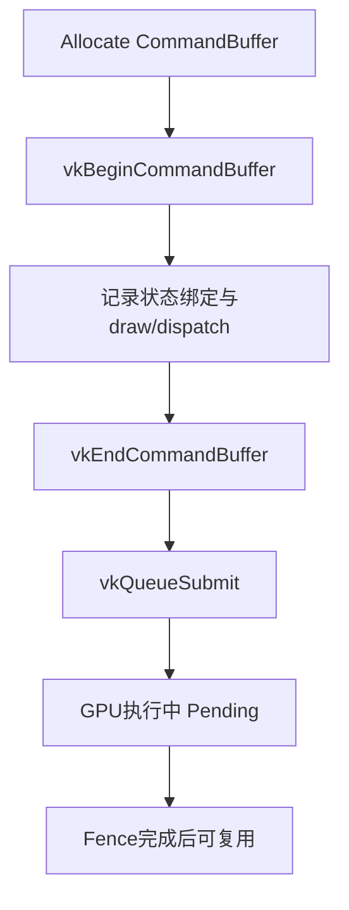

# Vulkan 3.4：CommandPool / CommandBuffer 面试详解

适用目标：
1. 彻底理解 Vulkan 命令系统：`CommandPool`、`CommandBuffer`、`QueueSubmit`。
2. 能讲清“为什么先录制后提交、如何复用、如何多线程”。
3. 能应对面试里的高频追问：状态机、重置策略、同步和性能陷阱。

---

## 0. 一句话总览（先背）

- `CommandPool`：命令缓冲的分配与管理池（按队列族创建）。
- `CommandBuffer`：GPU 要执行的命令列表（先录制，再提交）。

面试一句话：
`Vulkan把绘制工作组织为可预录制的命令缓冲，CommandPool负责生命周期和复用策略，CommandBuffer负责实际渲染/计算命令的批量提交。`

---

## 1. 为什么 Vulkan 要“先录制再提交”

## 1.1 通俗解释

OpenGL 更像“边说边做”；Vulkan 更像“先写施工清单，再一次性执行”。
这样做的收益：
1. 降低每个 draw 的即时调用开销。
2. 更适合多线程并行组织命令。
3. 提升 CPU 侧可预测性。

## 1.2 标准解释

Vulkan 命令需录入 `VkCommandBuffer`，再通过 `vkQueueSubmit` 提交到 `VkQueue`。
提交粒度由应用控制，可包含多个 command buffer 和同步依赖。

---

## 2. CommandPool（命令池）

## 2.1 通俗解释

CommandPool 是“命令缓冲内存仓库”。
它决定命令缓冲从哪里分配、如何重置和回收。

## 2.2 标准解释

`VkCommandPool` 与某个 queue family 绑定。
从该 pool 分配的 command buffer 只能提交到兼容该 family 的 queue。

## 2.3 创建关键点

1. 指定 `queueFamilyIndex`。
2. 常见 flags：
- `VK_COMMAND_POOL_CREATE_RESET_COMMAND_BUFFER_BIT`
  - 允许单独重置某个 command buffer。
- `VK_COMMAND_POOL_CREATE_TRANSIENT_BIT`
  - 暗示命令缓冲短生命周期（驱动可优化）。

## 2.4 常见策略（工程实践）

1. **按线程一个 pool**：减少锁竞争。
2. **按帧复用**：frames-in-flight，每帧一组 pool/CB/同步对象。
3. **避免频繁创建销毁**：尽量 reset/recycle。

---

## 3. CommandBuffer（命令缓冲）

## 3.1 两种类型

1. Primary Command Buffer
- 可直接提交到 queue。
- 常由主线程汇总。

2. Secondary Command Buffer
- 不能直接提交。
- 由 primary 通过 `vkCmdExecuteCommands` 执行。
- 常用于多线程录制分工。

## 3.2 状态机（面试高频）

典型状态流：
1. Initial
2. Recording（`vkBeginCommandBuffer`）
3. Executable（`vkEndCommandBuffer`）
4. Pending（提交后等待执行完成）
5. 回到 Initial/Executable（取决于 reset 和使用方式）

注意：
- `Pending` 时不能随意重录或重置。
- 必须先通过 fence 等待 GPU 用完。

## 3.3 Begin 录制 flags（常见）

1. `VK_COMMAND_BUFFER_USAGE_ONE_TIME_SUBMIT_BIT`
- 该 CB 通常只提交一次。

2. `VK_COMMAND_BUFFER_USAGE_SIMULTANEOUS_USE_BIT`
- 允许同一 CB 在前次执行未完成时再次提交（通常不推荐滥用）。

3. `VK_COMMAND_BUFFER_USAGE_RENDER_PASS_CONTINUE_BIT`
- Secondary CB 在 render pass 内继续录制时使用。

---

## 4. 标准录制提交流程



最小流程：
1. `vkAllocateCommandBuffers`
2. `vkBeginCommandBuffer`
3. 记录命令（pipeline、descriptor、vertex/index、draw）
4. `vkEndCommandBuffer`
5. `vkQueueSubmit`
6. `vkWaitForFences`（按帧同步）
7. reset/reuse

---

## 5. 与同步对象的关系（非常关键）

## 5.1 Fence

- 用来判断“这个 command buffer 对应提交是否执行完成”。
- 只有 fence 完成后，相关 per-frame 资源才可安全复用。

## 5.2 Semaphore

- CommandBuffer 本身不等于同步。
- 提交之间依赖要靠 semaphore 在 submit/present 阶段表达。

## 5.3 Barrier

- Barrier 写在 command buffer 内，解决资源访问顺序与可见性问题。
- 不是替代 fence/semaphore，而是不同层次同步。

---

## 6. 多线程录制（面试加分点）

## 6.1 推荐组织

1. 主线程：收集可见对象、分发任务、汇总提交。
2. 工作线程：各自录制 secondary CB（按渲染阶段或对象分块）。
3. 主线程 primary CB 中执行 secondary CB。

## 6.2 关键原则

1. 每线程独立 command pool。
2. 避免多个线程同时操作同一 pool。
3. 数据准备和命令录制解耦，减少主线程瓶颈。

---

## 7. 复用与重置策略

## 7.1 三种常见方式

1. 重置整个 pool（`vkResetCommandPool`）
- 批量重置，常用于按帧复用。

2. 重置单个 CB（`vkResetCommandBuffer`）
- 需要 pool 创建时带 RESET 标志。

3. 每帧重录（最常见）
- 尤其场景动态变化较多时。

## 7.2 实战建议

1. 初学阶段先“每帧重录 + 按帧 pool reset”。
2. 稳定后再做静态命令缓存优化。

---

## 8. 高频踩坑与排错

## 8.1 还在 Pending 就 reset

现象：
1. Validation 报错或随机崩溃。
2. 偶发黑屏/闪烁。

原因：
- 未等待 fence 就复用 command buffer 或 pool。

## 8.2 CommandPool family 选错

现象：
- 提交时报兼容性错误。

原因：
- pool 绑定队列族与实际提交队列不匹配。

## 8.3 Secondary CB 使用错误

现象：
- render pass 内外命令边界错乱。

原因：
- secondary 继承信息或 begin flags 配置不当。

## 8.4 过度依赖 SIMULTANEOUS_USE

现象：
- 性能变差或调试复杂化。

建议：
- 除非确有需要，优先按帧独立 CB+同步复用。

---

## 9. 最小代码骨架（可直接讲）

```cpp
// 1) 创建 CommandPool（绑定 graphics family）
VkCommandPoolCreateInfo pci{};
pci.sType = VK_STRUCTURE_TYPE_COMMAND_POOL_CREATE_INFO;
pci.queueFamilyIndex = graphicsFamily;
pci.flags = VK_COMMAND_POOL_CREATE_RESET_COMMAND_BUFFER_BIT;
VK_CHECK(vkCreateCommandPool(device, &pci, nullptr, &cmdPool));

// 2) 分配 CommandBuffer
VkCommandBufferAllocateInfo ai{};
ai.sType = VK_STRUCTURE_TYPE_COMMAND_BUFFER_ALLOCATE_INFO;
ai.commandPool = cmdPool;
ai.level = VK_COMMAND_BUFFER_LEVEL_PRIMARY;
ai.commandBufferCount = 1;
VK_CHECK(vkAllocateCommandBuffers(device, &ai, &cmd));

// 3) 录制
VkCommandBufferBeginInfo bi{};
bi.sType = VK_STRUCTURE_TYPE_COMMAND_BUFFER_BEGIN_INFO;
bi.flags = VK_COMMAND_BUFFER_USAGE_ONE_TIME_SUBMIT_BIT;
VK_CHECK(vkBeginCommandBuffer(cmd, &bi));

// ... vkCmdBindPipeline / vkCmdDraw ...

VK_CHECK(vkEndCommandBuffer(cmd));

// 4) 提交
VkSubmitInfo si{};
si.sType = VK_STRUCTURE_TYPE_SUBMIT_INFO;
si.commandBufferCount = 1;
si.pCommandBuffers = &cmd;
VK_CHECK(vkQueueSubmit(graphicsQueue, 1, &si, frameFence));
```

---

## 10. 面试高频问答（可直接背）

### Q1：为什么 CommandPool 要绑定 queue family？
A：因为命令缓冲的内部表示与目标队列族能力相关，分配来源必须和提交目标兼容。

### Q2：Primary 和 Secondary 的使用场景？
A：Primary 直接提交，Secondary 适合多线程分段录制后由 Primary 汇总执行。

### Q3：CommandBuffer 可以长期复用吗？
A：可以，但要保证内容稳定且同步正确。动态场景通常每帧重录更简单稳妥。

### Q4：为什么要按帧管理 CommandPool？
A：便于与 frames-in-flight 对齐，fence 完成后整体 reset，生命周期清晰且高效。

### Q5：Fence 和 CommandBuffer 关系？
A：Fence 是“这次提交是否完成”的外部信号，决定 command buffer/资源何时可安全复用。

---

## 11. 高分回答模板

`Vulkan采用先录制后提交的命令模型。CommandPool负责命令缓冲内存管理并绑定队列族，CommandBuffer负责记录渲染/计算命令。工程上常按线程拆分command pool、按帧复用命令资源，并通过fence确保GPU执行完成后再重置复用。Primary/Secondary组合可支持多线程录制，提升CPU提交效率。难点在于状态机与同步配合：Pending状态下不可重录或重置，提交间依赖和资源可见性仍需semaphore/barrier正确建模。`

---

## 12. 学习检查点

1. 能解释 CommandPool 与 CommandBuffer 各自职责。
2. 能说明 why 先录制再提交。
3. 能画出 command buffer 状态流转。
4. 能说出 primary/secondary 分工。
5. 能解释按帧复用与 fence 的关系。
6. 能列出 3 个常见复用错误及排查方法。
7. 能写最小录制+提交代码框架。

---

## 13. 一页速记（考前 1 分钟）

1. CommandPool 管分配与重置，绑定 queue family。
2. CommandBuffer 先 begin/record/end，再 submit。
3. Primary 可直接提交，Secondary 用于并行录制后汇总。
4. Pending 时不能乱 reset/re-record。
5. 按帧资源 + fence 完成后复用最稳。
6. 同步分层：Fence（CPU-GPU）/Semaphore（提交依赖）/Barrier（资源可见性）。
