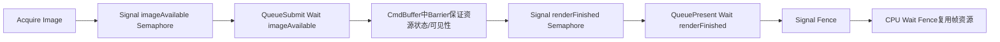

# Vulkan 3.9：Fence / Semaphore / Barrier 面试详解

适用目标：
1. 彻底理解 Vulkan 同步体系，不再把三者混为一谈。
2. 能把“执行顺序、内存可见性、资源状态转换”分层讲清。
3. 面试时能回答：怎么设计同步、怎么排查闪烁/黑帧/偶发 bug。

---

## 0. 一句话总览（先背）

- `Fence`：CPU 等 GPU 完成的同步对象。
- `Semaphore`：GPU 提交之间的同步对象。
- `Barrier`：命令流内资源访问依赖与可见性控制（含 layout 转换）。

面试一句话：
`Fence管CPU-GPU完成关系，Semaphore管提交依赖，Barrier管资源何时以何种状态被安全读写。三者是不同层级，不可互相替代。`

---

## 1. 为什么 Vulkan 同步这么复杂

## 1.1 通俗解释

Vulkan 是显式 API，驱动不会替你猜依赖。
你必须自己回答三件事：
1. 谁先执行。
2. 谁写的数据何时对谁可见。
3. 资源现在是什么状态（layout/access）。

## 1.2 标准解释

Vulkan 将同步拆分为：
1. 任务级（queue submit dependency）。
2. 主机-设备级（host wait/signal）。
3. 资源级（pipeline stage + access scope + layout）。

同步错误常表现为：
1. 偶发闪烁。
2. 黑块/脏数据。
3. 平台相关不稳定。
4. 验证层 hazard 报错。

---

## 2. Fence（CPU-GPU）

## 2.1 通俗解释

Fence 是“GPU 做完了请通知 CPU”的信号。
最常见用途是帧资源复用保护：
- 上一帧还没跑完，CPU 不能重用这一帧的命令缓冲和资源。

## 2.2 标准解释

1. 提交时可附带 fence：`vkQueueSubmit(..., fence)`。
2. CPU 侧用 `vkWaitForFences` 等待完成。
3. 复用前需 `vkResetFences`。

## 2.3 高频坑点

1. 未等待 fence 就重用 command buffer。
2. 忘记 reset fence 导致后续逻辑卡住。
3. 用 device wait idle 代替精细 fence，性能抖动明显。

---

## 3. Semaphore（GPU-GPU）

## 3.1 通俗解释

Semaphore 是“GPU 任务交接棒”。
一个提交 signal，另一个提交 wait。

典型场景：
1. Acquire 后渲染等待 image 可用。
2. 渲染完成后 present 等待 renderFinished。
3. 多队列图形/计算协作。

## 3.2 标准解释

### Binary Semaphore

- 二值信号（未触发/已触发）。
- 用于简单提交依赖。

### Timeline Semaphore

- 递增计数值同步。
- 更适合复杂跨帧调度（减少大量 binary semaphore 管理成本）。

## 3.3 高频坑点

1. wait/signal 链断裂，导致读到未完成结果。
2. stage mask 配置过宽或过窄。
3. 多队列下没有清晰依赖图，出现偶发竞争。

---

## 4. Barrier（资源级同步）

## 4.1 通俗解释

Barrier 是“资源访问红绿灯”。
它不只是“先后顺序”，还负责：
1. 写入结果何时可见。
2. 资源状态何时转到可读/可写布局。

## 4.2 标准解释

Barrier 关注三件事：
1. 执行依赖：`srcStage -> dstStage`
2. 访问依赖：`srcAccess -> dstAccess`
3. 资源状态迁移：`oldLayout -> newLayout`（image）

常见 API：
1. 旧同步：`vkCmdPipelineBarrier`
2. 新同步2：`vkCmdPipelineBarrier2`（推荐）

## 4.3 典型 image 转换

1. `UNDEFINED -> TRANSFER_DST_OPTIMAL`
2. `TRANSFER_DST_OPTIMAL -> SHADER_READ_ONLY_OPTIMAL`
3. `COLOR_ATTACHMENT_OPTIMAL -> PRESENT_SRC_KHR`
4. `COLOR_ATTACHMENT_OPTIMAL -> SHADER_READ_ONLY_OPTIMAL`

## 4.4 高频坑点

1. layout 转了，但 access mask 错。
2. access 写对了，但 stage mask 过早或过晚。
3. 只做了执行顺序，没做可见性。

---

## 5. 三者如何协作（帧流程）



关键认知：
1. semaphore 解决“提交之间谁先谁后”。
2. barrier 解决“同一资源读写依赖”。
3. fence 解决“CPU 何时可安全复用”。

---

## 6. 常见真实场景怎么写同步

## 6.1 纹理上传后采样

需求：
1. copy 到 image 完成。
2. shader 采样前看到正确数据。

做法：
1. `TRANSFER_DST_OPTIMAL` 写入后 barrier。
2. 转到 `SHADER_READ_ONLY_OPTIMAL`。
3. src/dst stage/access 对应 transfer write -> fragment shader read。

## 6.2 GBuffer Pass -> Lighting Pass 读取

需求：
1. GBuffer 写完。
2. Lighting pass 读取可见。

做法：
1. 若同 renderpass/subpass：用 subpass dependency。
2. 若跨 pass：用 image barrier + 合理 stage/access。

## 6.3 图形队列与计算队列协作

需求：
1. 图形输出作为计算输入。
2. 计算输出再回图形显示。

做法：
1. 提交间 semaphore 串联。
2. 资源访问点加 barrier。
3. 必要时处理 queue family ownership transfer。

---

## 7. 同步2（VK_KHR_synchronization2）怎么讲

## 7.1 为什么有同步2

旧模型参数分散、易误用。
同步2统一了阶段/访问描述结构，语义更清晰。

## 7.2 面试表达

`新项目建议优先使用vkCmdPipelineBarrier2和VkDependencyInfo路径，表达依赖更清晰，维护成本更低。`

---

## 8. 最小代码骨架（可直接讲）

### 8.1 提交时 semaphore + fence

```cpp
VkSubmitInfo submit{};
submit.sType = VK_STRUCTURE_TYPE_SUBMIT_INFO;
submit.waitSemaphoreCount = 1;
submit.pWaitSemaphores = &imageAvailable;
submit.pWaitDstStageMask = &waitStage; // e.g. COLOR_ATTACHMENT_OUTPUT
submit.commandBufferCount = 1;
submit.pCommandBuffers = &cmd;
submit.signalSemaphoreCount = 1;
submit.pSignalSemaphores = &renderFinished;

VK_CHECK(vkQueueSubmit(graphicsQueue, 1, &submit, frameFence));
```

### 8.2 典型 image barrier（旧接口示意）

```cpp
VkImageMemoryBarrier b{};
b.sType = VK_STRUCTURE_TYPE_IMAGE_MEMORY_BARRIER;
b.oldLayout = VK_IMAGE_LAYOUT_TRANSFER_DST_OPTIMAL;
b.newLayout = VK_IMAGE_LAYOUT_SHADER_READ_ONLY_OPTIMAL;
b.srcAccessMask = VK_ACCESS_TRANSFER_WRITE_BIT;
b.dstAccessMask = VK_ACCESS_SHADER_READ_BIT;
// subresourceRange ...

vkCmdPipelineBarrier(
    cmd,
    VK_PIPELINE_STAGE_TRANSFER_BIT,
    VK_PIPELINE_STAGE_FRAGMENT_SHADER_BIT,
    0,
    0, nullptr,
    0, nullptr,
    1, &b);
```

---

## 9. 高频踩坑与排错流程

## 9.1 症状：偶发闪烁/黑块

排查顺序：
1. 先开 validation，看是否有 hazard 报错。
2. 核对资源最后一次写入点与下一次读取点。
3. 检查 stage/access 是否覆盖真实操作。
4. 检查 layout 与实际用法是否匹配。

## 9.2 症状：CPU 卡顿或帧时尖峰

排查顺序：
1. 是否频繁 `vkDeviceWaitIdle`。
2. fence wait 粒度是否过粗。
3. 是否过度串行化提交导致并发失效。

## 9.3 症状：多队列偶发错帧

排查顺序：
1. semaphore 链是否完整。
2. queue ownership transfer 是否遗漏。
3. timeline semaphore 值是否单调正确。

---

## 10. 面试高频问答（可直接背）

### Q1：Fence、Semaphore、Barrier 分别解决什么问题？
A：Fence是CPU-GPU完成同步，Semaphore是提交间同步，Barrier是资源访问与可见性同步。

### Q2：为什么有了 Semaphore 还要 Barrier？
A：Semaphore只保证提交顺序，不自动完成资源级访问范围与layout可见性管理，Barrier负责这部分。

### Q3：为什么有了 Fence 还要 Semaphore？
A：Fence是主机等待，不能替代GPU提交之间的依赖建模；提交间同步应由Semaphore表达。

### Q4：如何减少同步 bug？
A：建立渲染图依赖模型、优先保守正确同步、用validation+RenderDoc验证，再逐步收紧优化。

### Q5：Timeline semaphore 价值？
A：用递增值统一表达复杂依赖，减少大量binary semaphore和fence组合管理复杂度。

---

## 11. 高分回答模板

`Vulkan同步我会分三层建模：Fence处理CPU-GPU完成关系，Semaphore处理提交间依赖，Barrier处理资源级执行和内存可见性（含layout转换）。实际工程里先画出资源读写依赖图，再把每条依赖映射到stage/access/layout，先保证正确性再收紧同步范围优化性能。复杂跨帧调度可用timeline semaphore降低同步对象管理复杂度。`

---

## 12. 学习检查点

1. 能区分三类同步对象边界。
2. 能解释“为什么 semaphore 不能替代 barrier”。
3. 能写出纹理上传后的正确 barrier。
4. 能画出一帧 Acquire/Submit/Present 同步链路。
5. 能列出 3 个同步高频 bug 与排查路径。

---

## 13. 一页速记（考前 1 分钟）

1. Fence：CPU 等 GPU。
2. Semaphore：GPU 提交依赖。
3. Barrier：资源可见性 + layout 转换 + 执行依赖。
4. 顺序对了不代表数据可见，barrier 不能省。
5. 同步先保守正确，再逐步优化范围。
6. 新项目优先同步2路径（barrier2）。
