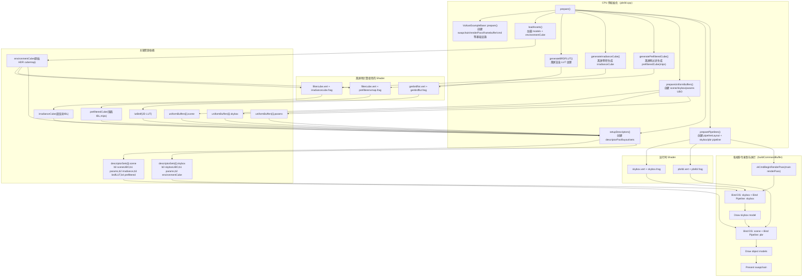

# Vulkan PBR IBL - importanceSample_GGX 三次问答记录

## 背景
当前讨论文件：`shaders/glsl/pbribl/genbrdflut.frag`

目标函数：
```glsl
vec3 importanceSample_GGX(vec2 Xi, float roughness, vec3 normal)
```

该函数的核心任务：
按 GGX 分布生成一个半程向量 `H`（half-vector），用于后续 BRDF 积分采样。

---

## 第一次问答
### 问题
没看懂

### 回答（详细整理）
可以先把函数理解成一句话：

**它是在法线 `normal` 周围，按粗糙度 `roughness` 选一个随机方向 `H`。**

输入先只记 3 个：
1. `Xi`：两个 0~1 的随机数
2. `roughness`：粗糙度，控制采样分布是集中还是发散
3. `normal`：参考法线，采样围绕它展开

输出：
1. 单位向量 `H`

函数流程可压缩成 4 步：
1. 用 `Xi.x` 决定“绕法线转几度”（方位角 `phi`）
2. 用 `Xi.y` + `roughness` 决定“偏离法线多远”（极角 `theta`）
3. 先在局部空间（法线朝上的坐标系）构造方向 `H`
4. 把局部 `H` 旋转到以 `normal` 为上方向的世界空间

可以这样读原代码：
```glsl
float alpha = roughness * roughness;
// 粗糙度重映射

float phi = 2.0 * PI * Xi.x + random(normal.xz) * 0.1;
// 围绕 normal 的方位角

float cosTheta = sqrt((1.0 - Xi.y) / (1.0 + (alpha*alpha - 1.0) * Xi.y));
float sinTheta = sqrt(1.0 - cosTheta * cosTheta);
// 离 normal 的倾斜角

vec3 H = vec3(sinTheta * cos(phi), sinTheta * sin(phi), cosTheta);
// 局部空间方向

vec3 up = abs(normal.z) < 0.999 ? vec3(0,0,1) : vec3(1,0,0);
vec3 tangentX = normalize(cross(up, normal));
vec3 tangentY = normalize(cross(normal, tangentX));
// 构建局部正交基

return normalize(tangentX * H.x + tangentY * H.y + normal * H.z);
// 局部方向 -> 世界方向
```

效果直觉：
1. `roughness` 小：采样更贴近法线，镜面更尖
2. `roughness` 大：采样更分散，镜面更糊

为什么重要：
1. 这不是均匀采样，而是“重要性采样”
2. 更容易采到贡献高的方向
3. 积分收敛更快、噪声更低

---

## 第二次问答
### 问题
绕法线转几度和偏离法线多远是什么意思

### 回答（详细整理）
这两个词是在描述同一个方向向量时的两件事：
1. 朝哪边转（方位）
2. 倾斜多少（离法线多远）

把 `normal` 想成一根竖直向上的针。

#### 1) 绕法线转几度（方位角 `phi`）
含义：
1. 围着这根针在水平面转一圈，决定朝哪个方向偏
2. 不改变“偏离法线的角度”

类比：
手电筒保持同样抬头角度，只在水平面转向。

#### 2) 偏离法线多远（极角 `theta`）
含义：
1. 方向与法线之间夹角多大
2. `theta = 0°`：完全沿法线
3. `theta` 越大：越斜，越接近地平线方向

类比：
手电筒不改朝向，只改变抬头/压低角度。

#### 3) 合起来怎么确定方向
一个方向 =
1. 先定“偏多远”（`theta`）
2. 再定“朝哪边偏”（`phi`）

这就是球坐标描述方向的标准方式。

#### 4) 在函数里的对应关系
1. `phi` 主要由 `Xi.x` 决定（绕法线转）
2. `theta` 由 `Xi.y` 和 `roughness` 决定（偏离法线程度）
3. `roughness` 越大，分布越容易偏离法线，采样越散

---

## 第三次问答
### 问题
也就是挑选半程向量是吗

### 回答（详细整理）
是，准确说：

**`importanceSample_GGX(...)` 就是在按 GGX 分布挑选半程向量 `H`。**

在这份 `genbrdflut.frag` 的流程里：
1. 先采样得到 `H`
2. 再根据 `V` 和 `H` 反推出光线方向 `L`

公式：
```glsl
L = 2.0 * dot(V, H) * H - V;
```

所以它不是直接采样 `L`，而是先采样半程向量 `H`，这正是 GGX 重要性采样的常见实现方式。

---

## 三次问答的统一结论
1. 这个函数的本质：
按 GGX 概率分布采样半程向量 `H`

2. “绕法线转几度 + 偏离法线多远”本质上就是：
用球坐标（`phi`, `theta`）来描述采样方向

3. 为什么这样做：
比均匀采样更高效，积分更快收敛，结果更稳定

4. 在 BRDF LUT 生成里的角色：
它是积分采样的方向生成器，决定每次样本从哪个方向贡献能量

---

## 追加问答：pbribl 整体流程图（含 CPU Vulkan 关系）

### 问题
请你画一个 `shaders/glsl/pbribl` 如何整体工作的流程图，包含各种资源的依赖关系，同时包含 CPU 侧的 Vulkan 关系。

### 回答（详细整理）
下面是 `examples/pbribl/pbribl.cpp` 与 `shaders/glsl/pbribl/*` 的整体验证链路，分为：
1. 初始化阶段（离屏预计算）
2. 运行时阶段（每帧渲染）



### 关键关系总结
1. `environmentCube` 是源头资源：
   既用于 skybox 直接显示，也用于生成 `irradianceCube` 与 `prefilteredCube`。
2. 离屏预计算三件套：
   - `genbrdflut.*` 生成 `lutBrdf`
   - `filtercube + irradiancecube.frag` 生成 `irradianceCube`
   - `filtercube + prefilterenvmap.frag` 生成 `prefilteredCube`
3. 运行时主物体的 PBR shader(`pbribl.frag`)依赖：
   `irradianceCube + prefilteredCube + lutBrdf + UBO`。
4. CPU 侧通过 `setupDescriptors()` 把这些资源写入 `descriptorSets[i].scene / skybox`，并在 `buildCommandBuffer()` 中按“先 skybox 后物体”绑定并绘制。
