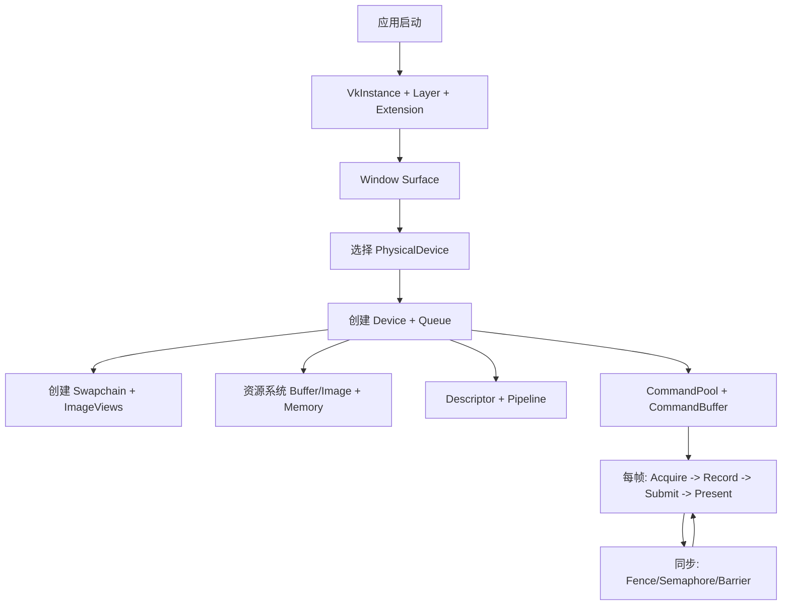

# Vulkan 整体框架与核心概念详解

本文目标：
1. 用一条清晰主线讲明白 Vulkan 整体框架。
2. 对核心概念给出“通俗易懂解释 + 标准解释”。
3. 让你能用于学习、实战和面试复述。

## 文档导航（3.x 拆分）

为避免目录和拆分文档对不上，下面给出当前映射：

| 总文档章节 | 拆分文档 |
|---|---|
| 3.1 Instance / Layer / Extension | `Vulkan_3.1_Instance_Layer_Extension_面试详解.md` |
| 3.2 PhysicalDevice / Device / Queue | `Vulkan_3.2_PhysicalDevice_Device_Queue_面试详解.md` |
| 3.3 Surface / Swapchain | `Vulkan_3.3_Surface_Swapchain_面试详解.md` |
| 3.4 Buffer / Image / ImageView / Sampler | `Vulkan_3.4_Buffer_Image_ImageView_Sampler_面试详解.md` |
| 3.5 Memory | `Vulkan_3.5_Memory_面试详解.md` |
| 3.6 Descriptor / PipelineLayout / Pipeline | `Vulkan_3.6_Descriptor_PipelineLayout_Pipeline_面试详解.md` |
| 3.7 RenderPass（或 Dynamic Rendering） | `Vulkan_3.7_RenderPass_DynamicRendering_面试详解.md` |
| 3.8 CommandPool / CommandBuffer | `Vulkan_3.8_CommandPool_CommandBuffer_面试详解.md` |
| 3.9 Fence / Semaphore / Barrier | `Vulkan_3.9_Fence_Semaphore_Barrier_面试详解.md` |

---

## 1. Vulkan 整体框架（先建立全局图）

一句话理解：
- Vulkan 不是“直接画图”，而是先搭系统（设备、资源、命令、同步），再在每帧驱动这个系统执行。

---

## 2. Vulkan 核心思想

1. 显式控制：同步、内存、资源状态转换由应用负责。
2. 可预测性：减少驱动隐式黑盒行为，便于稳定性能。
3. 可扩展性：适合多线程录制命令和大场景提交。
4. 工程复杂度高：需要规范的资源生命周期和调试流程。

---

## 3. 关键对象总览（通俗解释 + 标准解释）

## 3.1 Instance / Layer / Extension

### 通俗解释
- `VkInstance` 是 Vulkan 世界总入口。
- `Layer` 像调试外挂，用来检查你 API 是否用对。
- `Extension` 是可选功能包，不同平台/厂商会提供不同能力。

### 标准解释
- `VkInstance` 是顶层对象，承载全局扩展和层。
- Validation Layer 拦截 API 调用并执行规范校验。
- Extension 提供核心规范外能力（如表面创建、调试标记等）。

---

## 3.2 PhysicalDevice / Device / Queue

### 通俗解释
- `PhysicalDevice`：真实 GPU 候选清单。
- `Device`：你选中 GPU 后建立的逻辑会话。
- `Queue`：GPU 执行命令的通道（图形/计算/传输/呈现）。

### 标准解释
- `VkPhysicalDevice` 可查询硬件特性、格式支持、内存类型、队列族。
- `VkDevice` 从 PhysicalDevice 派生，承载大多数对象创建。
- `VkQueue` 隶属某个队列族，执行 `Submit` 的命令缓冲。

---

## 3.3 Surface / Swapchain

### 通俗解释
- `Surface` 是 Vulkan 与窗口系统的连接口。
- `Swapchain` 是一组“待显示图片”的轮转缓冲。

### 标准解释
- Surface 是平台相关呈现目标抽象。
- Swapchain 管理可呈现 image 集合，支持 Acquire/Present 同步模型。

---

## 3.4 Buffer / Image / ImageView / Sampler

### 通俗解释
- `Buffer`：线性数据块（顶点、索引、常量）。
- `Image`：有像素语义的纹理或渲染目标。
- `ImageView`：告诉 GPU 如何“看”这张图（格式、层、mip）。
- `Sampler`：纹理采样规则（过滤、寻址、LOD）。

### 标准解释
- Buffer 是线性地址空间资源。
- Image 具备维度、格式、mip、layout 等语义。
- ImageView 是 image 子资源/格式解释对象。
- Sampler 独立定义采样行为并可复用。

---

## 3.5 Memory（Vulkan 显式内存）

### 通俗解释
- 在 Vulkan 里，“资源对象”和“内存块”是分开的。
- 你要自己决定哪个资源放进哪种内存。

### 标准解释
- `VkBuffer/VkImage` 与 `VkDeviceMemory` 分离。
- 资源创建后通过 `vkGet*MemoryRequirements` 查询需求，再分配并绑定内存。
- 工程中常用“大片内存 + 子分配”而非每资源独立分配。

---

## 3.6 Descriptor / PipelineLayout / Pipeline

### 通俗解释
- `Descriptor` 是 shader 拿资源的地址簿。
- `PipelineLayout` 规定 shader 能绑定哪些资源接口。
- `Pipeline` 是“一整套渲染状态 + shader”打包。

### 标准解释
- DescriptorSetLayout 定义 set/binding 结构。
- PipelineLayout 绑定多个 set layout 与 push constant 范围。
- Graphics Pipeline 固化顶点输入、光栅化、深度、混合及 shader 阶段配置。

---

## 3.7 RenderPass（或 Dynamic Rendering）

### 通俗解释
- 规定这次渲染会用哪些附件、如何读写、何时清空/保留。

### 标准解释
- 传统 RenderPass 定义 attachment 生命周期和子通道依赖。
- Dynamic Rendering 是新路径，减少显式 RenderPass 对象样板，但附件流转思想相同。

---

## 3.8 CommandBuffer / CommandPool

### 通俗解释
- CommandBuffer 是“GPU 待办清单”，先录好再提交。
- CommandPool 是命令缓冲的分配池，常按线程/按帧管理。

### 标准解释
- 命令录制经 `vkBeginCommandBuffer`/`vkEndCommandBuffer`。
- 提交到 Queue 执行，支持 primary/secondary 命令缓冲分工。

---

## 3.9 同步：Fence / Semaphore / Barrier

### 通俗解释
- Fence：CPU 等 GPU。
- Semaphore：GPU 提交间交接。
- Barrier：资源读写红绿灯（执行阶段 + 内存可见性 + layout 转换）。

### 标准解释
- Fence 是主机可等待对象。
- Semaphore 是队列提交依赖同步对象。
- Pipeline Barrier 声明 stage/access 依赖与资源状态迁移。

---

## 4. 一帧渲染标准流程（必须会背）

1. `AcquireNextImage` 获取 swapchain image。
2. 等待当前帧 fence，保证帧资源可复用。
3. 重置并录制 command buffer。
4. 提交 queue（等待 imageAvailable semaphore，信号 renderFinished semaphore）。
5. Present（等待 renderFinished semaphore）。
6. 处理 swapchain 失效并按需重建。

---

## 5. 资源生命周期与工程规范

1. 创建顺序要清晰：Instance -> Device -> 资源。
2. 销毁顺序要反向：先销资源，后销 Device/Instance。
3. 每帧资源（命令缓冲、同步对象）按帧索引管理。
4. 强烈建议使用 RAII 包装 Vulkan 对象。
5. 调试阶段必须开启 Validation Layer。

---

## 6. 最常见错误与排查策略

## 6.1 黑屏排查顺序
1. swapchain acquire/present 是否成功。
2. command buffer 是否真的提交。
3. pipeline 与 render target 格式是否匹配。
4. descriptor set 是否正确更新并绑定。
5. viewport/scissor 是否有效。
6. barrier/layout 是否正确。

## 6.2 高频同步错误
1. 写后读没做 barrier。
2. stage mask/access mask 对不上真实读写阶段。
3. fence 未等待就复用命令或资源。

## 6.3 工具建议
1. Validation Layer：先消灭报错。
2. RenderDoc：逐 pass 看输入输出。
3. GPU Profiler：定位瓶颈在 CPU 还是 GPU。

---

## 7. 学习路线（从 0 到项目）

1. M0：清屏。
2. M1：三角形。
3. M2：顶点/索引/UBO。
4. M3：纹理采样。
5. M4：深度测试。
6. M5：模型加载。
7. M6：多光源/PBR 基础。
8. M7：阴影。
9. M8：HDR + ToneMapping + Bloom。
10. M9：性能优化与多线程命令录制。

---

## 8. 面试可直接使用的总结

`Vulkan 是显式低层图形 API。它把传统驱动隐式管理的同步、内存和资源状态前移到应用侧，提升了可预测性与并行扩展能力。整体框架可概括为：Instance/Device/Queue 初始化，Swapchain 呈现链路，Buffer/Image + Memory 资源系统，Descriptor + Pipeline 绑定与状态系统，CommandBuffer 录制提交模型，以及 Fence/Semaphore/Barrier 同步体系。`

---

## 9. 一句话记忆

- Vulkan 的本质：你自己精确描述 GPU 该做什么、何时做、按什么依赖做。
- 难点在工程组织，不在单个 API。
- 学会它的关键：最小可运行 -> 模块化扩展 -> 工具化调试 -> 同步与生命周期纪律。

