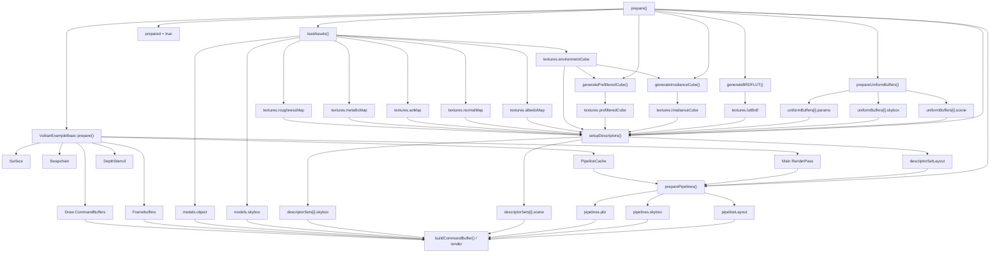

# initVulkan() 通俗问答记录

## 问题
通俗易懂解释 `initVulkan()`

## 回答
把 `initVulkan()` 当成“开机自检 + 选设备 + 装驱动”就好。

它做的事很像你第一次启动一台游戏主机：

1. 先决定要不要开调试模式（validation）。
2. 创建 Vulkan 实例（相当于“启动 Vulkan 系统”）。
3. 找机器里有哪些 GPU（显卡）。
4. 按参数选一张 GPU（默认第 0 张，`-g` 可指定）。
5. 读取这张 GPU 的能力（支持什么特性、内存类型等）。
6. 让当前示例先提需求：
   “我需要哪些功能/扩展？”（派生类通过 `getEnabledFeatures/Extensions` 提）。
7. 按这些需求创建逻辑设备 `VkDevice`（相当于“给应用开一个可用的 GPU 会话”）。
8. 从设备里拿到图形队列 `VkQueue`（后面提交绘制命令要用）。
9. 选一个可用的深度格式（后面做深度测试要用）。
10. 把 `instance + physicalDevice + device` 交给 swapchain 模块保存上下文。

最后返回 `true`，表示：
Vulkan 核心已经准备好，可以进入下一步 `prepare()` 去建交换链、render pass、framebuffer 等渲染资源。

一句话总结：
`initVulkan()` 负责“把 GPU 变成可用状态”；`prepare()` 负责“把画面渲染管线搭起来”。

---

## 问题
图形队列是什么，深度格式有哪些

## 回答
在 Vulkan 里：

1. 图形队列（Graphics Queue）是什么
- 可以把它理解成“GPU 的任务流水线入口”。
- CPU 把绘制命令（draw、pipeline、render pass 等）提交到 `VkQueue`。
- 队列来自某个 `queue family`，只有支持 `VK_QUEUE_GRAPHICS_BIT` 的队列才能执行图形渲染命令。
- 常见还有计算队列（compute）、传输队列（transfer）、呈现队列（present）。

2. 深度格式有哪些（常见）
- 只深度：
  - `VK_FORMAT_D16_UNORM`
  - `VK_FORMAT_D32_SFLOAT`
  - `VK_FORMAT_X8_D24_UNORM_PACK32`（较少直接用）
- 深度+模板（Stencil）：
  - `VK_FORMAT_D16_UNORM_S8_UINT`
  - `VK_FORMAT_D24_UNORM_S8_UINT`
  - `VK_FORMAT_D32_SFLOAT_S8_UINT`

3. 实际怎么选
- 不是所有 GPU 都支持所有格式。
- 需要在运行时检测支持性（通常用 `vkGetPhysicalDeviceFormatProperties`）。
- 项目里常见优先顺序：`D32_SFLOAT_S8_UINT` -> `D24_UNORM_S8_UINT` -> `D16_UNORM_S8_UINT`（或只深度版本）。

---

## 问题
分别说明这些格式是干什么的

## 回答
- `VK_FORMAT_D16_UNORM`：只有深度，16 位。省显存、速度通常不错，精度一般，适合对深度精度要求不高的场景。
- `VK_FORMAT_D32_SFLOAT`：只有深度，32 位浮点。精度更高，适合大场景、远近平面跨度大时减少深度冲突（z-fighting）。
- `VK_FORMAT_X8_D24_UNORM_PACK32`：24 位深度 + 8 位占位（`X8` 不使用），偏历史兼容格式，现代项目较少直接选它。
- `VK_FORMAT_D16_UNORM_S8_UINT`：16 位深度 + 8 位模板。需要模板测试，但深度精度要求不高时可用。
- `VK_FORMAT_D24_UNORM_S8_UINT`：24 位深度 + 8 位模板。常见的深度/占用平衡方案。
- `VK_FORMAT_D32_SFLOAT_S8_UINT`：32 位浮点深度 + 8 位模板。质量最好但开销更高。

补充：
- `UNORM`：归一化整数（映射到 0~1）
- `SFLOAT`：浮点
- `S8_UINT`：8 位模板值

## 问题
模板（Stencil）是干什么的

## 回答
模板可以理解为“每个像素一个 8 位小标签（0~255）”，先写标签，再按标签决定哪里能画、哪里不能画。

常见用途：
- 做描边/外轮廓（先写物体模板，再在模板外扩区域着色）。
- 做遮罩（只有模板值满足条件的区域才允许渲染）。
- 做局部特效区域控制（例如只在某些区域做后处理）。
- 做镜面/传送门这类“限定区域渲染”。

一句话：深度解决“前后遮挡”，模板解决“区域准入”。

---

## 问题
把 instance + physicalDevice + device 交给 swapchain 模块保存上下文是什么意思

## 回答
这句话的意思是：

把已经创建好的三个“句柄”传给 `swapchain` 类，让它以后创建/重建交换链时能直接用。

- `instance`：Vulkan 全局入口，和表面（surface）相关的很多查询要从这里开始。
- `physicalDevice`：真实 GPU，用来查询这个 GPU 对当前窗口表面的支持能力（格式、present mode、分辨率范围等）。
- `device`：逻辑设备，真正执行 `vkCreateSwapchainKHR`、`vkAcquireNextImageKHR` 等操作要用它。

“保存上下文”不是复制一份新设备，也不是转移所有权，只是 `swapchain` 模块把这几个句柄存成成员变量，后续随时调用。
可以理解为：先把“身份证、驾驶证、车辆钥匙”交给 `swapchain` 管理员，它才能办后面的所有流程。

---

## 问题
createSurface();
	createCommandPool();
	createSwapChain();
	createCommandBuffers();
	createSynchronizationPrimitives();
	setupDepthStencil();
	setupRenderPass();
	createPipelineCache();
	setupFrameBuffer();详细说明其中每个函数

## 回答
下面按这 9 个函数逐个说明（它们在 `prepare()` 里按顺序调用）：

1. `createSurface()`
- 作用：按平台把窗口句柄交给 `swapChain.initSurface(...)`，创建 `VkSurfaceKHR`。
- 关键点：它是平台分发器（Win32/Android/XCB/Wayland 等）。
- 依赖：必须先有窗口。
- 为什么先做：没有 surface，就不能创建 swapchain。

2. `createCommandPool()`
- 作用：创建命令池 `VkCommandPool`，后续命令缓冲从这里分配。
- 关键点：`queueFamilyIndex = swapChain.queueNodeIndex`。
- 依赖：需要先知道可用队列家族（由 swapchain/surface 初始化阶段确定）。

3. `createSwapChain()`
- 作用：创建交换链、拿到 swapchain images，并给每张图创建 image view。
- 关键点：会选择 present mode、图像数量、extent。
- 依赖：必须先有 surface。

4. `createCommandBuffers()`
- 作用：从命令池分配主命令缓冲。
- 关键点：数量来自 `drawCmdBuffers.size()`（并发帧数）。
- 依赖：必须先有 command pool。

5. `createSynchronizationPrimitives()`
- 作用：创建 `waitFences`、`presentCompleteSemaphores`、`renderCompleteSemaphores`。
- 关键点：`renderCompleteSemaphores` 按 `swapChain.images.size()` 分配。
- 依赖：需要先创建 swapchain 才知道图像数量。

6. `setupDepthStencil()`
- 作用：创建深度/模板 image、分配显存并绑定，再建 image view。
- 关键点：使用 `depthFormat`，若是深度+模板格式会加 stencil aspect。
- 依赖：`depthFormat` 在 `initVulkan()` 已选好。

7. `setupRenderPass()`
- 作用：定义颜色/深度附件、subpass、dependency，然后创建 `VkRenderPass`。
- 关键点：若启用 dynamic rendering，这里会跳过（`renderPass = VK_NULL_HANDLE`）。
- 依赖：需要已知 swapchain 颜色格式和深度格式。

8. `createPipelineCache()`
- 作用：创建 `VkPipelineCache`，给后续图形管线创建做缓存复用。
- 关键点：加速 pipeline 创建，不改变渲染逻辑。

9. `setupFrameBuffer()`
- 作用：为每个 swapchain image 创建 framebuffer（颜色 view + 深度 view）。
- 关键点：数量等于 swapchain 图像数。
- 依赖：要先有 swapchain image views、depth view、renderPass。

一句话串起来：
先连上屏幕输出（surface/swapchain），再准备命令与同步（pool/cmd/sync），最后搭渲染附件结构（depth/renderpass/framebuffer）。

---

## 问题
swapchain images是干什么的

## 回答
`swapchain images` 就是“最终要显示到屏幕上的那几张后台图像缓冲”。

每一帧基本流程是：
1. 从 swapchain 取一张可用图（`vkAcquireNextImageKHR`）。
2. 把本帧内容渲染到这张图。
3. 提交显示（`vkQueuePresentKHR`）。

它们通常是多张（双缓冲/三缓冲），作用是让“渲染”和“显示”并行，减少卡顿和撕裂风险。
你代码这两行是标准两步查询：先拿数量，再拿具体图像句柄。

## 问题
缓冲是什么意思，各类缓冲

## 回答
“缓冲（buffer）”可以理解成：先放数据的临时区/工作区，不直接一步到位到屏幕。

常见类型：
- 前台缓冲（Front Buffer）：正在显示给你看的那一张图。
- 后台缓冲（Back Buffer）：GPU 正在画的图，画完再切到前台显示（Vulkan 常对应 swapchain images）。
- 双缓冲/三缓冲：后台图像数量不同，三缓冲更顺滑但更占内存。
- 深度缓冲（Depth Buffer）：存像素深度，解决遮挡。
- 模板缓冲（Stencil Buffer）：存像素标签（0~255），做遮罩、描边、局部特效。
- 顶点缓冲（Vertex Buffer）：存模型顶点数据（位置/法线/UV）。
- 索引缓冲（Index Buffer）：存顶点连接关系，减少重复。
- 统一缓冲（Uniform Buffer / UBO）：存每帧常量（矩阵、相机、灯光参数）。
- 命令缓冲（Command Buffer）：GPU 指令清单，不是像素数据。

一句话：缓冲就是把渲染拆成多个中间存储区，让 GPU 更高效、更稳定地出图。

---

## 问题
// Get the swap chain buffers containing the image and imageview
	imageViews.resize(imageCount);
	for (auto i = 0; i < images.size(); i++)
	{
		VkImageViewCreateInfo colorAttachmentView{
			.sType = VK_STRUCTURE_TYPE_IMAGE_VIEW_CREATE_INFO,
			.image = images[i],
			.viewType = VK_IMAGE_VIEW_TYPE_2D,
			.format = colorFormat,
			.components = { VK_COMPONENT_SWIZZLE_R, VK_COMPONENT_SWIZZLE_G, VK_COMPONENT_SWIZZLE_B, VK_COMPONENT_SWIZZLE_A },
			.subresourceRange = {
				.aspectMask = VK_IMAGE_ASPECT_COLOR_BIT,
				.baseMipLevel = 0,
				.levelCount = 1,
				.baseArrayLayer = 0,
				.layerCount = 1
			},
		};
		VK_CHECK_RESULT(vkCreateImageView(device, &colorAttachmentView, nullptr, &imageViews[i]));
	}这里是干嘛

## 回答
这段是在给每一张 `swapchain image` 创建对应的 `image view`。

- `images[i]` 是原始图像资源。
- 渲染管线和 framebuffer 通常不直接用原始图像，而是通过 `VkImageView` 来引用。
- 所以循环里为每张交换链图都创建一个 2D、颜色用途的 view，并保存到 `imageViews[i]`。

关键参数：
- `viewType = VK_IMAGE_VIEW_TYPE_2D`：2D 视图。
- `format = colorFormat`：与交换链颜色格式一致。
- `aspectMask = VK_IMAGE_ASPECT_COLOR_BIT`：这是颜色附件。
- `levelCount = 1`、`layerCount = 1`：只使用第一个 mip 和第一层。
- `components = R/G/B/A`：通道不重排。

一句话：把“显示图像”包装成“可绑定的渲染视图”，供 framebuffer/render pass 使用。

## 问题
附件是什么意思

## 回答
“附件（Attachment）”可以理解成：`Render Pass` 里要读写的“目标图像槽位”。

常见两类：
- 颜色附件（Color Attachment）：存最终颜色输出。
- 深度/模板附件（Depth/Stencil Attachment）：存深度和模板，用于遮挡与区域控制。

之所以叫“附件”，是因为它们是“挂在一次渲染过程上的目标资源”。
你前面创建的 swapchain `imageView`，后面会作为颜色附件挂到 framebuffer/render pass 上。

---

## 问题
void VulkanExampleBase::createSynchronizationPrimitives()
{
	// Wait fences to sync command buffer access
	VkFenceCreateInfo fenceCreateInfo{ .sType = VK_STRUCTURE_TYPE_FENCE_CREATE_INFO, .flags = VK_FENCE_CREATE_SIGNALED_BIT };
	for (auto& fence : waitFences) {
		VK_CHECK_RESULT(vkCreateFence(device, &fenceCreateInfo, nullptr, &fence));
	}
	// Used to ensure that image presentation is complete before starting to submit again
	for (auto& semaphore : presentCompleteSemaphores) {
		VkSemaphoreCreateInfo semaphoreCI{ .sType = VK_STRUCTURE_TYPE_SEMAPHORE_CREATE_INFO };
		VK_CHECK_RESULT(vkCreateSemaphore(device, &semaphoreCI, nullptr, &semaphore));
	}
	// Semaphore used to ensure that all commands submitted have been finished before submitting the image to the queue
	renderCompleteSemaphores.resize(swapChain.images.size());
	for (auto& semaphore : renderCompleteSemaphores) {
		VkSemaphoreCreateInfo semaphoreCI{ .sType = VK_STRUCTURE_TYPE_SEMAPHORE_CREATE_INFO };
		VK_CHECK_RESULT(vkCreateSemaphore(device, &semaphoreCI, nullptr, &semaphore));
	}
}这里在干嘛

## 回答
这段是在创建“每帧同步工具”，防止 CPU/GPU 和显示系统抢资源。

它做了 3 组同步对象：

1. `waitFences`（栅栏）
- 作用：CPU 等待某帧 GPU 执行完，才能复用该帧命令缓冲。
- 为啥 `VK_FENCE_CREATE_SIGNALED_BIT`：第一次进循环时不需要等，避免首帧卡住。

2. `presentCompleteSemaphores`（信号量）
- 作用：`vkAcquireNextImageKHR` 成功后发信号，告诉队列“这张图可以开始渲染了”。
- 防止还没拿到可用交换链图就提交绘制。

3. `renderCompleteSemaphores`（信号量）
- 作用：渲染完成后发信号，`vkQueuePresentKHR` 等它再显示。
- 数量按 `swapChain.images.size()`，因为每张交换链图都可能需要自己的完成信号。

一句话：
这段就是搭好“可画 -> 画完 -> 可显示”的交通灯系统。
没有它就容易出现闪烁、撕裂、资源冲突或验证层报错。

## 问题
void VulkanExampleBase::createCommandPool()
{
	VkCommandPoolCreateInfo cmdPoolInfo{
		.sType = VK_STRUCTURE_TYPE_COMMAND_POOL_CREATE_INFO,
		.flags = VK_COMMAND_POOL_CREATE_RESET_COMMAND_BUFFER_BIT,
		.queueFamilyIndex = swapChain.queueNodeIndex,
	};
	VK_CHECK_RESULT(vkCreateCommandPool(device, &cmdPoolInfo, nullptr, &cmdPool));
}解释这个部分

## 回答
这段是在创建“命令缓冲的内存池”`cmdPool`，后面录制绘制命令都从它分配。

关键点：

1. `sType`
- 结构体类型标识，Vulkan 固定写法。

2. `flags = VK_COMMAND_POOL_CREATE_RESET_COMMAND_BUFFER_BIT`
- 允许“单独重置某个命令缓冲”。
- 好处：每帧可以只重录当前那一帧的 command buffer，不必整池一起重置。

3. `queueFamilyIndex = swapChain.queueNodeIndex`
- 这个池子绑定到某个队列家族。
- 从该池分配的命令缓冲，主要提交到这个家族的队列执行。
- 这里用 swapchain 选好的图形/呈现队列家族索引，保证后续提交路径一致。

4. `vkCreateCommandPool(...)`
- 真正向驱动申请命令池句柄，保存到 `cmdPool`。
- 失败就 `VK_CHECK_RESULT` 报错终止。

一句话：
这是在“先建一个能反复重录命令的池子”，供每帧 command buffer 分配与复用。

---

## 问题
void VulkanExampleBase::setupDepthStencil()
{
	VkImageCreateInfo imageCI{
		.sType = VK_STRUCTURE_TYPE_IMAGE_CREATE_INFO,
		.imageType = VK_IMAGE_TYPE_2D,
		.format = depthFormat,
		.extent = { width, height, 1 },
		.mipLevels = 1,
		.arrayLayers = 1,
		.samples = VK_SAMPLE_COUNT_1_BIT,
		.tiling = VK_IMAGE_TILING_OPTIMAL,
		.usage = VK_IMAGE_USAGE_DEPTH_STENCIL_ATTACHMENT_BIT
	};
	VK_CHECK_RESULT(vkCreateImage(device, &imageCI, nullptr, &depthStencil.image));
	VkMemoryRequirements memReqs{};
	vkGetImageMemoryRequirements(device, depthStencil.image, &memReqs);

	VkMemoryAllocateInfo memAllloc{
		.sType = VK_STRUCTURE_TYPE_MEMORY_ALLOCATE_INFO,
		.allocationSize = memReqs.size,
		.memoryTypeIndex = vulkanDevice->getMemoryType(memReqs.memoryTypeBits, VK_MEMORY_PROPERTY_DEVICE_LOCAL_BIT)
	};
	VK_CHECK_RESULT(vkAllocateMemory(device, &memAllloc, nullptr, &depthStencil.memory));
	VK_CHECK_RESULT(vkBindImageMemory(device, depthStencil.image, depthStencil.memory, 0));

	VkImageViewCreateInfo imageViewCI{
		.sType = VK_STRUCTURE_TYPE_IMAGE_VIEW_CREATE_INFO,
		.image = depthStencil.image,
		.viewType = VK_IMAGE_VIEW_TYPE_2D,
		.format = depthFormat,
		.subresourceRange = {
			.aspectMask = VK_IMAGE_ASPECT_DEPTH_BIT,
			.baseMipLevel = 0,
			.levelCount = 1,
			.baseArrayLayer = 0,
			.layerCount = 1,
		}
	};
	// Stencil aspect should only be set on depth + stencil formats (VK_FORMAT_D16_UNORM_S8_UINT..VK_FORMAT_D32_SFLOAT_S8_UINT
	if (depthFormat >= VK_FORMAT_D16_UNORM_S8_UINT) {
		imageViewCI.subresourceRange.aspectMask |= VK_IMAGE_ASPECT_STENCIL_BIT;
	}
	VK_CHECK_RESULT(vkCreateImageView(device, &imageViewCI, nullptr, &depthStencil.view));
}解释

## 回答
这段 `setupDepthStencil()` 在做一件完整的事：创建“深度/模板附件资源”，供后面 render pass 和 framebuffer 使用。

分 5 步：

1. 创建深度图像 `VkImage`
- 格式用 `depthFormat`（前面已选好）。
- 尺寸用当前窗口 `width/height`。
- 用途是 `VK_IMAGE_USAGE_DEPTH_STENCIL_ATTACHMENT_BIT`，说明它将作为深度/模板附件。

2. 查询这张图需要多少显存
- `vkGetImageMemoryRequirements(...)` 得到大小和可用内存类型位掩码。

3. 分配设备本地显存并绑定
- `getMemoryType(..., VK_MEMORY_PROPERTY_DEVICE_LOCAL_BIT)` 选 GPU 本地显存。
- `vkAllocateMemory` 分配，`vkBindImageMemory` 把内存绑到图像上。

4. 创建图像视图 `VkImageView`
- 渲染流程通常不直接用 `VkImage`，而用 `VkImageView` 来“看这张图”。
- 初始 `aspectMask = VK_IMAGE_ASPECT_DEPTH_BIT`，表示至少含深度面。

5. 如果格式带模板，再把 stencil 面也加入
- `if (depthFormat >= VK_FORMAT_D16_UNORM_S8_UINT)` 则加 `VK_IMAGE_ASPECT_STENCIL_BIT`。
- 最终 `vkCreateImageView` 得到 `depthStencil.view`。

一句话：
这段就是“造一张深度图 + 给它配显存 + 建可绑定视图”，让 GPU 能做遮挡测试（以及可选模板测试）。

---

## 问题
aspectMask = VK_IMAGE_ASPECT_DEPTH_BIT是什么意思

## 回答
`aspectMask = VK_IMAGE_ASPECT_DEPTH_BIT` 的意思是：这次操作（这里是创建 `ImageView`）只针对图像里的“深度部分（Depth aspect）”。

通俗说：
- 如果图像是“深度+模板”格式，它内部有两部分：Depth 和 Stencil。
- `VK_IMAGE_ASPECT_DEPTH_BIT` = 我现在只看/用 Depth 那一层。
- 如果还要同时包含模板，就再加 `VK_IMAGE_ASPECT_STENCIL_BIT`（你这段代码下面正是这么做的）。

---

## 问题
void VulkanExampleBase::setupRenderPass()
{
	if (useDynamicRendering) {
		// When dynamic rendering is enabled, render passes are no longer required
		renderPass = VK_NULL_HANDLE;
		return;
	}
	std::array<VkAttachmentDescription, 2> attachments{
		// Color attachment
		VkAttachmentDescription{
			.format = swapChain.colorFormat,
			.samples = VK_SAMPLE_COUNT_1_BIT,
			.loadOp = VK_ATTACHMENT_LOAD_OP_CLEAR,
			.storeOp = VK_ATTACHMENT_STORE_OP_STORE,
			.stencilLoadOp = VK_ATTACHMENT_LOAD_OP_DONT_CARE,
			.stencilStoreOp = VK_ATTACHMENT_STORE_OP_DONT_CARE,
			.initialLayout = VK_IMAGE_LAYOUT_UNDEFINED,
			.finalLayout = VK_IMAGE_LAYOUT_PRESENT_SRC_KHR
		},
		// Depth attachment
		VkAttachmentDescription{
			.format = depthFormat,
			.samples = VK_SAMPLE_COUNT_1_BIT,
			.loadOp = VK_ATTACHMENT_LOAD_OP_CLEAR,
			.storeOp = VK_ATTACHMENT_STORE_OP_STORE,
			.stencilLoadOp = VK_ATTACHMENT_LOAD_OP_CLEAR,
			.stencilStoreOp = VK_ATTACHMENT_STORE_OP_DONT_CARE,
			.initialLayout = VK_IMAGE_LAYOUT_UNDEFINED,
			.finalLayout = VK_IMAGE_LAYOUT_DEPTH_STENCIL_ATTACHMENT_OPTIMAL
		}
	};

	VkAttachmentReference colorReference{ .attachment = 0, .layout = VK_IMAGE_LAYOUT_COLOR_ATTACHMENT_OPTIMAL };
	VkAttachmentReference depthReference{ .attachment = 1, .layout = VK_IMAGE_LAYOUT_DEPTH_STENCIL_ATTACHMENT_OPTIMAL };

	VkSubpassDescription subpassDescription{
		.pipelineBindPoint = VK_PIPELINE_BIND_POINT_GRAPHICS,
		.colorAttachmentCount = 1,
		.pColorAttachments = &colorReference,
		.pDepthStencilAttachment = &depthReference,
	};

	// Subpass dependencies for layout transitions
	std::array<VkSubpassDependency, 2> dependencies{
		VkSubpassDependency{
			.srcSubpass = VK_SUBPASS_EXTERNAL,
			.dstSubpass = 0,
			.srcStageMask = VK_PIPELINE_STAGE_EARLY_FRAGMENT_TESTS_BIT | VK_PIPELINE_STAGE_LATE_FRAGMENT_TESTS_BIT,
			.dstStageMask = VK_PIPELINE_STAGE_EARLY_FRAGMENT_TESTS_BIT | VK_PIPELINE_STAGE_LATE_FRAGMENT_TESTS_BIT,
			.srcAccessMask = VK_ACCESS_DEPTH_STENCIL_ATTACHMENT_WRITE_BIT,
			.dstAccessMask = VK_ACCESS_DEPTH_STENCIL_ATTACHMENT_WRITE_BIT | VK_ACCESS_DEPTH_STENCIL_ATTACHMENT_READ_BIT,
		},
		VkSubpassDependency{
			.srcSubpass = VK_SUBPASS_EXTERNAL,
			.dstSubpass = 0,
			.srcStageMask = VK_PIPELINE_STAGE_COLOR_ATTACHMENT_OUTPUT_BIT,
			.dstStageMask = VK_PIPELINE_STAGE_COLOR_ATTACHMENT_OUTPUT_BIT,
			.srcAccessMask = 0,
			.dstAccessMask = VK_ACCESS_COLOR_ATTACHMENT_WRITE_BIT | VK_ACCESS_COLOR_ATTACHMENT_READ_BIT,
		}
	};

	VkRenderPassCreateInfo renderPassInfo{
		.sType = VK_STRUCTURE_TYPE_RENDER_PASS_CREATE_INFO,
		.attachmentCount = static_cast<uint32_t>(attachments.size()),
		.pAttachments = attachments.data(),
		.subpassCount = 1,
		.pSubpasses = &subpassDescription,
		.dependencyCount = static_cast<uint32_t>(dependencies.size()),
		.pDependencies = dependencies.data(),
	};
	VK_CHECK_RESULT(vkCreateRenderPass(device, &renderPassInfo, nullptr, &renderPass));
}说明，同时说renderpass是干什么的

## 回答
`render pass` 可以理解成“一次渲染作业的合同”。它提前声明：用哪些附件（颜色/深度）、开始时怎么处理、结束时怎么处理、以及阶段间同步规则。这样驱动能更高效地安排内存和布局转换。

这段 `setupRenderPass()` 做了这些事：

1. 动态渲染分支
- 如果 `useDynamicRendering=true`，就不创建传统 `VkRenderPass`，直接 `renderPass = VK_NULL_HANDLE` 返回。
- 因为动态渲染路径在录命令时临时指定附件。

2. 定义两个附件 `attachments`
- 颜色附件（index 0）：格式 `swapChain.colorFormat`。
- `loadOp = CLEAR`：每帧开始先清屏。
- `storeOp = STORE`：渲染结果要保留给显示。
- `initialLayout = UNDEFINED`，`finalLayout = PRESENT_SRC_KHR`：最后要变成可呈现布局。
- 深度附件（index 1）：格式 `depthFormat`。
- `loadOp = CLEAR`：每帧开始清深度。
- `storeOp = STORE`：保留深度内容（有些场景可能后续要用）。
- 结束布局是 `DEPTH_STENCIL_ATTACHMENT_OPTIMAL`。

3. 定义附件引用
- `colorReference` 指向附件 0。
- `depthReference` 指向附件 1。
- 并指定它们在子通道里使用的布局。

4. 定义一个子通道 `subpass`
- 这是图形管线子通道（`GRAPHICS`）。
- 使用 1 个颜色附件 + 1 个深度附件。
- 表示这次 pass 的绘制输出写到这两个目标。

5. 定义两个依赖 `dependencies`
- 深度测试相关依赖：保证外部阶段到本 subpass 的深度读写顺序正确。
- 颜色输出相关依赖：保证颜色附件读写时序正确。
- 作用是让布局转换和访问同步合法，避免数据竞争。

6. 创建 `VkRenderPass`
- 把附件、子通道、依赖打包进 `VkRenderPassCreateInfo`。
- 调 `vkCreateRenderPass(...)` 得到 `renderPass` 句柄。

一句话总结：
这段代码是在定义“本帧怎么清屏、往哪写颜色和深度、结束后给谁用、各阶段怎么同步”的完整渲染规则。

---

## 问题
子通道是干嘛的，依赖是干嘛的，外部阶段是什么意思，布局转换是干嘛的

## 回答
这 4 个概念可以这样理解：

1. 子通道（Subpass）是干嘛的
- 它是 render pass 里的“一个渲染步骤”。
- 每个子通道声明“我读写哪些附件”。
- 你的代码里只有 1 个子通道：把颜色写到 color attachment，把深度写到 depth attachment。

2. 依赖（Subpass Dependency）是干嘛的
- 它是“同步规则”，保证前后阶段不会读写冲突。
- 说白了就是：谁先做、谁后做、后者要等前者哪些写入完成。
- 你这里两条依赖分别约束了深度附件和颜色附件的时序。

3. 外部阶段（`VK_SUBPASS_EXTERNAL`）是什么意思
- 指“这个 render pass 之外”的操作。
- 比如前一帧留下的操作、present 引擎、或 pass 之外的管线阶段。
- `srcSubpass = VK_SUBPASS_EXTERNAL, dstSubpass = 0` 的意思是：从“外部”同步到“本 render pass 的第 0 个子通道”。

4. 布局转换（Image Layout Transition）是干嘛的
- Vulkan 图像在不同用途下要处于不同布局（layout）。
- 例如：
  - 用作颜色附件时：`COLOR_ATTACHMENT_OPTIMAL`
  - 用于显示时：`PRESENT_SRC_KHR`
- 布局转换就是把图像从一种用途状态切到另一种，保证 GPU 正确访问。
- 依赖 + render pass 的 `initialLayout/finalLayout` 一起确保这个转换是合法且有序的。

一句话：
子通道定义“做什么”，依赖定义“按什么顺序安全地做”，外部阶段是“pass 外的世界”，布局转换是“让图像切换到正确用途状态”。

---

## 问题
解释void VulkanExampleBase::setupFrameBuffer()

## 回答
`VulkanExampleBase::setupFrameBuffer()` 的作用是：把“渲染通道（renderPass）”和“实际图像附件（颜色+深度）”绑定成每帧可用的 `VkFramebuffer`。

核心流程：

1. 如果启用了 `useDynamicRendering`
- 直接跳过传统 framebuffer 创建（动态渲染路径不需要它）。

2. `frameBuffers.resize(swapChain.images.size())`
- 交换链有几张图，就建几个 framebuffer（一一对应）。

3. 循环每张交换链图创建 framebuffer
- 颜色附件：`swapChain.imageViews[i]`（当前这张屏幕图）
- 深度附件：`depthStencil.view`（同一个深度视图复用）
- 尺寸：`width/height`，层数 `1`

4. `vkCreateFramebuffer(...)`
- 真正创建句柄，保存到 `frameBuffers[i]`。

一句话：
它把“第 i 张可显示颜色图 + 深度图”打包成“第 i 帧渲染目标”，后面 `vkCmdBeginRenderPass` 就用这个 `frameBuffers[currentImageIndex]` 来画。

---

## 问题
解释examples\pbrtexture\pbrtexture.cpp的void generateBRDFLUT()

## 回答
`generateBRDFLUT()` 的本质是：先离线算好一张 2D 查找表（LUT），让运行时 PBR 采样更快。

它做的步骤：

1. 创建一张 512x512 的 2D 纹理（`R16G16_SFLOAT`）
- 用途是“可作为颜色附件渲染 + 可被着色器采样”。

2. 给这张纹理分配显存、创建 `imageView` 和 `sampler`
- 然后把它填进 `textures.lutBrdf.descriptor`，后面描述符直接用。

3. 搭一个“临时离屏渲染管线”
- 临时 render pass + framebuffer（只渲染到这张 LUT 纹理）。
- 临时 pipeline 使用 `genbrdflut.vert/frag`。

4. 录制并提交一次命令：画一个全屏三角形
- `vkCmdDraw(..., 3, ...)`，相当于把整张 LUT 每个像素都算一遍。

5. 销毁临时对象，保留 LUT 纹理本体
- 保留：`textures.lutBrdf.image/view/sampler`
- 销毁：临时 pipeline/layout/renderpass/framebuffer/descriptor pool 等。

这张 LUT 后面怎么用：
- 在描述符里绑定到 `binding = 3`
- 在 PBR 片元着色器里采样：`brdf = texture(samplerBRDFLUT, vec2(NdotV, roughness)).rg`
- 最终用于镜面 IBL 公式：`specular = reflection * (F * brdf.x + brdf.y)`

一句话：`generateBRDFLUT()` 是“开场预计算”，把昂贵的 BRDF 积分先烘焙成贴图，运行时只查表。

## 问题
BRDF积分是什么，贴图是什么，lut是什么

## 回答
1. BRDF 积分是什么
- BRDF 是“材质如何反射光”的函数。
- 积分是把“来自半球方向的光贡献”累加起来。
- PBR 里这一步数学很重，实时每像素做会很慢。

2. 贴图是什么（Texture）
- 本质是一张图像数据。
- 着色器按 UV 或方向去采样它，用来拿颜色/法线/参数。
- 不只“图片外观”，也可以存各种计算结果（比如 BRDF 结果）。

3. LUT 是什么（Look-Up Table，查找表）
- 把“复杂计算结果”预先算好，存进一张表。
- 运行时只要查表，不用再做完整计算。
- 在你这个例子里，`BRDF LUT` 就是把 BRDF 积分结果预烘焙成 2D 纹理，输入常见是 `NdotV` 和 `roughness`。

一句话：BRDF 积分是“算反射总量”，贴图是“存数据的图”，LUT 是“把重计算预存到贴图里，运行时快速查”。

---

## 问题
你说的不够清楚详细

## 回答
你说得对，我换成“从原理到代码执行”的完整版本。

1. BRDF LUT 在解决什么问题
- 实时 PBR 镜面 IBL 本来需要高成本积分。
- 其中有一部分只和 `NdotV`、`roughness` 有关，与具体环境贴图无关。
- 所以先把这部分预计算成 2D LUT，运行时直接查表。

2. LUT 里存什么
- 格式是 `R16G16_SFLOAT`，每像素存两个系数 `A/B`。
- 横轴 `NdotV`，纵轴 `roughness`。
- 运行时用 `vec2(NdotV, roughness)` 采样，得到 `A/B`。

3. `generateBRDFLUT()` 做什么
- 创建 LUT 纹理并分配显存。
- 创建 image view、sampler、descriptor。
- 建临时离屏 render pass/framebuffer/pipeline。
- 画全屏三角形，把每个像素的 LUT 值算出来。
- 销毁临时对象，保留 LUT 纹理本体。

4. 预计算怎么计算
- 在 `genbrdflut.frag` 里对每个像素做多次采样（Hammersley + GGX）。
- 累加几何可见性项与 Fresnel 拆分项，输出 `vec4(A,B,0,1)`。

5. 运行时怎么用
- `brdf = texture(samplerBRDFLUT, vec2(NdotV, roughness)).rg`
- `specular = reflection * (F * brdf.x + brdf.y)`

一句话：把“最贵的积分”启动时烘焙成 LUT，运行时查表得到接近真实的镜面 IBL。

## 问题
我还是没太搞懂

## 回答
把 BRDF LUT 当成“预先做好的乘法表”就行。

- 原本要算：`镜面光 = 很复杂函数(NdotV, roughness, 环境光...)`
- 实时每像素现算太慢
- 所以先离线生成一张表
- 运行时只做：查表 + 简单乘加

最简流程：
1. 启动时 `generateBRDFLUT()` 生成 512x512 LUT（横轴 NdotV，纵轴 roughness，每像素存 A/B）。
2. 渲染时 shader 用当前像素的 NdotV、roughness 去采样 LUT。
3. 得到 A/B 后和环境反射组合，得到镜面 IBL。

一句话：`BRDF LUT = 把复杂积分提前烘焙成纹理，运行时查表代替积分。`

## 问题
LUT 是 2 通道（R16G16_SFLOAT），每个像素存 A,B 两个系数。AB两个系数是什么东西

## 回答
`A/B` 不是颜色，是镜面 IBL 公式里的两个权重系数。

运行时公式：
`specular = reflection * (F * A + B)`

在 shader 中：
- `brdf = texture(...).rg` 取出 `A=brdf.x, B=brdf.y`
- 然后代入上式。

预计算时（`genbrdflut.frag`）大意：
- `A = 平均[(1 - Fc) * G_Vis]`
- `B = 平均[Fc * G_Vis]`
- 其中 `Fc` 是 Fresnel 的 5 次项，`G_Vis` 是几何/可见性项。

所以：
- `R` 通道存 `A`
- `G` 通道存 `B`

## 问题
Fresnel 反射是什么额外偏置补偿是什么

## 回答
1. Fresnel 反射
- 观察角越斜，反射越强；正对时反射较弱。
- 常用 Schlick 近似：`F = F0 + (1 - F0) * (1 - cosθ)^5`。

2. 额外偏置补偿（这里的 `B` 项）
- 在 `specular = reflection * (F * A + B)` 中：
  - `A` 是跟 Fresnel 共同作用的权重
  - `B` 是不直接乘 `F` 的补偿项
- 它不是常数，而是随 `NdotV`、`roughness` 预计算进 LUT 的第二通道。

一句话：Fresnel 描述“越斜越像镜子”，`B` 是查表近似为贴近真实积分加的修正项。

## 问题
reflection是什么东西

## 回答
这里的 `reflection` 是：
从预过滤环境贴图 `prefilteredMap` 按反射方向 `R` 采样得到的环境反射颜色（`vec3`）。

流程：
- `R = reflect(-V, N)` 算反射方向
- `reflection = prefilteredReflection(R, roughness)` 按粗糙度选择 mip 采样

它不是系数，而是反射颜色本身；再乘 `(F * A + B)` 得到最终镜面 IBL。

---

## 问题
prefilteredReflection(R, roughness)是在干什么

## 回答
`prefilteredReflection(R, roughness)` 的作用是：按反射方向 `R` 和粗糙度 `roughness`，从预过滤环境立方体贴图里取镜面反射颜色。

核心逻辑：
1. 用 `roughness` 映射到 mip 级别（粗糙越大，mip 越高，越模糊）。
2. 采样相邻两级 mip。
3. 在两级之间线性插值。

一句话：它是在按粗糙度选择“反射模糊程度”，返回当前像素的环境镜面反射颜色。

## 问题
prefilteredMap的格式是什么样的

## 回答
在这个项目里，`prefilteredMap` 对应 `textures.prefilteredCube`，格式是：
- 像素格式：`VK_FORMAT_R16G16B16A16_SFLOAT`
- 类型：`Cube Map`（6 个面）
- 基础尺寸：`512 x 512`（每个面）
- Mip 层数：`floor(log2(512)) + 1 = 10`
- 采样：线性过滤 + 线性 mip 过滤

语义上存的是 HDR 反射颜色，不同 mip 表示不同粗糙度下的模糊反射。

## 问题
为什么用Cube Map

## 回答
因为环境反射是“按方向取样”，不是按普通 2D UV 取样。

`Cube Map` 的优势：
- 直接用方向向量 `R` 采样（最匹配反射计算）。
- 能覆盖 360° 环境。
- 天然适配 IBL（irradiance + prefiltered reflection）。
- 配合 mip 可高效表达粗糙度带来的模糊反射。

## 问题
也就是说reflection相当于根据方向与粗糙度从cubemap得到的像素值吗

## 回答
对，准确说：
- `R` 决定采样方向；
- `roughness` 决定采样 mip（模糊等级）；
- 得到的 `reflection` 是该方向、该粗糙度下的环境反射颜色（`vec3`）。

## 问题
是取六个面中的某个面吗还是怎么操作

## 回答
不是手动选面，而是 GPU 自动完成。

`samplerCube` 采样时：
1. 输入方向向量 `R(x,y,z)`；
2. GPU 根据方向自动确定落到哪个面（+X/-X/+Y/-Y/+Z/-Z）；
3. 映射为该面的 2D 坐标并采样；
4. 结合 mip 和过滤得到最终结果（边界处可跨面过滤）。

所以本质是“方向采样”，不是代码里手写 if/else 选面。

---

## 问题
void generateIrradianceCube()这个是在干什么

## 回答
`generateIrradianceCube()` 是在预计算“漫反射 IBL 用的环境光立方体贴图”（irradiance cube）。

核心作用：
- 把原始环境贴图卷积成低频漫反射环境光。
- 运行时直接采样，不用每像素实时做半球积分。

主要流程：
1. 创建 `irradianceCube`（cube、6 面、mip、可采样）。
2. 建离屏 render pass/framebuffer/pipeline（使用 `irradiancecube.frag`）。
3. 按每个 mip + 每个面渲染并拷贝到目标 cube。
4. 最后转为 `SHADER_READ_ONLY_OPTIMAL` 供主 PBR 使用。

一句话：把“漫反射环境光”提前烘焙成 cube 贴图。

## 问题
shader 里真正做半球积分这一步在干嘛，前面不是已经变成cubemap了吗

## 回答
不冲突：
- “变成 cubemap”只是数据形态（按方向可采样）。
- “半球积分”才是把原环境光转换成漫反射 irradiance 的计算过程。

也就是说：
- 输入 `environmentCube` 仍是原始方向辐亮度。
- shader 对每个输出方向 `N` 进行半球采样积分。
- 积分结果写入 `irradianceCube`。

所以 cubemap 只是容器，积分才是核心变换。

## 问题
shader 里真正做半球积分是在什么时候发生的

## 回答
发生在 `generateIrradianceCube()` 执行期间、离屏渲染时：

1. `prepare()` 调用 `generateIrradianceCube()`。
2. 创建并绑定 `irradiancecube.frag` 管线后进入 face/mip 循环。
3. 每次 `vkCmdBeginRenderPass` + `models.skybox.draw(cmdBuf)` 时，片元着色器执行半球积分。
4. 渲染结果再拷贝到 `textures.irradianceCube` 对应面和 mip。

所以这是预计算阶段做的，不是每帧实时做。

## 问题
半球积分是在积分到cube上吗

## 回答
可以这么理解，但更准确是：
- 积分计算发生在 shader 里（每个输出方向算一次）。
- 计算结果写入 `irradianceCube` 的像素。
- 因为目标是 cubemap，结果最终“落在 cube 上”。

## 问题
irradianceCube和prefilteredMap有什么关系和区别

## 回答
关系：
- 都是从环境贴图预计算出来的 IBL 资源，都是 cubemap。

区别：
1. 用途
- `irradianceCube`：漫反射 IBL。
- `prefilteredMap`：镜面反射 IBL。

2. 计算
- `irradianceCube`：半球卷积，低频平滑。
- `prefilteredMap`：按 GGX/roughness 预过滤，保留镜面方向性。

3. 与粗糙度关系
- `irradianceCube`：通常不强依赖 roughness。
- `prefilteredMap`：强依赖 roughness，通过 mip 表达模糊程度。

4. shader 用法
- `irradianceCube` 参与 diffuse。
- `prefilteredMap` 与 BRDF LUT/Fresnel 组合参与 specular。

## 问题
GGX/roughness 预过滤是什么，ALBEDO是什么

## 回答
1. GGX/roughness 预过滤
- GGX：微表面反射分布模型。
- roughness：粗糙度，越大高光越散。
- 预过滤：提前把环境贴图按不同 roughness 烘焙到不同 mip，运行时按 roughness 选 mip 采样。

2. ALBEDO
- 材质本征底色（反照率）。
- 在本例中来自 `albedoMap`，并做 gamma->线性转换。
- 主要影响漫反射，也影响金属 F0 混合。

一句话：
- 预过滤是“提前算好不同粗糙度的镜面环境反射”。
- ALBEDO 是“物体本身颜色”。

---

## 问题
void generateBRDFLUT()其中的每一行注释下的内容分别是在做什么

## 回答
按 `generateBRDFLUT()` 里每个注释块对应说明如下（按代码顺序）：

1. `// Image`
- 创建 LUT 目标图像本体：2D、`R16G16_SFLOAT`、`512x512`。
- 用途是“可做颜色附件 + 可被采样”。
- 然后查询内存需求、分配显存、绑定显存到图像。

2. `// Image view`
- 给 LUT 图像创建 `VkImageView`，让它可被 framebuffer/shader 正确引用。

3. `// Sampler`
- 创建采样器（线性过滤、ClampToEdge），供后续片元着色器采样 LUT。

4. `textures.lutBrdf.descriptor = ...`（紧跟 Sampler）
- 把 imageView/sampler/layout 填进 descriptor 结构，后续绑定时直接使用。

5. `// FB, Att, RP, Pipe, etc.`
- 开始搭建临时离屏渲染环境，用来把 BRDF 结果写进 LUT 纹理。

6. `// Color attachment`（附件描述）
- 定义 render pass 的唯一颜色附件。
- `load=clear`、`store=store`，最终布局设为 `SHADER_READ_ONLY_OPTIMAL`，方便渲染后直接采样。

7. `// Use subpass dependencies for layout transitions`
- 定义子通道依赖，保证外部到子通道、子通道到外部的访问与布局转换同步安全。

8. `// Create the actual renderpass`
- 真正创建这个临时 render pass。

9. Framebuffer 创建（属于上块）
- 把 `textures.lutBrdf.view` 作为附件创建离屏 framebuffer（512x512）。

10. `// Descriptors`
- 创建 descriptor set layout（本 pass 基本不依赖外部采样输入）。

11. `// Descriptor Pool`
- 创建描述符池。

12. `// Descriptor sets`
- 分配 descriptor set。

13. `// Pipeline layout`
- 创建管线布局，关联 descriptor set layout。

14. `// Pipeline`
- 配置图形管线固定功能：输入装配、光栅化、混合、深度模板、动态 viewport/scissor。

15. `// Look-up-table (from BRDF) pipeline`
- 绑定 `genbrdflut.vert.spv` 与 `genbrdflut.frag.spv` 创建 pipeline。
- 这个 fragment shader 负责计算 LUT 每个像素的 BRDF 结果。

16. `// Render`
- 录制并提交一次命令：begin render pass、设 viewport/scissor、bind pipeline、`vkCmdDraw(3,1,0,0)` 画全屏三角形，填满整张 LUT。

17. 清理临时资源 + 打印耗时（末尾）
- 销毁临时 pipeline/layout/renderpass/framebuffer/descriptor 资源。
- 保留 `textures.lutBrdf`（image/view/sampler）作为最终可采样结果。

---

## 问题
采样器是谁的东西

## 回答
采样器（`VkSampler`）是 Vulkan 资源对象，由应用创建，GPU 在采样纹理时使用。

它不是图片本身，而是“怎么取图片”的规则：
- 过滤方式（线性/最近邻）
- 寻址模式（重复/Clamp）
- mip 选择范围（`minLod/maxLod`）
- 各向异性等

在 `generateBRDFLUT()` 里，采样器是给 `textures.lutBrdf` 这张纹理配的，并通过 descriptor 绑定给 shader。

## 问题
renderpass是什么，descriptor是什么，Pipeline是什么，都是干什么的

## 回答
- `RenderPass`：定义输出端规则（写哪些附件、开始/结束布局、同步关系）。
- `Descriptor`：把 shader 要用的资源（UBO/纹理/采样器）按 binding 绑定起来。
- `Pipeline`：定义绘制方法（shader + 光栅化 + 深度测试 + 混合等状态）。

一句话：
- RenderPass 规定“画到哪和附件规则”
- Descriptor 提供“画图输入资源”
- Pipeline 规定“怎么画”

## 问题
没搞懂，写的详细一点，还有pipeline和renderpass是什么关系和区别

## 回答
职责区别：
- `RenderPass` 关心输出附件生命周期：附件格式、load/store、layout 转换、子通道依赖。
- `Pipeline` 关心绘制计算规则：shader、顶点输入、光栅化、深度/模板、混合等。

关系：
- 你是在已开始的 pass/subpass 里绑定并使用 pipeline。
- 同一个 pass 里可以切换多个 pipeline 画不同对象。
- 创建图形 pipeline 时要与目标 renderpass（或等效 rendering info）兼容。

## 问题
也就是说是pass使用pipeline吗

## 回答
可以这么理解，但更准确是：
- 不是 `RenderPass` 持有 `Pipeline`；
- 而是你在一个已开始的 pass/subpass 上下文里绑定并使用 pipeline。
- 同一个 pass 里可以切换多个 pipeline。

## 问题
举例子说明让我搞懂

## 回答
以本项目每帧命令为例：
1. `vkCmdBeginRenderPass(...)`：先开始一个 pass（确定 framebuffer/附件）。
2. `vkCmdBindPipeline(..., pipelines.skybox)`：绑定 skybox pipeline，`draw` 天空盒。
3. 仍在同一个 pass 里，切到 `pipelines.pbr`：`draw` 模型。
4. `vkCmdEndRenderPass(...)`：结束 pass。

这说明：
- pass 是“舞台/输出目标”
- pipeline 是“画法/节目”
- 同一场里可以换多种画法。

---

## 问题
一句话定义renderpass，一句话定义pipeline，要求精准准确

## 回答
- `RenderPass`：定义一次渲染中附件（颜色/深度/模板）的读写方式、布局转换与子通道同步规则。
- `Pipeline`：定义 GPU 执行绘制的完整状态与着色器组合（输入装配、光栅化、深度/混合等）。

## 问题
项目里的pbr部分有涉及cook Torrance吗

## 回答
有。项目里的 PBR 着色器使用了 Cook-Torrance 微表面模型核心结构：`D * F * G / (4 * NdotL * NdotV)`，并配合 GGX 与 Schlick 近似。

## 问题
是在运行的适合才会开始计算吗，还是之前我们看过的预计算内容里就用过了

## 回答
两者都有：
- 预计算阶段会先算（`generateBRDFLUT`、`generateIrradianceCube`、`generatePrefilteredCube`）。
- 每帧运行时仍会算一部分实时项（例如 D/F/G 的直接光部分）并查预计算贴图。

所以不是只在运行时才开始算。

## 问题
详细解释当前的shader里的dfg系统，让我搞懂是怎么算的，作用是什么

## 回答
当前 shader 的 DFG 系统是“直接光实时 DFG + IBL 的 split-sum 近似”联合：

1. 直接光路径
- 使用 `D * F * G / (4 * NdotL * NdotV)`。
- D（GGX）控制高光分布；F（Schlick）控制角度反射增强；G（Schlick-Smith）控制几何遮挡。

2. IBL 镜面路径
- 用 `prefilteredMap` 取方向反射颜色 `reflection`。
- 用 BRDF LUT 取 `A/B`（`brdf = texture(...).rg`）。
- 合成为 `specular = reflection * (F * brdf.x + brdf.y)`。

作用：
- 保持物理上更合理的镜面反射行为；
- 将昂贵积分前移到预计算，运行时只做较轻计算 + 查表。

## 问题
直接光路径和IBL镜面路径是什么东西，ibl是干嘛的，直射光和环境光是什么东西

## 回答
- 直接光路径：来自明确灯光（点光/方向光）的光照计算，方向明确、阴影与高光位置明确。
- IBL 镜面路径：来自环境贴图的镜面反射计算，用 `prefilteredMap + BRDF LUT` 近似。
- IBL：Image-Based Lighting，用环境图提供真实环境光和反射。
- 直射光：光源直接照到物体。
- 环境光：场景多次反射形成的整体背景光，PBR 中常由 IBL 表达。

## 问题
irradiance cube是干什么的来着

## 回答
`irradianceCube` 是给 IBL 漫反射（diffuse）使用的预计算环境光贴图。

- 它把环境图做半球卷积，得到各方向的漫反射环境光强度；
- 运行时直接采样：`irradiance = texture(samplerIrradiance, N).rgb`，再 `diffuse = irradiance * ALBEDO`。

## 问题
预计算的两个cube有用到dfg吗

## 回答
不是“完整 DFG 都用到”：
- `irradianceCube` 预计算不使用 D/F/G（做的是漫反射卷积）。
- `prefilteredCube` 预计算使用了 D（GGX 分布）用于重要性采样/PDF/mip 选择，但不直接完整使用 F 和 G。
- F/G 主要通过 BRDF LUT + 运行时组合补齐（split-sum）。

## 问题
D F G 分别是怎么实现的

## 回答
在 `pbrtexture.frag` 中：

1. D（GGX 分布）
- 函数 `D_GGX`。
- 用 roughness 推导 alpha，再按 GGX NDF 公式计算。

2. G（Schlick-Smith GGX 几何项）
- 函数 `G_SchlicksmithGGX`。
- 分别算 `GL/GV` 再相乘，表示微表面遮蔽。

3. F（Schlick Fresnel）
- 函数 `F_Schlick` 与 `F_SchlickR`。
- 用 `(1-cosTheta)^5` 近似角度相关反射。

直接光中组合公式：
`spec = D * F * G / (4 * dotNL * dotNV + 0.001)`。

---

## 问题
void prepareUniformBuffers()按照注释划分解释\examples\pbrtexture\pbrtexture.cpp中的该函数

## 回答
按函数里的注释分段解释：

1. `// Prepare and initialize uniform buffer containing shader uniforms`
- 总目标：为每个并发帧准备 UBO，并做初始化映射。
- 外层 `for (auto& buffer : uniformBuffers)` 表示“每帧一套”，避免 CPU/GPU 并发时覆盖。

2. `// Scene matrices uniform buffer`
- 创建 `buffer.scene`，大小是 `UniformDataMatrices`。
- 给主模型传矩阵/相机数据（projection/view/model/camPos）。
- `map()` 后得到 CPU 可写指针，后续每帧 `memcpy` 更新。

3. `// Skybox matrices uniform buffer`
- 创建 `buffer.skybox`，也是 `UniformDataMatrices` 大小。
- 专门给天空盒用，与主模型分开，避免两套变换干扰。
- 同样先 `map()`，每帧直接写入。

4. `// Shared parameter uniform buffer`
- 创建 `buffer.params`，大小是 `UniformDataParams`。
- 存灯光、曝光、gamma 等参数。
- “shared” 表示这组参数可被场景和天空盒共同使用。

补充：该函数只做“创建+映射”，具体数据在 `updateUniformBuffers()` 每帧写入。

## 问题
uniformBuffer是干什么的

## 回答
`UniformBuffer`（UBO）是给 shader 传“每帧或每物体的小参数数据”的。

常见内容：
- 矩阵（projection/view/model）
- 相机位置
- 灯光参数
- 曝光、gamma 等渲染参数

特点：
- GPU 读、CPU 经常更新
- 数据量小但更新频繁
- 通过 descriptor 绑定到 shader 的 `binding`

本项目里 `scene/skybox/params` 三类 UBO 就分别存这些数据。

## 问题
我始终没搞懂descriptor是干什么的，让我彻底搞明白

## 回答
把 `descriptor` 当成“shader 资源插线板”。

shader 里 `binding = 0/1/2...` 只是插口定义，没有接真实资源。descriptor 的作用是把真实资源接到这些插口上。

四层结构：
1. `DescriptorSetLayout`：定义插口数量与类型。
2. `DescriptorPool`：分配 descriptor set 的内存池。
3. `DescriptorSet`：一组具体资源绑定结果。
4. `vkUpdateDescriptorSets`：把真实 buffer/texture/sampler 写入各 binding。

绘制时通过 `vkCmdBindDescriptorSets(...)` 让当前 pipeline/shader 使用这组绑定。

在本项目 `setupDescriptors()` 里：
- `binding 0` -> scene UBO
- `binding 1` -> params UBO
- `binding 2` -> irradiance cube
- `binding 3` -> BRDF LUT
- `binding 4` -> prefiltered cube
- `binding 5~9` -> 各材质贴图

一句话：descriptor 是“把 shader 的 binding 插口与真实 GPU 资源一一接线，并在 draw 时生效”的机制。

---

## 问题
解释 `examples/pbrtexture/pbrtexture.cpp` 里的 `void setupDescriptors()`，根据其中写的注释分块解释

## 回答
这个函数的职责很集中：
把当前示例要给 shader 用的 `buffer + texture` 组织成 Vulkan 的 descriptor，并分别为 `scene` 和 `skybox` 准备好可直接绑定的 descriptor set。

可以把它理解成：
“先定义插线板长什么样，再把每一根线插到正确插口里。”

按函数里的注释分块看：

1. `// Descriptor Pool`
- 先创建 `descriptor pool`，也就是“给 descriptor set 分配空间的池子”。
- 这里预留了两类资源：
  - `VK_DESCRIPTOR_TYPE_UNIFORM_BUFFER`
  - `VK_DESCRIPTOR_TYPE_COMBINED_IMAGE_SAMPLER`
- 因为这个示例每帧都要有两套 set：
  - 一套给 `scene`
  - 一套给 `skybox`
- 所以 pool 的容量按 `maxConcurrentFrames` 放大，保证多帧并发时每一帧都有自己那份 descriptor set。

2. `// Descriptor set layout`
- 这里定义 descriptor set 的“结构”。
- 也就是规定 shader 的每个 `binding` 插口分别是什么类型：
  - `binding 0`：矩阵/相机数据的 UBO
  - `binding 1`：参数 UBO（灯光、曝光、gamma 等）
  - `binding 2~9`：各种贴图和 IBL 纹理
- 这一步还没有绑定真实资源，只是在声明：
  “这个 set 未来必须长成这个样子。”

3. `// Sets per frame, just like the buffers themselves`
- 这一段说明它的组织策略：
  - descriptor set 是“按帧分开”的
  - 纹理资源是“跨帧共享”的
- 原因是 UBO 每帧都会更新，如果多帧共用同一份，很容易出现 CPU 改数据时 GPU 还在读旧帧。
- 所以这里给每个并发帧都准备一套自己的 descriptor set，对应自己的 uniform buffer。
- 但贴图不需要每帧拷贝一份，因为它们通常是只读共享资源。

4. `// Scene`
- 这里给场景主物体分配并写入 `descriptorSets[i].scene`。
- 它一次性绑定了 10 个资源：
  - `binding 0` -> `scene` UBO
  - `binding 1` -> `params` UBO
  - `binding 2` -> `irradianceCube`
  - `binding 3` -> `lutBrdf`
  - `binding 4` -> `prefilteredCube`
  - `binding 5` -> `albedoMap`
  - `binding 6` -> `normalMap`
  - `binding 7` -> `aoMap`
  - `binding 8` -> `metallicMap`
  - `binding 9` -> `roughnessMap`
- 这就是一整套 PBR + IBL 计算所需的输入资源表。
- `vkUpdateDescriptorSets(...)` 的作用就是把这些“资源和 binding 的对应关系”真正写进 descriptor set。

5. `// Sky box`
- 这里给天空盒分配并写入 `descriptorSets[i].skybox`。
- 它只需要三类资源：
  - `binding 0` -> `skybox` UBO
  - `binding 1` -> `params` UBO
  - `binding 2` -> `environmentCube`
- 因为 skybox 只负责把环境贴图画成背景，不需要 PBR 物体用的那些金属度、粗糙度、法线、AO 等贴图。

6. 运行时怎么用
- 到真正绘制时：
  - 画 skybox 前，绑定 `descriptorSets[currentBuffer].skybox`
  - 画物体前，绑定 `descriptorSets[currentBuffer].scene`
- 这样同一个 `pipelineLayout` 下，不同 draw call 可以快速切换不同的一整套资源。

一句话总结：
`setupDescriptors()` 做的是“把 shader 要用的所有资源，按 binding 规则装配成两套可直接绑定的资源表：一套给天空盒，一套给 PBR 物体”。

---

## 问题
`descriptor`、`descriptor set`、`descriptorSetLayout`、`buffer` 分别是什么关系，如何运行，有什么作用

## 回答
这几个概念最容易混在一起，但它们其实正好是一条链上的不同层级：

`buffer` -> `descriptor` -> `descriptor set` -> `descriptor set layout`

可以按“数据从哪里来，shader 怎么拿到”来理解。

1. `buffer` 是什么
- `buffer` 是真实资源本体，里面装的是实际数据。
- 例如：
  - 顶点数据
  - 索引数据
  - uniform 数据
  - storage 数据
- 在 `pbrtexture` 里，`scene/skybox/params` 这些 UBO 本质上就是 buffer。
- 所以 `buffer` 解决的是：
  “数据放在哪儿”。

2. `descriptor` 是什么
- `descriptor` 不是数据本体，而是“资源描述项”。
- 它告诉 Vulkan：
  - 这个 binding 对应哪个 buffer / image
  - 从哪个 offset 开始
  - 多大
  - 用什么 sampler
  - 以什么 image layout 访问
- 所以 `descriptor` 解决的是：
  “shader 怎么找到这个资源”。

3. `descriptor set` 是什么
- `descriptor set` 是一组 descriptor 的集合。
- 也就是把当前 draw call / 当前 pipeline 需要的资源打包成一整套。
- 比如 `pbrtexture` 的 `scene` set 里，就同时放了：
  - scene UBO
  - params UBO
  - irradiance cube
  - BRDF LUT
  - prefiltered cube
  - albedo/normal/ao/metallic/roughness
- 所以 `descriptor set` 解决的是：
  “这一组资源如何整体绑定给 shader 用”。

4. `descriptor set layout` 是什么
- `descriptor set layout` 是 descriptor set 的结构定义。
- 它规定：
  - 有哪些 binding
  - 每个 binding 的类型是什么
  - 哪些 shader stage 能访问
- 它相当于“参数表模板”。
- 所以 `descriptor set layout` 解决的是：
  “这一整套资源接口长什么样”。

5. 它们之间的关系
- `buffer/image`：真实资源
- `descriptor`：指向真实资源的说明书
- `descriptor set`：把多份说明书打包成一组
- `descriptor set layout`：提前规定这一组说明书应该有哪些字段

最像的类比是：
- `descriptor set layout` = 结构体定义
- `descriptor set` = 结构体实例
- `descriptor` = 结构体字段值
- `buffer/image` = 字段真正引用的资源对象

6. 运行流程
- 第一步：创建真实资源
  - 比如 buffer、image、sampler
- 第二步：创建 `descriptor set layout`
  - 定义 binding 结构
- 第三步：创建 `descriptor pool`
  - 给 descriptor set 分配空间
- 第四步：分配 `descriptor set`
  - 按 layout 创建具体实例
- 第五步：用 `vkUpdateDescriptorSets(...)` 把 buffer/image 写进去
  - 这一步相当于“接线”
- 第六步：绘制时调用 `vkCmdBindDescriptorSets(...)`
  - 把这一整套资源绑定到 pipeline
- 第七步：shader 按 `set = x, binding = y` 读取资源

7. 它们各自的作用
- `buffer`
  - 真正存数据
- `descriptor`
  - 告诉 shader 去哪里取数据
- `descriptor set`
  - 把一组资源整体打包，绘制时整体切换
- `descriptor set layout`
  - 约束资源绑定接口，保证 shader 和 C++ 侧一致

8. 一句话理解
- `buffer` 是货物
- `descriptor` 是货物标签
- `descriptor set` 是整箱货单
- `descriptor set layout` 是货单模板

shader 不直接“认识”某个 buffer 句柄，它只认识：
- 第几个 `set`
- 第几个 `binding`

Vulkan 再根据 descriptor set 里的内容，把这个 binding 映射到真实资源。

一句话总结：
Vulkan 这套设计的目的，就是把“shader 需要什么资源、这些资源怎么组织、绘制时怎么切换”变成一套显式、可批量管理的机制。

---

## 问题
解释 `examples/pbrtexture/pbrtexture.cpp` 的 `void prepare()`

```cpp
void prepare()
{
    VulkanExampleBase::prepare();
    loadAssets();
    generateBRDFLUT();
    generateIrradianceCube();
    generatePrefilteredCube();
    prepareUniformBuffers();
    setupDescriptors();
    preparePipelines();
    prepared = true;
}
```

解释这些步骤准备了哪些资源，元件与元件之间是怎么交互工作的

## 回答
`pbrtexture::prepare()` 的作用不是“开始渲染”，而是把这个示例渲染一帧所需的所有核心资源都准备齐。它把一个 PBR + IBL 场景拆成几类资源，按依赖顺序组装起来，最后让后续 `buildCommandBuffer()` 和每帧更新函数可以直接使用。

函数位置在：
`examples/pbrtexture/pbrtexture.cpp`

```cpp
void prepare()
{
    VulkanExampleBase::prepare();
    loadAssets();
    generateBRDFLUT();
    generateIrradianceCube();
    generatePrefilteredCube();
    prepareUniformBuffers();
    setupDescriptors();
    preparePipelines();
    prepared = true;
}
```

### 先看整体图
这几个步骤的依赖关系可以先压缩成一条链：

1. `VulkanExampleBase::prepare()`
   准备“窗口显示和主渲染通道”的底座

2. `loadAssets()`
   加载模型和原始贴图，准备输入资源

3. `generateBRDFLUT()`
   生成 PBR 查找表

4. `generateIrradianceCube()`
   由环境贴图生成漫反射 IBL 立方体贴图

5. `generatePrefilteredCube()`
   由环境贴图生成镜面反射 IBL 预过滤立方体贴图

6. `prepareUniformBuffers()`
   建立每帧要更新的参数缓冲

7. `setupDescriptors()`
   把上面这些 buffer 和 texture 接到 shader 的 binding 上

8. `preparePipelines()`
   用 descriptor layout + shader + render pass 创建 skybox 和 PBR 两条图形管线

9. `prepared = true`
   告诉主循环：“资源齐了，可以录制/提交真正的绘制命令了”

下面按顺序解释每一步准备了什么，以及后面怎么被使用。

### 1. `VulkanExampleBase::prepare()`
这一步不是这个示例独有的，它准备的是“所有样例共享”的底层渲染基础设施：

- `createSurface()`
  创建窗口系统对应的显示 surface

- `createCommandPool()`
  创建主命令池

- `createSwapChain()`
  创建交换链，也就是最终显示到屏幕的一组图像

- `createCommandBuffers()`
  创建主渲染命令缓冲

- `createSynchronizationPrimitives()`
  创建每帧同步对象

- `setupDepthStencil()`
  创建默认深度模板资源

- `setupRenderPass()`
  创建主 render pass

- `createPipelineCache()`
  创建 pipeline cache

- `setupFrameBuffer()`
  为交换链图像创建 framebuffer

如果把整个系统类比成一间工厂，这一步就是把厂房、电源、流水线、出货口都搭好。

它给后面步骤提供的关键基础是：

- `device`
- `queue`
- `renderPass`
- `frameBuffers`
- `drawCmdBuffers`
- `pipelineCache`

这些对象后面都会被 `generate...`、`preparePipelines()`、`buildCommandBuffer()` 直接使用。

### 2. `loadAssets()`
这一阶段加载“外部资产”，主要分两类：

1. 模型
- `models.skybox`：天空盒用的立方体模型
- `models.object`：Cerberus 模型

2. 原始纹理
- `textures.environmentCube`
- `textures.albedoMap`
- `textures.normalMap`
- `textures.aoMap`
- `textures.metallicMap`
- `textures.roughnessMap`

它做的事本质上是：
把磁盘上的 glTF 和 KTX 文件读进来，然后创建对应的 GPU 资源。

这些资源后面分别这样用：

- `models.skybox`
  在天空盒 draw call 中绘制几何体

- `models.object`
  在 PBR draw call 中绘制实体模型

- `textures.environmentCube`
  直接给 skybox shader 采样
  同时作为后面生成 `irradianceCube` 和 `prefilteredCube` 的输入

- `albedo/normal/ao/metallic/roughness`
  给 PBR 物体的 fragment shader 使用

这一步是“把原材料运进工厂”。

### 3. `generateBRDFLUT()`
这一步创建的是：

- 一张 2D 纹理：`textures.lutBrdf`

它不是从文件加载，而是“运行时离屏渲染出来”的。

这一步还会临时创建一套离屏渲染资源：

- 一个 render pass
- 一个 framebuffer
- 一个临时 pipeline
- 一个临时 descriptor set / layout
- 一组命令缓冲操作

最后把结果渲染到这张 2D 纹理里，然后供主 PBR shader 采样。

它的作用是：
给镜面 BRDF 提供一个查找表，把一部分昂贵积分预先烘焙掉，运行时就能直接查表。

所以它在系统里的角色是：

- 输入：数学模型 / shader 计算
- 输出：`lutBrdf` 纹理
- 消费者：PBR fragment shader

如果少了它，PBR 镜面反射部分就没法按这套 IBL 流程完整工作。

### 4. `generateIrradianceCube()`
这一步生成的是：

- `textures.irradianceCube`

它的输入不是文件，而是：
- 已经加载好的 `textures.environmentCube`

它会先创建一个目标 cubemap 纹理，再建立临时离屏 framebuffer、render pass、descriptor、pipeline，用渲染方式把环境贴图卷积成 irradiance 结果。

它的作用是：
把环境贴图变成“漫反射环境光”的低频版本。

PBR 中通常会把环境光分成两部分：

- 漫反射 IBL
  用 `irradianceCube`

- 镜面反射 IBL
  用 `prefilteredCube + BRDF LUT`

所以这一步的系统角色是：

- 输入：`environmentCube`
- 输出：`irradianceCube`
- 消费者：PBR fragment shader

这就是“把原始环境贴图处理成适合漫反射采样的版本”。

### 5. `generatePrefilteredCube()`
这一步生成的是：

- `textures.prefilteredCube`

它也是从 `environmentCube` 派生出来，不过不是给漫反射用，而是给镜面反射用。不同粗糙度的材质会采样不同 mip 级别，从而近似不同粗糙度下的模糊反射。

所以这一步的角色是：

- 输入：`environmentCube`
- 输出：`prefilteredCube`
- 消费者：PBR fragment shader

你可以这样理解这三张 IBL 相关纹理：

- `environmentCube`
  原始环境照片，主要给 skybox 直接显示

- `irradianceCube`
  环境漫反射版

- `prefilteredCube`
  环境镜面反射版

再加上：
- `lutBrdf`
  镜面 BRDF 的查找表

这四者合在一起，才是完整的 IBL 资源组。

### 6. `prepareUniformBuffers()`
这一阶段创建的是每帧要更新的 UBO：

- `buffer.scene`
- `buffer.skybox`
- `buffer.params`

而且是为每个并发帧都创建一份：

- `std::array<UniformBuffers, maxConcurrentFrames> uniformBuffers`

它们的含义分别是：

- `scene`
  主物体的矩阵、视图、相机位置

- `skybox`
  天空盒的矩阵数据

- `params`
  灯光、曝光、gamma 等共享参数

这些 buffer 都是：

- `VK_BUFFER_USAGE_UNIFORM_BUFFER_BIT`
- `HOST_VISIBLE`
- `HOST_COHERENT`

而且会 `map()`，方便 CPU 每帧直接 `memcpy` 更新。

它们的实际更新发生在 `updateUniformBuffers()`：

- `scene`：物体矩阵、相机矩阵、相机位置
- `skybox`：只保留视图旋转的 skybox 矩阵
- `params`：四个灯光位置、曝光、gamma

所以这一阶段的作用是：
创建“每帧可变数据”的承载体。

如果前面的贴图是“静态资源”，这里的 uniform buffer 就是“动态状态”。

### 7. `setupDescriptors()`
这一阶段不再创建模型或纹理，而是把前面准备好的资源组织成 shader 可访问的绑定表。

它主要创建：

- `descriptorPool`
- `descriptorSetLayout`
- `descriptorSets[i].scene`
- `descriptorSets[i].skybox`

这里的核心是两套 descriptor set：

1. `scene`
   给 PBR 物体使用，绑定：
   - scene UBO
   - params UBO
   - irradianceCube
   - lutBrdf
   - prefilteredCube
   - albedo
   - normal
   - ao
   - metallic
   - roughness

2. `skybox`
   给天空盒使用，绑定：
   - skybox UBO
   - params UBO
   - environmentCube

所以它做的是“接线”。

前几步准备的是资源本体：
- buffer
- image
- sampler
- view

而 `setupDescriptors()` 把这些资源接到 shader 的 `binding` 上，让 shader 在运行时按 `binding` 能取到正确资源。

这一步的依赖很明确：

- 依赖 `prepareUniformBuffers()`
  因为 descriptor 里要引用这些 UBO

- 依赖 `loadAssets()`
  因为 descriptor 里要引用材质贴图和环境贴图

- 依赖 `generateBRDFLUT()`
- 依赖 `generateIrradianceCube()`
- 依赖 `generatePrefilteredCube()`
  因为 descriptor 里要绑定这些运行时生成纹理

所以它必须放在这些步骤之后。

### 8. `preparePipelines()`
这一步创建的是：

- `pipelineLayout`
- `pipelines.skybox`
- `pipelines.pbr`

其中最关键的是 `pipelineLayout` 使用了前面 `setupDescriptors()` 创建的 `descriptorSetLayout`。

这意味着：

- shader 资源接口
- descriptor set 的结构
- pipeline 期望的 binding 结构

三者在这里被正式对齐。

然后它创建两条 graphics pipeline：

1. `pipelines.skybox`
   使用 `skybox.vert.spv + skybox.frag.spv`
   用来画背景环境盒

2. `pipelines.pbr`
   使用 `pbrtexture.vert.spv + pbrtexture.frag.spv`
   用来画带 PBR 材质的 Cerberus 模型

它们共用：
- 同一个 `pipelineLayout`
- 同一个主 `renderPass`

但 shader 不同、部分 raster/depth 状态不同。

这一步的作用是：
把“资源绑定规则 + shader + 固定功能状态 + render pass”组合成 GPU 真正可执行的渲染管线对象。

如果说 `setupDescriptors()` 是接线板，那么 `preparePipelines()` 是把电路图和机器装成可运行设备。

### 9. `prepared = true`
这只是一个状态位，但很重要。

它告诉主循环：
- 初始化资源已经齐备
- 后面可以安全执行录制命令、更新 uniform、提交 draw

没有这个标志，通常样例不会进入正常渲染路径。

### 这些资源最后是怎么一起工作的
真正的协作要看每帧绘制逻辑。绘制时绑定发生在：

1. 每帧先更新当前帧的 UBO
   - `updateUniformBuffers()`

2. 开始主 render pass
   - 渲染目标是交换链 framebuffer

3. 如果显示 skybox
   - 绑定 `descriptorSets[currentBuffer].skybox`
   - 绑定 `pipelines.skybox`
   - 绘制 `models.skybox`

4. 绘制主物体
   - 绑定 `descriptorSets[currentBuffer].scene`
   - 绑定 `pipelines.pbr`
   - 绘制 `models.object`

也就是说，运行时资源交互是这样的：

#### 天空盒路径
- 几何体：`models.skybox`
- pipeline：`pipelines.skybox`
- descriptor set：`descriptorSets[currentBuffer].skybox`
- shader 资源：
  - `uniformBuffers[currentBuffer].skybox`
  - `uniformBuffers[currentBuffer].params`
  - `textures.environmentCube`

作用：
把环境贴图直接渲染成背景。

#### PBR 物体路径
- 几何体：`models.object`
- pipeline：`pipelines.pbr`
- descriptor set：`descriptorSets[currentBuffer].scene`
- shader 资源：
  - `uniformBuffers[currentBuffer].scene`
  - `uniformBuffers[currentBuffer].params`
  - `textures.irradianceCube`
  - `textures.prefilteredCube`
  - `textures.lutBrdf`
  - `textures.albedoMap`
  - `textures.normalMap`
  - `textures.aoMap`
  - `textures.metallicMap`
  - `textures.roughnessMap`

作用：
根据物体材质贴图、相机参数、灯光参数和 IBL 预计算纹理，计算最终 PBR 光照结果。

### 为什么这个顺序不能乱
这个 `prepare()` 的顺序其实就是一条依赖链：

1. 先 `VulkanExampleBase::prepare()`
   因为后面所有 GPU 资源创建都依赖 `device / queue / renderPass / command buffers`

2. 再 `loadAssets()`
   因为 `environmentCube` 是后面两个 cube map 生成函数的输入

3. 再生成：
   - `BRDF LUT`
   - `irradianceCube`
   - `prefilteredCube`

4. 再 `prepareUniformBuffers()`
   因为 descriptor set 要引用这些 UBO

5. 再 `setupDescriptors()`
   因为 pipeline layout 要用 descriptor set layout

6. 最后 `preparePipelines()`
   因为此时 shader 要用的资源接口已经完整确定

简单说：

- 先有设备和主渲染底座
- 再有模型和原始贴图
- 再有派生出来的 IBL 贴图
- 再有每帧参数 buffer
- 再把资源接到 binding
- 再创建真正的渲染管线

这是非常标准的 Vulkan 初始化思路。

### 一句话总结
`prepare()` 干的事是：

把 `pbrtexture` 这个示例所需的三大类资源组装起来：

- 主渲染底座：swapchain / render pass / framebuffer / command buffers
- 资源数据：模型、材质贴图、环境贴图、BRDF LUT、irradiance cube、prefiltered cube、uniform buffers
- 绑定与执行：descriptor sets、pipeline layout、skybox pipeline、PBR pipeline

最终在每帧绘制时形成两条协作链：

- `skybox model + skybox pipeline + environmentCube`
- `object model + pbr pipeline + material textures + IBL textures + per-frame UBO`

---

## 问题
把上面 `prepare()` 相关内容整理成图

## 回答
下面把 `pbrtexture.cpp` 里的 `prepare()` 整理成一张“资源依赖图 + 运行图”。

### 资源图

```text
prepare()
  |
  +-- VulkanExampleBase::prepare()
  |     |
  |     +-- Surface
  |     +-- Swapchain
  |     +-- Main RenderPass
  |     +-- Framebuffers
  |     +-- Draw CommandBuffers
  |     +-- DepthStencil
  |     +-- PipelineCache
  |
  +-- loadAssets()
  |     |
  |     +-- models.skybox
  |     +-- models.object
  |     +-- textures.environmentCube
  |     +-- textures.albedoMap
  |     +-- textures.normalMap
  |     +-- textures.aoMap
  |     +-- textures.metallicMap
  |     +-- textures.roughnessMap
  |
  +-- generateBRDFLUT()
  |     |
  |     +-- textures.lutBrdf
  |
  +-- generateIrradianceCube()
  |     |
  |     +-- input: textures.environmentCube
  |     +-- output: textures.irradianceCube
  |
  +-- generatePrefilteredCube()
  |     |
  |     +-- input: textures.environmentCube
  |     +-- output: textures.prefilteredCube
  |
  +-- prepareUniformBuffers()
  |     |
  |     +-- uniformBuffers[i].scene
  |     +-- uniformBuffers[i].skybox
  |     +-- uniformBuffers[i].params
  |
  +-- setupDescriptors()
  |     |
  |     +-- descriptorSetLayout
  |     +-- descriptorSets[i].scene
  |     +-- descriptorSets[i].skybox
  |
  +-- preparePipelines()
  |     |
  |     +-- pipelineLayout
  |     +-- pipelines.skybox
  |     +-- pipelines.pbr
  |
  +-- prepared = true
```

### 运行图

```text
每帧 updateUniformBuffers()
  |
  +-- 更新 uniformBuffers[currentBuffer].scene
  +-- 更新 uniformBuffers[currentBuffer].skybox
  +-- 更新 uniformBuffers[currentBuffer].params

开始主 RenderPass
  |
  +-- Skybox 路径
  |     |
  |     +-- 绑定 descriptorSets[currentBuffer].skybox
  |     +-- 绑定 pipelines.skybox
  |     +-- 绘制 models.skybox
  |
  +-- Object 路径
        |
        +-- 绑定 descriptorSets[currentBuffer].scene
        +-- 绑定 pipelines.pbr
        +-- 绘制 models.object

输出到 swapchain framebuffer
```

### 把图翻成通俗话
`prepare()` 实际上在搭三层东西：

1. 底座层
   - `VulkanExampleBase::prepare()`
   - 负责把窗口显示、交换链、主 render pass、framebuffer、深度缓冲、命令缓冲这些公共渲染基础设施建好

2. 数据层
   - `loadAssets()` 负责加载模型和原始贴图
   - `generateBRDFLUT()`、`generateIrradianceCube()`、`generatePrefilteredCube()` 负责生成 IBL 所需的派生纹理
   - `prepareUniformBuffers()` 负责创建每帧动态参数缓冲

3. 绑定与执行层
   - `setupDescriptors()` 把 buffer 和 texture 接到 shader binding 上
   - `preparePipelines()` 把 shader、descriptor layout、render pass、光栅状态组装成可执行 pipeline

### 两个渲染子系统
这个示例最后其实是两条并行但共享底座的渲染链。

1. Skybox 链
   - 几何体：`models.skybox`
   - 资源：`environmentCube` + `skybox UBO` + `params UBO`
   - 绑定：`descriptorSets[currentBuffer].skybox`
   - 管线：`pipelines.skybox`

2. PBR 物体链
   - 几何体：`models.object`
   - 资源：
     - `scene UBO`
     - `params UBO`
     - `irradianceCube`
     - `prefilteredCube`
     - `lutBrdf`
     - `albedo/normal/ao/metallic/roughness`
   - 绑定：`descriptorSets[currentBuffer].scene`
   - 管线：`pipelines.pbr`

### 资源依赖顺序图
这个顺序不能乱，原因如下：

```text
VulkanExampleBase::prepare
    -> 提供 device / queue / renderPass / framebuffer / commandBuffer

loadAssets
    -> 提供 environmentCube / 模型 / 材质贴图

generateBRDFLUT
    -> 生成 lutBrdf

generateIrradianceCube
    -> 依赖 environmentCube
    -> 生成 irradianceCube

generatePrefilteredCube
    -> 依赖 environmentCube
    -> 生成 prefilteredCube

prepareUniformBuffers
    -> 生成 scene/skybox/params UBO

setupDescriptors
    -> 依赖所有 UBO 和纹理
    -> 生成 descriptorSetLayout + descriptorSets

preparePipelines
    -> 依赖 descriptorSetLayout + renderPass
    -> 生成 pipelineLayout + graphics pipelines
```

### 最关键的交互关系
1. `environmentCube` 有双重作用
   - 一方面直接给 skybox 显示
   - 一方面作为输入，生成 `irradianceCube` 和 `prefilteredCube`

2. `uniformBuffers` 是每帧动态更新的数据源
   - 相机变了、灯光参数变了，就改这里
   - descriptor set 不需要每帧重建，只要 descriptor 指向的 buffer 没变，更新 buffer 内容即可

3. `descriptorSets` 是资源总接线板
   - 它把“这次 draw 需要的所有资源”一次性交给 shader

4. `pipeline` 是执行规则
   - 它定义 shader、顶点格式、深度测试、剔除模式等
   - 但 pipeline 不存实际纹理内容，实际资源由 descriptor set 提供

### 一句话版图解

```text
模型/贴图/IBL纹理/UBO
    -> descriptor set
    -> pipeline
    -> command buffer
    -> render pass + framebuffer
    -> swapchain 显示到屏幕
```

---

## 问题
解释 `void preparePipelines()`，按照注释分块

## 回答
`preparePipelines()` 的职责是：把前面已经准备好的资源接口、shader 和渲染状态组装成两条真正可执行的图形管线。

它最后创建出两个核心对象：

- `pipelines.skybox`
- `pipelines.pbr`

这两个 pipeline 后面在绘制时分别这样用：

- 画天空盒时绑定 `pipelines.skybox`
- 画主物体时绑定 `pipelines.pbr`

下面按函数里的注释分块解释，同时把注释前那一段“通用状态准备”也补上，不然很难看懂后面为什么只改几行就能造出两条 pipeline。

### 先说函数开头这段“无注释准备区”
这一段先创建一批“管线状态对象”，它们像一份基础模板，后面 skybox 和 PBR pipeline 都在这份模板上做少量修改。

包含的状态有：

- `inputAssemblyState`
  - 图元装配方式，这里是 `VK_PRIMITIVE_TOPOLOGY_TRIANGLE_LIST`
  - 意思是顶点按三角形列表来解释

- `rasterizationState`
  - 光栅化状态
  - 初始设置为：
    - 填充模式 `VK_POLYGON_MODE_FILL`
    - 背面剔除 `VK_CULL_MODE_BACK_BIT`
    - 正面定义 `VK_FRONT_FACE_COUNTER_CLOCKWISE`

- `blendAttachmentState` / `colorBlendState`
  - 颜色混合状态
  - 这里关闭混合，相当于正常覆盖写颜色

- `depthStencilState`
  - 深度模板状态
  - 初始是：
    - 深度测试关闭
    - 深度写入关闭
    - 比较函数 `LESS_OR_EQUAL`

- `viewportState`
  - 视口和裁剪矩形数量
  - 这里只声明会有 1 个 viewport 和 1 个 scissor

- `multisampleState`
  - 多重采样状态
  - 这里是 `VK_SAMPLE_COUNT_1_BIT`，即不开 MSAA

- `dynamicState`
  - 动态状态
  - 指定：
    - `VK_DYNAMIC_STATE_VIEWPORT`
    - `VK_DYNAMIC_STATE_SCISSOR`
  - 也就是 viewport/scissor 不写死在 pipeline 里，而是在录制命令缓冲时设置

- `shaderStages`
  - 预留两个 shader stage 槽位
  - 因为这个示例的两个 pipeline 都是：
    - 一个 vertex shader
    - 一个 fragment shader

这一整段的作用可以概括为：
先准备一份“图形管线公共模板”，减少后面创建两条 pipeline 时的重复代码。

### `// Pipeline layout`
这里创建的是 `pipelineLayout`。

它的作用是：
把“shader 将如何访问资源”这件事正式固定下来。

这里最关键的是传入了：

- `&descriptorSetLayout`
- 数量 `1`

这表示：
这个 pipeline layout 包含 1 套 descriptor set layout，而这套 layout 正是前面 `setupDescriptors()` 创建出来的那一份。

也就是说，在这里完成了这件事：

- shader 需要哪些 binding
- descriptor set 长什么样
- pipeline 认什么资源接口

三者被绑定到一起。

你可以把 `pipelineLayout` 理解成：
“管线对外暴露的资源接口协议”。

没有它，后面即使 descriptor set 准备好了，pipeline 也不知道该怎么解释这些 binding。

### `// Pipelines`
这一段是在把“公共模板”真正装进 `VkGraphicsPipelineCreateInfo`。

核心意思是：

- 使用哪个 `pipelineLayout`
- 使用哪个 `renderPass`
- 顶点怎么解释
- 图元怎么装配
- 怎样剔除面
- 是否做深度测试
- 是否做颜色混合
- shader 是哪两个阶段

尤其要注意这两个点：

1. `pipelineLayout`
   - 来自上一块，决定资源接口

2. `renderPass`
   - 来自基类 `VulkanExampleBase::prepare()`
   - 它决定这个 pipeline 是在哪种 framebuffer/attachment 语境下运行的

还有一个关键点是顶点输入：

- `Position`
- `Normal`
- `UV`
- `Tangent`

这说明这个 pipeline 期待 glTF 模型提供这些顶点属性。

这块本质上是在说：
“后面两条 pipeline 都以这份 `pipelineCI` 为基础，只改少数差异项。”

### `// Skybox pipeline (background cube)`
这块创建天空盒管线，重点是改了两件事：

1. 剔除模式改成 `VK_CULL_MODE_FRONT_BIT`
2. shader 换成 skybox 专用 shader

为什么 skybox 用“剔除正面”而不是默认的“剔除背面”？

因为天空盒通常是一个包围相机的立方体，而相机在立方体内部看向内侧。
这时你真正想看到的是立方体的“内表面”，所以通常要把正面剔掉，保留内侧那一面。

这就是：

- 普通物体：看外壳，通常剔背面
- 天空盒：人在盒子里面看内壁，通常剔正面

这套 shader 的工作重点不是做完整 PBR，而是：
采样 `environmentCube`，把环境贴图渲染成背景。

这条 pipeline 创建完成后，后面在 draw 时会和：

- `descriptorSets[currentBuffer].skybox`
- `models.skybox`

组合使用。

### `// PBR pipeline`
这块开始创建主物体的 PBR pipeline。

它先把前面为了 skybox 改掉的剔除模式改回来：

- `VK_CULL_MODE_BACK_BIT`

这符合普通实体模型的常规渲染方式：
保留正面，剔除背面。

然后换成 PBR 用的 shader：

- `pbrtexture.vert.spv`
- `pbrtexture.frag.spv`

这套 shader 才是真正消费以下资源的地方：

- `scene` UBO
- `params` UBO
- `irradianceCube`
- `prefilteredCube`
- `lutBrdf`
- `albedo / normal / ao / metallic / roughness`

也就是说，前面 `prepare()` 里最重的那些资源准备，主要都是为了这一条 PBR pipeline 服务。

### `// Enable depth test and write`
这块非常关键。

前面公共模板里，深度测试和深度写入默认是关的：

- `depthWriteEnable = VK_FALSE`
- `depthTestEnable = VK_FALSE`

这样做是因为 skybox 通常不需要像普通实体那样参与深度遮挡逻辑，或者至少不希望它以普通前景物体的方式写深度。

而到 PBR 物体这里，必须把深度打开：

- 开启深度测试：
  决定当前片元是不是被前面的片元挡住

- 开启深度写入：
  把当前物体的深度写入深度缓冲，供后续遮挡判断使用

否则主模型会出现典型问题：

- 前后遮挡错乱
- 模型内部层次不对
- 与 skybox/其他物体的空间关系错误

所以这一块的本质是：
让主物体进入“正常 3D 场景深度规则”。

### 这个函数最终产出了什么
`preparePipelines()` 结束后，最重要的结果是三个对象：

1. `pipelineLayout`
   - 定义资源接口

2. `pipelines.skybox`
   - 画天空盒

3. `pipelines.pbr`
   - 画 PBR 主物体

这三个对象跟前面步骤的关系是：

- 依赖 `descriptorSetLayout`
  - 来自 `setupDescriptors()`

- 依赖 `renderPass`
  - 来自 `VulkanExampleBase::prepare()`

- 依赖 shader 文件
  - 来自 `shaders/.../pbrtexture`

- 依赖模型顶点格式
  - 来自 `vkglTF::Vertex`

### 它和运行时的交互方式
在真正录制绘制命令时，这两个 pipeline 分别被绑定：

天空盒：
- 绑定 `descriptorSets[currentBuffer].skybox`
- 绑定 `pipelines.skybox`
- 绘制 `models.skybox`

主物体：
- 绑定 `descriptorSets[currentBuffer].scene`
- 绑定 `pipelines.pbr`
- 绘制 `models.object`

所以你可以把这两个 pipeline 看成两台已经装配好的机器：

- skybox 机器：
  - 输入 skybox 资源表和 cube 模型，输出背景环境

- PBR 机器：
  - 输入 PBR 资源表和 Cerberus 模型，输出带材质和 IBL 光照的最终物体

### 一句话总结
按注释分块看，这个函数做的是：

1. `// Pipeline layout`
   - 先把 descriptor 资源接口固定成 pipeline 可识别的布局

2. `// Pipelines`
   - 再搭一份公共图形管线模板

3. `// Skybox pipeline (background cube)`
   - 基于模板创建天空盒专用 pipeline

4. `// PBR pipeline`
   - 切换成主物体 shader 和剔除方式

5. `// Enable depth test and write`
   - 为主物体开启正常 3D 深度规则，并最终创建 PBR pipeline

---

## 问题
是 `renderpass` 绑定 `pipeline`，还是 `pipeline` 绑定 `renderpass`

## 回答
更准确地说：

是 `pipeline` 绑定到 `render pass`，不是 `render pass` 绑定 `pipeline`。

在 Vulkan 里，创建 graphics pipeline 时，你要把它声明为“适用于哪个 render pass / subpass”。

在这个示例里就是这句：

```cpp
VkGraphicsPipelineCreateInfo pipelineCI =
    vks::initializers::pipelineCreateInfo(pipelineLayout, renderPass);
```

这里把 `renderPass` 填进了 `pipelineCI`，然后再：

```cpp
vkCreateGraphicsPipelines(...)
```

所以方向是：

- `pipeline` 在创建时依赖 `renderPass`
- 不是 `renderPass` 去记录或拥有某个 `pipeline`

### 为什么这样设计
因为 `render pass` 定义的是“渲染环境”：

- 有哪些 attachment
- color/depth attachment 格式是什么
- 有几个 subpass
- attachment 如何读写/切换布局

而 `pipeline` 定义的是“在这个渲染环境里怎么画”：

- shader
- 顶点输入
- 光栅化
- 深度测试
- 混合
- 资源布局

所以 pipeline 必须知道它要运行在什么 render pass 里，才能保证兼容。

你可以这么记：

- `render pass` = 舞台
- `pipeline` = 演员的表演规则
- 演员要先知道自己上的是哪个舞台
- 不是舞台去绑定某个演员

### 运行时是什么关系
运行时你会先：

1. `vkCmdBeginRenderPass(...)`
   - 进入某个 render pass 实例

2. `vkCmdBindPipeline(...)`
   - 绑定一个和这个 render pass 兼容的 pipeline

所以执行顺序看起来像是：
“先开 render pass，再 bind pipeline”

但对象依赖关系仍然是：
“pipeline 在创建时绑定了 render pass 兼容性”。

这两个层面不要混：

1. 创建期关系
   - pipeline 依赖 render pass

2. 命令录制期顺序
   - 先 begin render pass
   - 再 bind pipeline

### 一句话结论
- 从对象设计上说：`pipeline` 绑定 `render pass`
- 从命令执行上说：先进入 `render pass`，再绑定 `pipeline`

