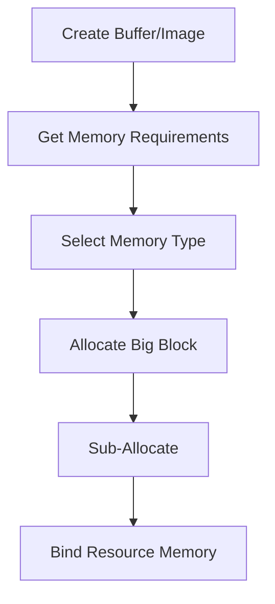
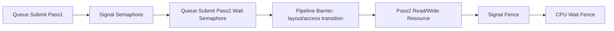
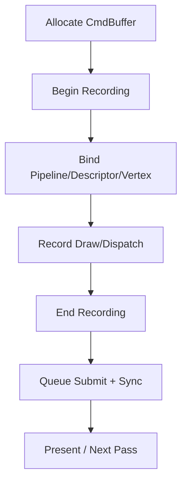

# 图形学基础：2.10 Vulkan/OpenGL/DX

本文覆盖 `面经题目分类汇总.md` 中图形学基础的 `2.10 Vulkan/OpenGL/DX` 全部题目。
每个题目包含：标准准确的说法、通俗易懂的理解、面试回答简版模板、难点深挖。

---

## 题目：Vulkan和OpenGL的区别？

### 标准准确的说法
- OpenGL 是高层状态机风格 API，驱动负责大量隐式管理与优化。
- Vulkan 是低层显式 API，应用侧负责更多资源、同步和命令组织。
- Vulkan 典型特征：
- 显式同步（barrier/semaphore/fence）。
- 显式内存管理（分配/绑定/子分配）。
- 命令缓冲预录制和多线程提交友好。
- 对比结果：
- OpenGL 上手快，开发效率高。
- Vulkan 可预测性和可扩展性更强，适合高性能引擎架构。

### 通俗易懂的理解
- OpenGL 像“自动挡”，Vulkan 像“手动挡”。Vulkan更难开，但能更精细控制性能。

### 面试回答简版模板
`OpenGL偏易用和隐式管理，Vulkan偏显式和可控。Vulkan把驱动隐式成本前移到引擎侧，换来更稳定的多线程和高性能上限。`

### 难点深挖
- 高频追问：为什么 Vulkan 项目初期开发效率常低于 OpenGL。
- 因为需要先搭建抽象层（资源管理、同步框架、命令系统），前期工程投入大。

---

## 题目：Vulkan的内存管理？

### 标准准确的说法
- Vulkan 中资源（Buffer/Image）与内存对象（`VkDeviceMemory`）分离。
- 常见流程：
- 创建资源对象，查询内存需求（size/alignment/typeBits）。
- 选择合适内存类型（设备本地、主机可见等）。
- 分配并绑定内存。
- 工程实践通常不会“每资源独立分配”，而是用大块内存子分配器（buddy/slab/linear）降低碎片和系统调用开销。
- 现代项目常用 VMA（Vulkan Memory Allocator）统一管理，减少底层样板代码。

### 通俗易懂的理解
- Vulkan 里“资源对象”和“内存块”是分开的。你要自己决定把哪些资源放进哪块内存。

### 面试回答简版模板
`Vulkan内存管理是显式的：资源创建后要自己选内存类型并绑定。工程上通常通过子分配器或VMA做统一管理，平衡性能和碎片。`

### 难点深挖

- 追问：为什么 staging buffer 常见？
- 因为设备本地显存快但 CPU 不可见，上传数据需走主机可见 staging 中转。

---

## 题目：Vulkan的同步机制？(Fence/Semaphore/Barrier)

### 标准准确的说法
- Vulkan 同步分两类：
- 队列间/提交间同步：`Semaphore`（GPU-GPU）。
- CPU-GPU 同步：`Fence`（CPU 等 GPU）。
- 资源可见性与执行顺序控制：`Pipeline Barrier`（含 stage mask、access mask、layout transition）。
- 常见语义：
- Binary semaphore：简单信号。
- Timeline semaphore：用递增值表达跨帧依赖，更适合复杂调度。
- 错误同步会导致数据竞态、图像撕裂、随机闪烁或隐藏死等。

### 通俗易懂的理解
- Fence 管“CPU什么时候能继续”。
- Semaphore 管“GPU任务先后关系”。
- Barrier 管“资源什么时候可读可写、处于什么布局”。

### 面试回答简版模板
`Vulkan同步要分清三层：Fence做CPU-GPU，Semaphore做提交依赖，Barrier做资源可见性和布局转换。问题通常不是API不会用，而是依赖关系建模不完整。`

### 难点深挖

- 高频追问：为什么“看起来没报错但偶发花屏”？
- 因为同步错误常是数据竞争，属于时序问题，不一定稳定复现。

---

## 题目：VBO和VAO的区别？

### 标准准确的说法
- VBO（Vertex Buffer Object）存储顶点数据。
- VAO（Vertex Array Object）记录顶点输入状态配置：
- 各 attribute 的格式、偏移、步长。
- attribute 到 buffer 的绑定关系。
- VAO 本身通常不存几何数据，而是“如何解释 VBO 数据”的配置快照。

### 通俗易懂的理解
- VBO 是“数据仓库”，VAO 是“读取说明书”。

### 面试回答简版模板
`VBO负责存顶点数据，VAO负责记录顶点布局和绑定关系。切换VAO等于快速切换一套顶点输入配置。`

### 难点深挖
- 追问：为什么错误的 stride/offset 会导致模型“炸点”。
- 因为 GPU 按错误布局解码二进制数据。

---

## 题目：Vulkan中Buffer和Image的区别？

### 标准准确的说法
- Buffer：线性地址空间，适合顶点、索引、常量、结构化数据等。
- Image：具有维度和格式语义（1D/2D/3D、mip、array、layout），适合纹理与渲染目标。
- Image 常需要布局转换（layout transition）以匹配不同 pipeline 使用场景。
- Buffer 通常强调字节寻址；Image 强调采样、过滤和像素格式语义。

### 通俗易懂的理解
- Buffer 像“原始内存条”，Image 像“有像素规则的图像资源”。

### 面试回答简版模板
`Buffer偏线性数据容器，Image偏纹理/像素语义资源。Image需要布局管理，Buffer主要关注访问阶段和对齐。`

### 难点深挖
- 追问：为什么有些中间结果会写 Buffer 而不是 Image。
- Compute 阶段结构化写入和随机访问时，Buffer 更灵活。

---

## 题目：Vulkan的RenderPass概念？

### 标准准确的说法
- RenderPass 描述一组子通道（subpass）及 attachment 的读写关系、加载存储策略、布局过渡。
- 核心价值：给驱动提供更完整渲染意图，利于 tile-based GPU 做带宽优化。
- 典型要素：
- Color/Depth attachment 描述。
- Subpass 依赖关系。
- LoadOp/StoreOp（Load/Clear/DontCare）。
- 现代 Vulkan 也有 dynamic rendering 路径，但 RenderPass 思想仍是理解基础。

### 通俗易懂的理解
- RenderPass 是“这几步渲染怎么串起来、附件怎么流转”的施工计划书。

### 面试回答简版模板
`RenderPass用于声明附件生命周期和子通道依赖，帮助驱动做更高效调度。即便使用dynamic rendering，也要理解其背后的attachment流转和依赖模型。`

### 难点深挖
- 追问：为什么移动端常强调 subpass 优化？
- 因为可减少对外部内存的读写，利用片上缓存提升带宽效率。

---

## 题目：CommandBuffer的使用流程？

### 标准准确的说法
- 常见流程：
- 从 CommandPool 分配 CommandBuffer。
- `Begin` 录制，绑定 pipeline/descriptor/vertex/index 等。
- 记录 draw/dispatch 命令。
- `End` 完成录制。
- 提交到队列执行，并结合同步原语组织依赖。
- 可使用 primary/secondary command buffer 分工，提升多线程录制效率。

### 通俗易懂的理解
- 先把“要做什么”写进命令本，再一次性交给 GPU 执行。

### 面试回答简版模板
`CommandBuffer是Vulkan提交模型核心：先录制再提交。引擎常用多线程录制secondary CB，主线程聚合提交并配套同步。`

### 难点深挖

- 追问：为什么“频繁 reset pool”可能影响性能。
- 会影响命令分配复用策略与驱动内部管理成本。

---

## 题目：描述符(Descriptor)的作用？

### 标准准确的说法
- Descriptor 用于把 shader 访问资源（UBO、SSBO、Sampler、Image 等）与实际 GPU 资源绑定。
- Vulkan 通过 descriptor set layout + pipeline layout 固化绑定接口。
- 运行时更新 descriptor set，把具体资源句柄写入。
- 现代扩展如 descriptor indexing 支持更灵活资源数组和 bindless 风格。

### 通俗易懂的理解
- 描述符就是 shader 拿资源的“地址簿”。

### 面试回答简版模板
`Descriptor是shader资源绑定机制核心。它把代码里的binding槽位映射到真实Buffer/Image，是Vulkan资源系统的关键接口层。`

### 难点深挖
- 追问：为什么 descriptor set 设计会影响性能和可维护性。
- 因为它直接决定资源更新频率、绑定粒度和 pipeline 兼容性。

---

## 题目：DX12和OpenGL的区别？

### 标准准确的说法
- DX12 与 Vulkan 类似，属于低层显式 API；OpenGL 仍偏高层状态机。
- DX12 强调命令队列、根签名、描述符堆、资源状态转换等显式控制。
- OpenGL 由驱动做更多隐式工作，开发快但可预测性和多线程扩展性受限。
- 实务中常通过渲染抽象层统一 DX12/Vulkan/Metal，不直接把业务绑定单 API。

### 通俗易懂的理解
- DX12 和 Vulkan 是“引擎工程化路线”，OpenGL 更像“教学和快速原型路线”。

### 面试回答简版模板
`DX12和Vulkan都走显式控制路线，性能上限与可预测性更强；OpenGL易上手但隐式开销大。商业引擎通常做跨API抽象而非强绑定单平台。`

### 难点深挖
- 追问：为什么很多团队不直接维护“纯DX12版逻辑”。
- 因为跨平台需求和长期维护成本通常要求 API 抽象层。
