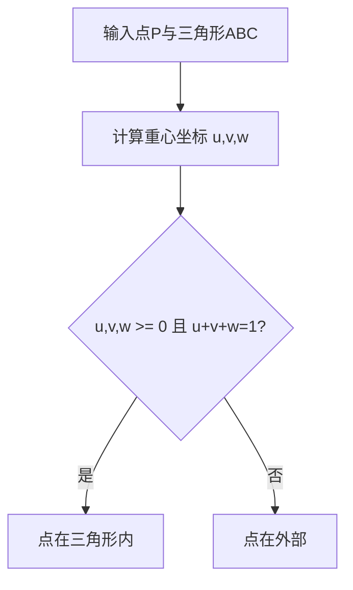
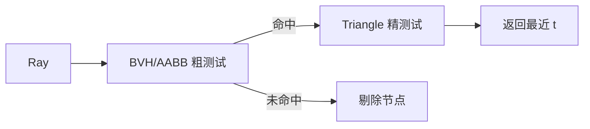

# 图形学基础：2.12 数学基础

本文覆盖 `面经题目分类汇总.md` 中图形学基础的 `2.12 数学基础` 全部题目。
每个题目包含：标准准确的说法、通俗易懂的理解、面试回答简版模板、难点深挖。

---

## 题目：如何判断点在三角形内？

### 标准准确的说法
- 常见判定方法：
- 重心坐标法：求点对三角形的重心坐标 `(u,v,w)`，若都在 `[0,1]` 且和为 1，则在内（含边界）。
- 同向叉积法：点与三条边形成的叉积符号一致则在内。
- 面积法：三个子三角形面积和等于原三角形面积（数值稳定性较差）。
- 图形学与碰撞系统中通常优先重心坐标或边函数，兼顾效率和可插值能力。

### 通俗易懂的理解
- 把三角形看成三条边围起来的区域，点在内部时，对这三条边的“方向关系”是一致的。

### 面试回答简版模板
`工程里我常用重心坐标或边函数判断点在三角形内：坐标都非负且和为1即在内，同时还能直接用于属性插值。`

### 难点深挖

- 追问：浮点误差怎么处理？
- 常用 `epsilon` 容差，避免边界点误判。

---

## 题目：已知法线和入射向量求反射向量？

### 标准准确的说法
- 设入射方向为 `I`（指向表面），法线为单位向量 `N`。
- 反射向量公式：`R = I - 2 * dot(I, N) * N`。
- 使用前应确保 `N`（必要时 `I`）归一化，否则反射方向误差会放大。

### 通俗易懂的理解
- 就像镜面反射：沿法线方向“翻折”入射向量。

### 面试回答简版模板
`反射向量公式是 R=I-2*(I·N)*N，关键前提是法线归一化。这个公式在高光、反射、SSR方向计算都常用。`

### 难点深挖
- 追问：折射向量怎么求？
- 可引到 Snell 定律和 `refract` 函数，顺便说明全反射条件。

---

## 题目：射线与球体/AABB/三角形求交？

### 标准准确的说法
- 射线表示：`P(t) = O + tD, t>=0`。
- 射线-球：代入球方程得到一元二次，判别式决定是否命中。
- 射线-AABB：常用 slab 法，计算 x/y/z 三轴 `tmin/tmax` 区间求交。
- 射线-三角形：常用 Moller-Trumbore，直接求 `t,u,v`，要求 `u,v>=0` 且 `u+v<=1`。
- 三者常组合用于 BVH traversal 与拾取系统。

### 通俗易懂的理解
- 本质是在问：沿射线往前走，什么时候第一次碰到目标几何体。

### 面试回答简版模板
`球体交点用二次方程，AABB用slab区间，三角形常用Moller-Trumbore解t/u/v。工程里一般先BVH+AABB粗筛，再精确到三角形。`

### 难点深挖

- 追问：为什么要先 AABB 再 triangle。
- 因为 AABB 测试更便宜，能大幅减少精测试次数。

---

## 题目：欧拉角有什么问题？四元数如何解决？

### 标准准确的说法
- 欧拉角问题：
- 万向节锁（Gimbal Lock），某些角度自由度退化。
- 插值不平滑，路径依赖和速度不均匀。
- 四元数优势：
- 紧凑表达旋转，避免万向节锁。
- 可用 slerp 做平滑球面插值。
- 注意四元数用于旋转组合方便，但显示/编辑层常仍以欧拉角交互。

### 通俗易懂的理解
- 欧拉角像“按固定顺序拧三个轴”，某些姿态会轴重合；四元数像更稳定的旋转坐标表示。

### 面试回答简版模板
`欧拉角直观但有万向节锁和插值问题，四元数能稳定表示旋转并支持平滑slerp。实际工程常用欧拉输入、四元数计算。`

### 难点深挖
- 追问：四元数插值为何常选 slerp 而非 lerp。
- slerp 保持单位球面路径和角速度更合理。

---

## 题目：点到线段/三角形的距离？

### 标准准确的说法
- 点到线段距离：
- 先把点投影到线段方向，得到参数 `t`。
- 将 `t` clamp 到 `[0,1]`，求最近点再算欧氏距离。
- 点到三角形距离：
- 先投影到三角形平面并判断是否在内。
- 在内：距离是到平面的垂距。
- 在外：取到三条边线段距离最小值。
- 碰撞检测和 SDF 生成中都很常见。

### 通俗易懂的理解
- 先找“最近点”再求距离，关键是最近点可能在线段内部也可能在端点。

### 面试回答简版模板
`距离问题统一套路是“先求最近点再算长度”：线段用投影+clamp，三角形先判投影点是否在内，不在则退化为边距离最小值。`

### 难点深挖
- 追问：为何这题常考？
- 它体现你是否能把几何问题转成“投影 + 区域分类”。

---

## 题目：重心坐标怎么计算？

### 标准准确的说法
- 对三角形 `A,B,C` 和点 `P`，可写 `P = uA + vB + wC`，且 `u+v+w=1`。
- 可通过向量点积解线性方程，或通过子三角形面积比计算。
- 重心坐标不仅用于“点在三角形内判断”，还用于插值（UV、法线、颜色等）。

### 通俗易懂的理解
- 重心坐标就是“P由三个顶点按多少比例混合出来”。

### 面试回答简版模板
`重心坐标把点表示成三个顶点的线性组合，权重和为1。它既可做inside test，也可做属性插值，是渲染和几何计算的基础工具。`

### 难点深挖
- 追问：透视投影下直接线性插值为什么不对。
- 因为需做透视矫正，不能直接在屏幕空间线性混。

---

## 题目：透视矫正插值的原理？

### 标准准确的说法
- 透视投影后，屏幕空间插值并不保持线性深度关系。
- 正确做法是先对属性做 `attr/w` 插值，同时插值 `1/w`，最后恢复：
- `attr = (interpolate(attr/w)) / (interpolate(1/w))`
- 这就是 perspective-correct interpolation，避免纹理扭曲与接缝错误。

### 通俗易懂的理解
- 先把属性“除以透视因子再插值”，最后再乘回来，才能保证远近透视下纹理不漂移。

### 面试回答简版模板
`透视矫正核心是插值 attr/w 和 1/w，再做除法恢复attr，避免屏幕空间直接线性插值带来的透视失真。`

### 难点深挖
```mermaid
flowchart TD
  A[顶点属性 attr 与 w] --> B[插值 attr/w]
  A --> C[插值 1/w]
  B --> D[重建 attr = (attr/w)/(1/w)]
  D --> E[正确透视插值结果]
```
- 高频追问：为什么法线插值后还要归一化。
- 因为插值会破坏单位长度，需恢复才能正确参与光照。

---

## 题目：凸包算法？

### 标准准确的说法
- 凸包是包含点集的最小凸多边形/多面体边界。
- 常见 2D 算法：
- Graham Scan：按极角排序后用栈维护转向。
- Monotone Chain：按字典序排序构造上下壳，工程实现常用。
- 复杂度典型为 `O(n log n)`（排序主导）。
- 应用：碰撞包围、路径规划、几何预处理。

### 通俗易懂的理解
- 想象用橡皮筋套住一堆点，松手后橡皮筋形成的边界就是凸包。

### 面试回答简版模板
`2D凸包常用Monotone Chain或Graham Scan，核心是排序+转向判定，复杂度O(n log n)。`

### 难点深挖
- 追问：共线点怎么处理？
- 取决于需求，可能保留边界共线点，也可能只保留端点。

---

## 题目：法线矩阵是什么？

### 标准准确的说法
- 法线矩阵通常指模型矩阵线性部分的逆转置：
- `Nmat = transpose(inverse(M3x3))`
- 作用是把法线正确变换到目标空间，尤其在存在非均匀缩放时避免法线方向错误。
- 若仅有纯旋转（或均匀缩放可配合归一化），可简化处理。

### 通俗易懂的理解
- 顶点能直接乘模型矩阵，但法线不行；非均匀缩放会把法线“拉歪”，所以要用逆转置专门修正。

### 面试回答简版模板
`法线矩阵是模型矩阵3x3线性部分的逆转置，用于正确变换法线。特别在非均匀缩放下，这是保证光照正确的关键。`

### 难点深挖
- 高频追问：为什么不用 `M` 直接变换法线。
- 因为法线是几何面约束方向，不是普通位置向量，变换规则不同。
