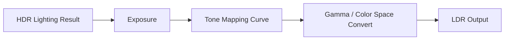
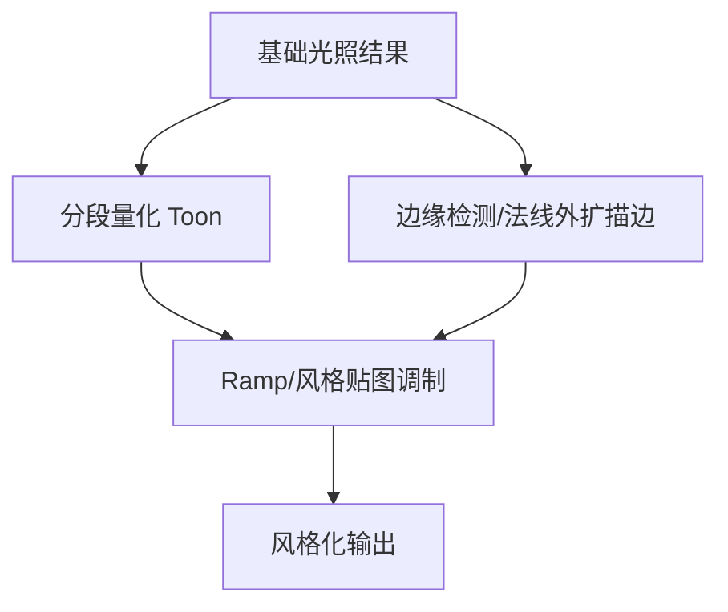

# 图形学基础：2.13 其他图形学

本文覆盖 `面经题目分类汇总.md` 中图形学基础的 `2.13 其他图形学` 全部题目。
每个题目包含：标准准确的说法、通俗易懂的理解、面试回答简版模板、难点深挖。

---

## 题目：HDR和LDR是什么？

### 标准准确的说法
- LDR（Low Dynamic Range）通常把颜色限制在较窄范围（如 8bit [0,1] 映射）。
- HDR（High Dynamic Range）允许更高亮度范围和精度（如 float/half float 渲染目标）。
- 实时渲染常在 HDR 空间完成光照累加，最后经 tone mapping 压到显示设备可显示范围。

### 通俗易懂的理解
- HDR 像“更大亮度容器”，能装下太阳高光和暗部细节；LDR 容器小，容易高光溢出或暗部死黑。

### 面试回答简版模板
`HDR提供更大亮度动态范围，适合物理光照累积；最终要通过tone mapping输出到LDR显示设备。`

### 难点深挖
- 追问：仅用 HDR 缓冲不做 tone mapping 会怎样？
- 最终显示仍会被截断或失真，必须做映射和曝光控制。

---

## 题目：色调映射(Tone Mapping)是什么？

### 标准准确的说法
- Tone Mapping 将 HDR 颜色映射到显示器可表示范围，目标是保留主观视觉层次。
- 常见曲线：Reinhard、ACES 近似、Filmic 等。
- 通常还结合曝光（auto exposure）动态调整全局亮度。
- Tone mapping 后再做 gamma/色彩空间变换输出。

### 通俗易懂的理解
- 就像把超亮场景“压缩”进屏幕能显示的亮度区间，同时尽量看起来自然。

### 面试回答简版模板
`Tone Mapping是HDR到显示范围的非线性映射，常配合曝光控制。它决定了高光保留、对比度和整体观感。`

### 难点深挖

- 追问：为什么同样光照不同 tone curve 风格差异大。
- 因为高光压缩和中灰对比区间定义不同。

---

## 题目：Gamma校正是什么？为什么需要？

### 标准准确的说法
- 显示设备亮度响应通常非线性，近似幂函数关系。
- 纹理和颜色在 sRGB 空间存储时，线性光照计算前应转线性空间；输出到屏幕前再编码回 sRGB。
- 若忽略 gamma 流程，会导致亮度混合错误（偏暗或偏灰）。

### 通俗易懂的理解
- 光照计算要在“线性数学世界”做，显示给人看前再转到屏幕习惯的非线性空间。

### 面试回答简版模板
`Gamma校正确保“线性空间做计算，显示空间做输出”。不做会让光照和混合结果失真。`

### 难点深挖
- 追问：最常见错误是什么？
- sRGB 纹理重复解码或漏解码，导致颜色全流程不一致。

---

## 题目：Bloom效果的实现？

### 标准准确的说法
- Bloom 模拟亮部光晕扩散，常见流程：
- 提取高亮区域（threshold）。
- 多级降采样与模糊（高斯/Kawase）。
- 上采样叠加回原图（常含强度控制）。
- Bloom 与 HDR 搭配更自然，LDR 下容易“发灰”。

### 通俗易懂的理解
- 把特别亮的部分“扩散一点光晕”再加回去，画面会更有亮部氛围。

### 面试回答简版模板
`Bloom一般是高亮提取 + 多级模糊 + 回叠，和HDR配合效果更好。关键是阈值和强度控制，避免全屏发雾。`

### 难点深挖
- 追问：为什么常做多级金字塔而不是单次大核模糊。
- 多级更高效，且能更自然地覆盖不同尺度光晕。

---

## 题目：双缓冲和垂直同步？

### 标准准确的说法
- 双缓冲：前缓冲用于显示，后缓冲用于渲染，交换后展示新帧。
- 垂直同步（VSync）：让交换缓冲与显示器刷新节奏对齐，减少 tearing。
- 代价：可能增加输入延迟；帧率不稳定时可能出现卡顿节奏问题。
- 常见扩展：三缓冲、可变刷新率（G-Sync/FreeSync）缓解矛盾。

### 通俗易懂的理解
- 双缓冲避免“边画边看”的撕裂；VSync 让换帧踩准屏幕节拍，但有时会牺牲响应速度。

### 面试回答简版模板
`双缓冲解决显示一致性，VSync减少撕裂但可能增加延迟。实际常结合三缓冲或VRR在画质和响应间折中。`

### 难点深挖
- 追问：为什么关闭 VSync 也可能看起来更“丝滑”但有撕裂。
- 因为低延迟带来主观响应提升，但显示不同步导致画面断裂。

---

## 题目：蒙特卡洛积分的原理？

### 标准准确的说法
- 蒙特卡洛积分用随机采样估计积分：
- `Integral(f) ≈ (1/N) * Σ f(x_i)/p(x_i)`
- 无偏性依赖正确采样分布 `p(x)` 与权重补偿。
- 收敛率通常是 `O(1/sqrt(N))`，样本数上升后噪声下降较慢。
- 路径追踪、IBL 预积分和采样型 GI 都以此为核心。

### 通俗易懂的理解
- 算不动的积分就“随机抽样平均”，样本越多越接近真实值。

### 面试回答简版模板
`蒙特卡洛积分通过随机采样估计复杂积分，核心是样本按概率分布采样并做1/p补偿。图形学中的路径追踪和很多GI近似都基于它。`

### 难点深挖
- 追问：为什么同样样本数噪声差异很大？
- 因为采样分布是否匹配目标函数（重要性采样）决定方差大小。

---

## 题目：重要性采样的理解？

### 标准准确的说法
- 重要性采样是让采样分布 `p(x)` 更贴近被积函数高贡献区域，降低方差。
- 在渲染中常按 BRDF、光源分布或可见性做采样分配。
- 常与 MIS（Multiple Importance Sampling）结合，平衡多种采样策略。

### 通俗易懂的理解
- 把采样预算更多花在“贡献大的地方”，比均匀乱采更省样本。

### 面试回答简版模板
`重要性采样通过让采样分布贴近高贡献区域来降噪提效，现代路径采样常配合MIS进一步稳定方差。`

### 难点深挖
- 追问：为什么“只采最亮光源”有时反而偏差大。
- 因为忽略其他贡献路径会导致估计不稳定或偏置风险，需要平衡策略。

---

## 题目：TBR和TBDR的了解？

### 标准准确的说法
- TBR（Tile-Based Rendering）把屏幕划分 tile 组织渲染。
- TBDR（Tile-Based Deferred Rendering）常先对图元做 tile 分桶，再在 tile 内进行延后处理，减少外部带宽访问。
- 移动 GPU 常见 TBDR 架构，优势是功耗和带宽效率。
- 设计含义：渲染路径要尽量利用 tile 局部性，避免无谓中间写回。

### 通俗易懂的理解
- 把屏幕切成小块逐块算，尽量在片上把事情做完，少访问外部显存。

### 面试回答简版模板
`移动端常见TBDR，通过tile局部处理降低带宽和功耗。渲染管线设计要适配这种“片上优先”的硬件特点。`

### 难点深挖
- 追问：为什么某些桌面思路直接搬到移动端会掉帧。
- 因为带宽模型不同，移动端对中间缓冲读写更敏感。

---

## 题目：流体模拟/粒子系统的了解？

### 标准准确的说法
- 粒子系统通常由发射、更新、渲染三阶段组成。
- 更新可在 CPU 或 GPU（Compute）执行，GPU 方案更适合大规模粒子。
- 流体模拟常见方法：
- 网格法（Eulerian，例如 Stable Fluids）。
- 粒子法（Lagrangian，例如 SPH）。
- 实时项目多采用近似与艺术可控方案，强调视觉稳定和可调参。

### 通俗易懂的理解
- 粒子是“很多小点按规则运动”，流体是“让这些点或网格满足流动规律”。

### 面试回答简版模板
`实时特效里粒子系统常用GPU并行更新；流体可用网格法或粒子法近似。工程上更看重稳定性和可控性，不追求离线级精确。`

### 难点深挖
- 追问：为什么特效团队常用“假流体”而非全物理。
- 因为预算有限且艺术目标优先，近似方案性价比更高。

---

## 题目：NPR/卡通渲染的方法？

### 标准准确的说法
- NPR（Non-Photorealistic Rendering）目标是风格化而非真实感。
- 常见卡通渲染技术：
- Toon shading（分段光照）。
- 描边（法线外扩、后处理边缘检测）。
- Ramp 纹理控制明暗层次。
- 手绘噪声、半色调、笔触贴图等风格增强。
- 关键在“稳定风格一致性”，而非物理准确。

### 通俗易懂的理解
- 卡通渲染是“故意不真实”，强调可辨识的艺术风格和线条层次。

### 面试回答简版模板
`NPR核心是风格表达，常用Toon分段光照+描边+Ramp纹理。工程重点是风格统一和时序稳定，而不是物理逼真。`

### 难点深挖

- 追问：为什么卡通描边容易抖动？
- 因为边缘检测对深度/法线噪声敏感，需要时域稳定与阈值调优。
