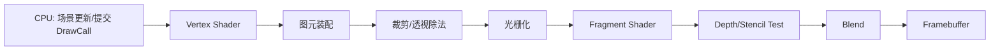
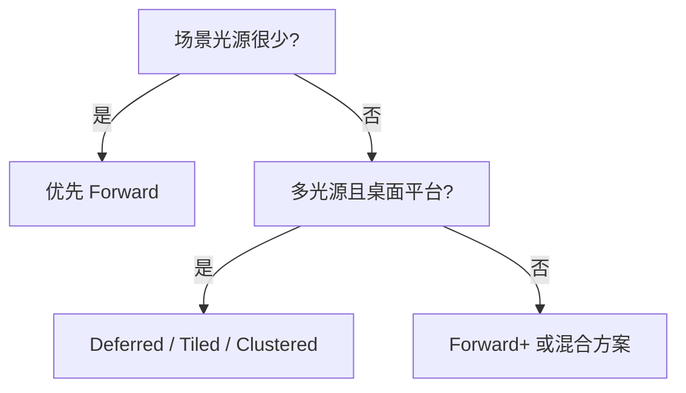

# 图形学基础：2.1 渲染管线

本文覆盖 `面经题目分类汇总.md` 中图形学基础的 `2.1 渲染管线` 全部题目。
每个题目包含：标准准确的说法、通俗易懂的理解、面试回答简版模板、难点深挖。

---

## 题目：介绍一下GPU渲染管线

### 标准准确的说法
- 现代实时渲染管线核心阶段可概括为：
- 应用阶段（CPU 侧准备场景、命令、资源）。
- 顶点处理（Vertex Shader）。
- 图元装配与裁剪。
- 光栅化（把图元离散为片元）。
- 片元处理（Fragment/Pixel Shader）。
- 深度/模板/混合与写回（ROP）。
- 可编程部分主要是 VS/GS/TS/FS（含 Compute 旁路），固定功能部分包括光栅化和 ROP 等。

### 通俗易懂的理解
- CPU 像导演发拍摄计划，GPU 按流水线把“几何体”一步步变成“屏幕像素”。

### 面试回答简版模板
`GPU 渲染管线是把模型数据变成屏幕像素的流水线：CPU 提交命令，GPU 做顶点处理、装配裁剪、光栅化、片元着色和输出合成；可编程阶段决定画面效果，固定阶段保证高吞吐执行。`

### 难点深挖

- 追问常见点：瓶颈在 CPU（DrawCall 太多）还是 GPU（像素着色过重、带宽不足）。

---

## 题目：前向渲染和延迟渲染的区别？各自的优劣？

### 标准准确的说法
- 前向渲染（Forward）：几何阶段直接做光照，通常每个物体按材质逐像素累加光照。
- 延迟渲染（Deferred）：先写 G-Buffer（法线、深度、材质参数等），再在屏幕空间做光照合成。
- 前向优点：流程简单、透明支持自然、带宽压力相对小。
- 前向缺点：多光源时着色成本高。
- 延迟优点：多光源扩展性强、光照和材质解耦。
- 延迟缺点：G-Buffer 带宽与显存开销大，MSAA 成本高，透明处理复杂。

### 通俗易懂的理解
- 前向是“边画物体边算光”。
- 延迟是“先把几何信息记账，再统一算灯光”。

### 面试回答简版模板
`前向渲染简单、透明友好；延迟渲染适合多光源但吃带宽和显存。项目里一般按目标平台和光源复杂度选择，移动端常用前向或Forward+。`

### 难点深挖
- 追问落点：为什么延迟在移动端吃亏？
- 核心是 tile 带宽、MRT 写入与读取成本、以及功耗约束。

---

## 题目：延迟渲染怎么处理透明物体？

### 标准准确的说法
- 传统延迟渲染对透明不友好，因为透明需要按顺序混合，且一个像素可能有多层。
- 常见做法是：
- 不透明物体走 Deferred（写 G-Buffer + 光照）。
- 透明物体单独走 Forward pass，按从远到近排序混合。
- 进阶方案包括 OIT（Order-Independent Transparency），如 Weighted Blended OIT、A-Buffer。

### 通俗易懂的理解
- 延迟像“先记账再统一结算”，透明却要求“按先后顺序一层层叠”，两者天然冲突。

### 面试回答简版模板
`工程上通常采用混合管线：不透明 Deferred，透明 Forward；若透明层复杂再考虑 OIT。`

### 难点深挖
- 面试官常追问“为什么不能全放 G-Buffer”：
- 单像素多层透明无法用单层 G-Buffer 表达。
- 排序与混合顺序决定视觉正确性。

---

## 题目：顶点着色器到片元着色器的数据处理过程？

### 标准准确的说法
- VS 输出的顶点属性（位置、法线、UV 等）经图元装配后进入光栅化。
- 光栅化阶段在屏幕空间对属性做插值，生成片元输入。
- 片元着色器得到插值后的属性，再结合纹理/光照计算最终颜色。
- 透视投影下插值需做透视校正（perspective-correct interpolation）。

### 通俗易懂的理解
- VS 是给每个顶点打标签，光栅化负责把标签在三角形内部“平滑铺开”，FS 再按每个像素做最终着色。

### 面试回答简版模板
`VS 处理逐顶点数据，光栅化把顶点属性插值到片元，FS 做逐像素着色；关键是插值和透视校正。`

### 难点深挖
- 追问关键词：`SV_Position/gl_Position`、`varying`、透视矫正插值。

---

## 题目：光栅化的定义与作用？算法有哪些？

### 标准准确的说法
- 光栅化是把连续几何图元离散成像素/片元的过程。
- 目标是确定哪些像素被图元覆盖，并生成插值属性用于后续着色。
- 常见判定思路：边函数（edge function）、重心坐标、扫描线等。
- 现代 GPU 采用高度并行硬件光栅化管线，强调吞吐与一致性。

### 通俗易懂的理解
- 本质是“把数学三角形涂到屏幕网格上”。

### 面试回答简版模板
`光栅化负责把图元映射到像素并产生插值输入，常见数学工具是边函数和重心坐标。`

### 难点深挖
- 追问点：Top-left 规则、子像素精度、覆盖测试一致性。

---

## 题目：顶点着色器和片元着色器各自的作用？

### 标准准确的说法
- 顶点着色器：逐顶点执行，主要做坐标变换、骨骼蒙皮、顶点属性准备。
- 片元着色器：逐片元执行，主要做材质采样、光照计算、后处理局部逻辑。
- 二者执行频率不同：片元数量通常远大于顶点数量，FS 往往更容易成为性能瓶颈。

### 通俗易懂的理解
- VS 负责“摆形状”，FS 负责“上颜色和质感”。

### 面试回答简版模板
`VS 决定几何和插值输入，FS 决定像素外观；性能优化通常优先关注高开销 FS。`

### 难点深挖
- 高频追问：为什么“降低过度绘制”和“简化片元着色”常常收益更大。

---

## 题目：G-Buffer存储什么内容？格式是什么？

### 标准准确的说法
- G-Buffer 常存：法线、深度（或可重建深度）、反照率、金属度、粗糙度、AO、材质ID 等。
- 格式选型取决于精度/带宽平衡：
- 法线可用 `RGB10A2` 或八面体编码压缩。
- 颜色常用 `RGBA8` 或 HDR 格式。
- 材质参数可打包到多个通道减少 MRT 数量。

### 通俗易懂的理解
- G-Buffer 是“每个像素的几何与材质小档案”。

### 面试回答简版模板
`G-Buffer 记录后续光照所需的几何+材质信息，格式设计本质是精度与带宽的权衡。`

### 难点深挖
- 追问方向：带宽优化手段（通道打包、法线编码、深度重建）。

---

## 题目：deferred shading和deferred lighting的区别？

### 标准准确的说法
- Deferred Shading：在屏幕空间结合 G-Buffer 做完整光照与材质计算。
- Deferred Lighting（有时叫 light pre-pass）：先计算光照项，再在后续 pass 结合材质。
- Deferred Lighting 可降低部分 G-Buffer 材质信息存储压力，但 pass 结构更复杂。

### 通俗易懂的理解
- 一个是“光照+材质一次结算”，一个是“先算灯，再套材质”。

### 面试回答简版模板
`Deferred lighting 把光照与材质进一步解耦，可能减轻 G-Buffer 压力，但整体流程更复杂。`

### 难点深挖
- 追问落点：为什么现在项目中更常见的是 Deferred + Tiled/Clustered 的组合。

---

## 题目：延迟渲染在移动端的劣势？

### 标准准确的说法
- 移动端对带宽和功耗极敏感，延迟渲染的 MRT 写入/读取开销重。
- MSAA 与延迟的组合成本高，透明和后处理叠加后成本更明显。
- Tile-based GPU 架构下，Forward/Forward+ 在很多场景更高效。

### 通俗易懂的理解
- 手机平台最怕“内存来回搬运太多数据”，而延迟正是带宽大户。

### 面试回答简版模板
`移动端延迟渲染主要输在带宽和功耗，常改用 Forward+ 或混合渲染降低成本。`

### 难点深挖
- 追问关键词：TBDR、带宽、功耗、热限制。

---

## 题目：几何着色器的作用？

### 标准准确的说法
- 几何着色器（GS）位于顶点后、光栅化前，可对图元进行放大、裁剪、生成新图元。
- 适合某些特效或可视化任务，但在很多平台上吞吐和可扩展性一般。
- 实务中常被 Compute Shader 或实例化方案替代。

### 通俗易懂的理解
- GS 像“图元加工站”，能改图元形态，但性能不一定划算。

### 面试回答简版模板
`GS 能做图元级扩展，但常见问题是吞吐不高；工程里会评估是否改用 compute 或实例化替代。`

### 难点深挖
- 追问：为什么现代引擎不重度依赖 GS。

---

## 题目：可编程管线分几个阶段？

### 标准准确的说法
- 常见可编程阶段：VS、TCS/TES（可选）、GS（可选）、FS。
- 现代 API 还常用 Compute Shader 走图形旁路计算。
- 不同 API 术语略有差异（Vertex/Pixel、Fragment 等），但语义一致。

### 通俗易懂的理解
- 可编程阶段就是“你能写 shader 代码控制行为的环节”。

### 面试回答简版模板
`基础可编程阶段是 VS 和 FS；曲面细分与几何阶段可选，现代项目大量结合 Compute 做混合流水线。`

### 难点深挖
- 追问建议答法：按“是否必须 + 实际项目使用比例”回答，不要机械背阶段名。
