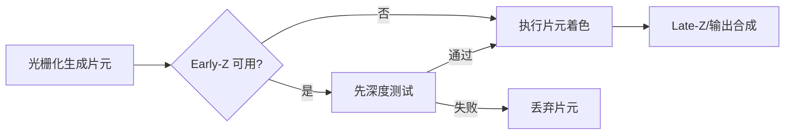
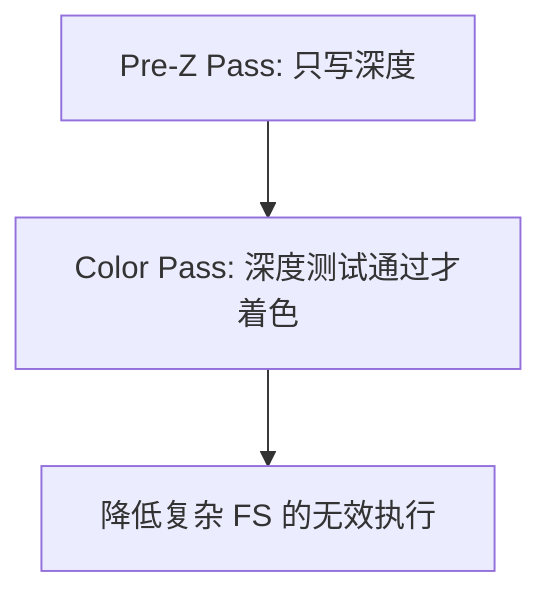

# 图形学基础：2.2 深度测试与Early-Z

本文覆盖 `面经题目分类汇总.md` 中图形学基础的 `2.2 深度测试与Early-Z` 全部题目。
每个题目包含：标准准确的说法、通俗易懂的理解、面试回答简版模板、难点深挖。

---

## 题目：Early-Z是什么？有什么优劣？

### 标准准确的说法
- Early-Z 指在片元着色前尽早做深度测试，尽量剔除被遮挡片元，减少无效 FS 开销。
- 优点：降低 overdraw 成本，提升像素阶段性能。
- 限制：需要满足一定条件（不能有会改变深度/覆盖关系的操作）。

### 通俗易懂的理解
- 先判断“这个像素会不会被挡住”，挡住就不算颜色，省时间。

### 面试回答简版模板
`Early-Z 是把深度测试前置，核心价值是减少无效片元着色；收益取决于 overdraw 和 shader 成本。`

### 难点深挖

---

## 题目：Early-Z失效的情况有哪些？

### 标准准确的说法
- 常见失效或收益降低场景：
- Shader 中 `discard/alpha test` 导致覆盖关系不确定。
- 写 `gl_FragDepth/SV_Depth` 改写深度值。
- 某些混合、顺序依赖操作使硬件无法提前确定可见性。
- 透明物体本身按混合流程通常无法依赖 Early-Z 获得同等收益。

### 通俗易懂的理解
- 只要片元阶段会“临时反悔”改覆盖或深度，GPU 就很难提前裁决。

### 面试回答简版模板
`Early-Z 失效核心是“深度可见性在片元着色前不可确定”，典型触发点是 discard、深度写和透明混合。`

### 难点深挖
- 追问建议：区分“完全失效”和“部分失效/收益下降”，不同硬件行为会有差异。

---

## 题目：Pre-Z Pass是什么？

### 标准准确的说法
- Pre-Z（Z-Prepass）通常先做一次深度预填充，只写深度不做重着色。
- 后续颜色 pass 可更充分利用 Early-Z，减少复杂材质 shader 的无效执行。
- 代价是多一次几何遍历，是否划算取决于场景 overdraw 与 shader 复杂度。

### 通俗易懂的理解
- 先打一层“深度草稿”，后面正式上色时就能跳过很多被挡住像素。

### 面试回答简版模板
`Pre-Z 是“先写深度、后着色”的两阶段策略，适合 overdraw 高且片元开销重的场景，但会增加额外 draw 成本。`

### 难点深挖

- 追问点：角色皮肤、复杂 PBR、透明对象通常如何单独处理。

---

## 题目：深度测试的过程？透明和非透明物体的渲染顺序？

### 标准准确的说法
- 深度测试比较当前片元深度与深度缓冲中的已有值，比较函数如 Less/LessEqual。
- 非透明物体通常前到后（Front-to-Back）渲染，提高早期深度剔除收益。
- 透明物体通常后到前（Back-to-Front）排序渲染，并关闭或限制深度写入，只做深度测试。

### 通俗易懂的理解
- 不透明先“占坑”，透明再按远近叠色，否则混合结果会错。

### 面试回答简版模板
`不透明优先前到后以提升 Early-Z，透明通常后到前并保留深度测试但关闭深度写，保证混合正确性。`

### 难点深挖
- 追问：透明排序为什么难？
- 因为对象级排序在交叉透明几何体时无法完美解决，需要 OIT 类方案补足。

---

## 题目：Z-Buffer的实现？深度精度问题如何解决？

### 标准准确的说法
- Z-Buffer 是每像素存深度值的缓冲区，通常用 24-bit 或 32-bit 深度格式。
- 透视投影下深度分布非线性，近处精度高、远处精度低。
- 深度精度优化常见手段：
- 合理设置 near/far（尤其避免 near 太小）。
- 反向 Z（Reversed-Z）+ 浮点深度。
- 分层渲染或 logarithmic depth（特定场景）。

### 通俗易懂的理解
- 深度精度像把尺子分格子：近处格子密、远处格子稀，远处容易“量不准”。

### 面试回答简版模板
`Z-Buffer 精度问题本质是透视下非线性分布；工程上首选优化 near/far，进阶可用 Reversed-Z 提升远距离精度。`

### 难点深挖
- 高频陷阱：把 near 设得过小会显著恶化整体深度精度。

---

## 题目：z-fighting怎么处理？

### 标准准确的说法
- z-fighting 常因两个表面深度非常接近，受精度限制在不同像素/帧发生竞争。
- 解决思路：
- 拉开几何间距或避免共面。
- 优化 near/far，提升可用深度精度。
- 使用 polygon offset（如 Decal 场景）。
- 进阶采用 Reversed-Z 或分层深度策略。

### 通俗易懂的理解
- 两层面几乎贴在一起时，深度缓冲分不清谁在前，就会闪烁抖动。

### 面试回答简版模板
`z-fighting 是深度精度竞争问题；优先改 near/far 与几何关系，必要时用 polygon offset 或 Reversed-Z。`

### 难点深挖
- 追问建议：给一个真实场景，比如地面贴花（Decal）和地表共面时的处理策略。
