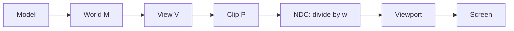
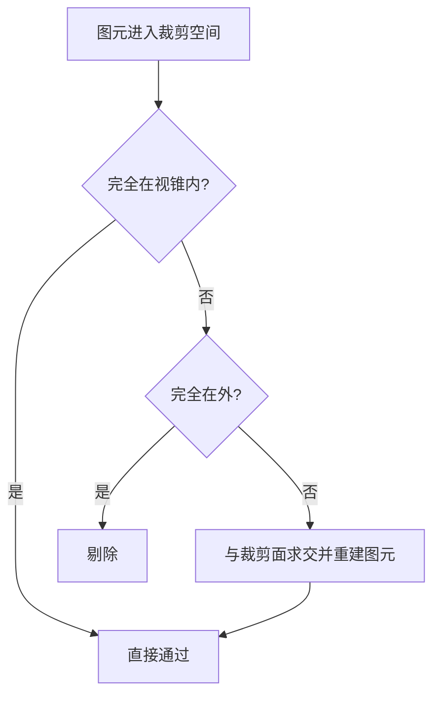

# 图形学基础：2.3 空间变换与坐标系

本文覆盖 `面经题目分类汇总.md` 中图形学基础的 `2.3 空间变换与坐标系` 全部题目。
每个题目包含：标准准确的说法、通俗易懂的理解、面试回答简版模板、难点深挖。

---

## 题目：模型到屏幕的空间变换过程？有哪些坐标空间？

### 标准准确的说法
- 常见坐标链路：
- 模型空间（Model/Object Space）
- 世界空间（World Space）
- 观察/相机空间（View Space）
- 裁剪空间（Clip Space）
- NDC（透视除法后）
- 屏幕/视口空间（Viewport/Screen Space）
- 数学上通常写作：`clipPos = P * V * M * localPos`。

### 通俗易懂的理解
- 先把模型摆到世界里，再放到相机视角里，投影到裁剪空间，最后映射到屏幕像素坐标。

### 面试回答简版模板
`从模型到屏幕的主链路是 M -> V -> P，再经透视除法到 NDC，最后做视口变换到屏幕坐标。`

### 难点深挖

---

## 题目：MVP矩阵各自的作用？如何推导？

### 标准准确的说法
- `M`（Model）：局部坐标 -> 世界坐标（平移、旋转、缩放）。
- `V`（View）：世界坐标 -> 相机坐标（相机逆变换）。
- `P`（Projection）：相机坐标 -> 裁剪空间（透视或正交）。
- 推导本质是线性代数变换链与坐标系定义的一致性。
- 注意矩阵乘法顺序受“行向量/列向量约定”影响，面试要先说明约定。

### 通俗易懂的理解
- M 决定“物体摆哪儿”，V 决定“相机怎么看”，P 决定“怎么投到屏幕”。

### 面试回答简版模板
`M 负责物体姿态，V 负责观察坐标，P 负责投影压缩；三者组合完成从局部到裁剪空间的变换。`

### 难点深挖
- 常见翻车点：左右手坐标系与深度范围（OpenGL vs D3D）差异。

---

## 题目：齐次坐标是什么？有什么好处？

### 标准准确的说法
- 齐次坐标通过增加一维 `w`，把平移也纳入矩阵乘法统一表示。
- 点通常表示为 `(x, y, z, 1)`，方向向量常为 `(x, y, z, 0)`。
- 好处：统一仿射/投影变换表达，并支持透视除法流程。

### 通俗易懂的理解
- 加上 `w` 后，平移、旋转、缩放都能用同一种矩阵运算处理。

### 面试回答简版模板
`齐次坐标让平移可矩阵化，统一了图形变换管线，并为透视投影后的 w 除法提供数学基础。`

### 难点深挖
- 高频追问：为什么向量 `w=0` 不受平移影响。

---

## 题目：NDC是什么？坐标范围？

### 标准准确的说法
- NDC（Normalized Device Coordinates）是裁剪空间坐标经 `w` 除法后的归一化空间。
- `x,y` 通常在 `[-1,1]`；`z` 范围受 API 约定影响：
- OpenGL 传统为 `[-1,1]`。
- D3D/Vulkan 常用 `[0,1]`。
- NDC 之后再做 viewport 变换映射到像素坐标。

### 通俗易懂的理解
- NDC 是“标准化舞台”，所有可见内容先被挤压到统一范围。

### 面试回答简版模板
`NDC 是透视除法后的标准化坐标空间；x/y 通常 [-1,1]，z 范围取决于图形 API 约定。`

### 难点深挖
- 追问：跨 API 迁移时，最容易出错的是 z 范围和坐标系方向。

---

## 题目：透视投影和正交投影的区别？

### 标准准确的说法
- 透视投影：远小近大，保留视觉透视效果，平行线可能汇聚。
- 正交投影：不随距离缩放，平行关系保持，常用于 UI、CAD、编辑器视图。
- 透视投影更符合人眼观察，正交投影更强调尺寸关系与测量准确性。

### 通俗易懂的理解
- 透视像真实相机，正交像工程制图。

### 面试回答简版模板
`透视强调真实感，正交强调几何一致性；游戏主视图通常透视，UI/工具视图常用正交。`

### 难点深挖
- 追问落点：阴影贴图的光源相机为什么常用正交（方向光）。

---

## 题目：视口变换的作用？

### 标准准确的说法
- 视口变换把 NDC 坐标映射到屏幕像素坐标和深度范围。
- 包括尺度变换与偏移，决定图像渲染到目标缓冲区的具体区域。
- 在多视口、分屏、后处理 pass 中是基础能力。

### 通俗易懂的理解
- 视口变换就是把“标准坐标”贴到“具体屏幕区域”。

### 面试回答简版模板
`视口变换负责把 NDC 映射到像素坐标和深度区间，是从数学空间走向真实屏幕的最后一步。`

### 难点深挖
- 追问：为什么有些后处理要重设 viewport/scissor。

---

## 题目：切线空间是什么？

### 标准准确的说法
- 切线空间（Tangent Space）以表面法线 `N`、切线 `T`、副切线 `B` 构成局部坐标系（TBN）。
- 法线贴图中的法线通常存于切线空间，需要通过 TBN 转到世界/观察空间参与光照。
- TBN 构建质量直接影响法线贴图是否出现接缝、翻转等问题。

### 通俗易懂的理解
- 切线空间是“贴在模型表面上的小坐标系”，法线贴图里的方向先在这个小坐标系里定义。

### 面试回答简版模板
`切线空间用于法线贴图：先在表面局部坐标描述细节法线，再用 TBN 矩阵转换到统一光照空间。`

### 难点深挖
- 追问关键词：MikkTSpace、一致性切线生成、镜像 UV。

---

## 题目：裁剪空间做了什么？

### 标准准确的说法
- 顶点经投影矩阵后进入裁剪空间，GPU 在此执行视锥体裁剪。
- 裁剪通过后再进行透视除法，进入 NDC。
- 裁剪可避免无意义光栅化，减少后续开销。

### 通俗易懂的理解
- 裁剪空间是“入场安检区”，不在相机可见范围的图元先被挡在门外。

### 面试回答简版模板
`裁剪空间是投影后的中间空间，用于视锥裁剪；通过后才做 w 除法进入 NDC。`

### 难点深挖
- 追问：为什么先裁剪再做透视除法，和数值稳定性有什么关系。

---

## 题目：齐次空间裁剪怎么做？

### 标准准确的说法
- 在齐次裁剪空间中，常见可见条件是与 `w` 的比较关系（例如 `-w<=x<=w` 等，取决于 API 约定）。
- 对跨越裁剪面的图元，需要做线段/边插值求交，生成新的裁剪后图元。
- 本质是多平面裁剪问题，经典思路可类比 Sutherland-Hodgman。

### 通俗易懂的理解
- 图元如果一半在屏幕内一半在外，就把“越界部分切掉”，留下可见部分继续渲染。

### 面试回答简版模板
`齐次裁剪通过与 w 的边界关系判定可见性；跨界图元会在裁剪平面上求交并重建图元，再进入后续阶段。`

### 难点深挖

- 追问建议：强调“齐次空间裁剪 + 透视除法”顺序，不要颠倒。
