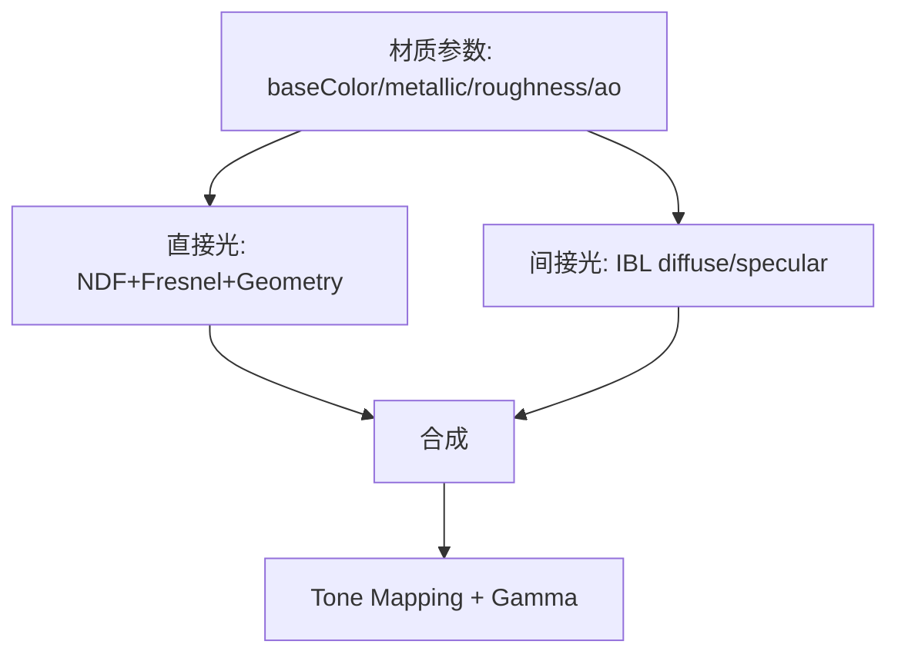
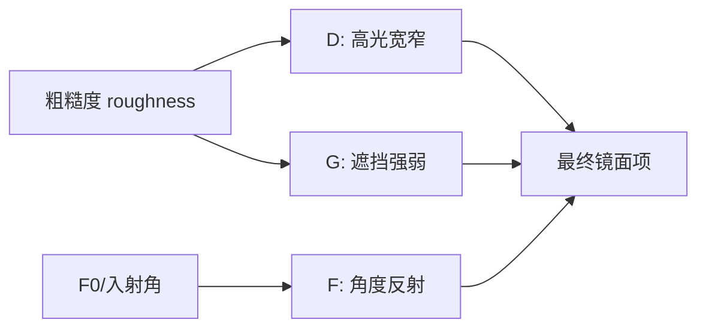

# 图形学基础：2.4 光照模型与PBR

本文覆盖 `面经题目分类汇总.md` 中图形学基础的 `2.4 光照模型与PBR` 全部题目。
每个题目包含：标准准确的说法、通俗易懂的理解、面试回答简版模板、难点深挖。

---

## 题目：PBR的原理？实时渲染中怎么体现？

### 标准准确的说法
- PBR（Physically Based Rendering）核心目标是用更符合物理规律的材质和光照模型，提升不同光照环境下的一致性。
- 实时 PBR 常见要素：
- 微表面模型（如 Cook-Torrance BRDF）。
- 能量守恒（反射与漫反射分配合理）。
- Fresnel（入射角越刁钻，镜面反射越明显）。
- 金属度/粗糙度工作流（Metallic-Roughness）。
- 实时引擎里通常拆成直接光（逐光源）+ 间接光（IBL）两部分。

### 通俗易懂的理解
- 传统材质常“靠调参看起来像”，PBR是“按材料真实反光规律来算”，所以在不同场景光照下更稳定。

### 面试回答简版模板
`PBR是基于微表面理论和能量守恒的材质体系。实时实现一般用 Cook-Torrance 做直接光，再配合 IBL 做环境光照，材质参数常用金属度和粗糙度。`

### 难点深挖

- 面试追问常见链路：为什么 PBR 看起来“更稳”？因为参数含义更物理、跨环境泛化更好。

---

## 题目：BRDF是什么？介绍一下

### 标准准确的说法
- BRDF（Bidirectional Reflectance Distribution Function）描述入射方向到出射方向的反射分布关系。
- 输入通常包含法线 `N`、视线 `V`、光线 `L`，输出某方向上的反射比例。
- 合法 BRDF 通常要求：非负、互易性（在适用条件下）、能量不增。
- 实时渲染中最常见是拆为漫反射项 + 镜面反射项。

### 通俗易懂的理解
- BRDF就是“这个材质遇到光时会怎么反光”的规则函数。

### 面试回答简版模板
`BRDF描述光从入射方向打到表面后，在观察方向上反射多少。实时里常用漫反射+镜面反射模型，核心约束是能量守恒。`

### 难点深挖
- 追问常见：为什么很多引擎选 GGX 而不是更早的分布？
- 因为 GGX 在高光尾部表现更接近真实，粗糙材质视觉更自然。

---

## 题目：Cook-Torrance模型的各项含义？(D/F/G项)

### 标准准确的说法
- Cook-Torrance 镜面项常写成：`spec = D * F * G / (4 * (N·L) * (N·V))`。
- `D`（NDF，法线分布函数）：描述微表面法线朝向统计分布，决定高光形状。
- `F`（Fresnel）：描述反射率随角度变化，掠射角反射增强。
- `G`（Geometry/Masking-Shadowing）：描述微表面自遮挡、自阴影造成的可见性衰减。
- 实时中常见组合：GGX + Schlick Fresnel + Smith Geometry。

### 通俗易懂的理解
- `D` 决定“高光有多集中”，`F` 决定“斜着看有多亮”，`G` 决定“微结构互相挡住了多少光”。

### 面试回答简版模板
`Cook-Torrance里 D 控分布、F 控角度反射、G 控遮挡，三者共同决定镜面能量分布。工程上常见GGX+Schlick+Smith。`

### 难点深挖

- 高频追问：粗糙度为什么会同时影响 D 和 G，而不是只影响一个项。

---

## 题目：Phong和Blinn-Phong的区别？

### 标准准确的说法
- Phong 通过反射向量 `R` 与视线 `V` 的点积控制高光。
- Blinn-Phong 用半程向量 `H` 与法线 `N` 点积，数值更稳定、计算更友好。
- 在同样指数下两者高光形态不同，通常 Blinn-Phong 更容易得到稳定高光。
- 二者都属于经验模型，不如 PBR 微表面模型物理一致。

### 通俗易懂的理解
- Phong是“看反射方向对不对眼”，Blinn-Phong是“看法线和光视中间方向贴不贴”。

### 面试回答简版模板
`Blinn-Phong把Phong的反射向量改为半程向量，计算更稳更常用，但两者本质都偏经验模型，不如PBR物理一致。`

### 难点深挖
- 追问：为什么老项目仍用 Blinn-Phong？
- 因为实现简单、成本低，在风格化或低端平台仍有价值。

---

## 题目：菲涅尔项的F0有什么含义？

### 标准准确的说法
- `F0` 是法线入射（入射角接近 0）时的基础反射率。
- 介电材料 `F0` 通常较低（约 0.02~0.08 常见范围），金属材料 `F0` 更高且带颜色。
- Metallic 工作流中：
- 非金属：高光颜色接近中性，漫反射占主导。
- 金属：高光带材质色，漫反射大幅减少。

### 通俗易懂的理解
- `F0` 可以理解为“材质最正面看时的镜面底色和底强度”。

### 面试回答简版模板
`F0是材质在正入射时的基础反射率。PBR里它和metallic一起决定高光颜色与强度分配。`

### 难点深挖
- 高频追问：为什么金属度为1时漫反射几乎没有。
- 因为导体能量主要走镜面反射通道。

---

## 题目：什么是能量守恒？

### 标准准确的说法
- 能量守恒在着色里表示：材质反射出去的总能量不应超过入射能量。
- 实时实现常通过 `kD + kS <= 1` 的思想约束漫反射与镜面反射分配。
- 若不做约束，会出现“材质越照越亮”或多光源下不合理增亮。

### 通俗易懂的理解
- 材质不能“无中生有发光”，反射出去的亮度总量要有上限。

### 面试回答简版模板
`能量守恒就是限制材质反射总能量不超过入射能量，工程上常通过漫反射和镜面反射权重约束来实现。`

### 难点深挖
- 追问落点：为何传统经验模型在强光和多光源下更容易“过曝假亮”。

---

## 题目：渲染方程的物理意义？

### 标准准确的说法
- 渲染方程描述某点向观察方向的出射辐射亮度，等于自发光 + 半球入射光经 BRDF 加权积分。
- 它是局部反射模型和全局光传输关系的统一表达。
- 实时渲染通常做近似：
- 直接光用少量光源采样。
- 间接光用 IBL、探针、屏幕空间近似等。

### 通俗易懂的理解
- 一个像素有多亮，来自“自己发光”加上“环境里来的光反射出去”的总和。

### 面试回答简版模板
`渲染方程把光照问题抽象成入射光积分。实时项目不会精确解积分，而是用直接光+IBL等近似方案平衡效果和性能。`

### 难点深挖
- 追问建议：强调“方程是目标，实时方案是近似解法”，并举一个近似路径（例如预积分IBL）。

---

## 题目：局部光照和全局光照的方案？

### 标准准确的说法
- 局部光照（Local Illumination）：只考虑光源到表面的一次作用，忽略多次反弹。
- 全局光照（Global Illumination）：考虑间接反射、颜色渗透、软阴影等多次光传输。
- 常见实时 GI 近似：IBL、探针、SSGI、VXGI、DDGI、Lumen 类方案等。
- 离线渲染通常可用路径追踪获得更高精度。

### 通俗易懂的理解
- 局部光照像“只看直射灯”，全局光照像“把光在场景里来回弹射也算进去”。

### 面试回答简版模板
`局部光照便宜但缺少间接信息；全局光照更真实但成本高。实时项目通常用IBL或探针做主要近似，再按预算叠加更高阶GI。`

### 难点深挖
- 追问：项目里怎么取舍 GI？
- 按平台预算、场景类型、动态性（静态烘焙 vs 实时更新）综合决定。

---

## 题目：法线分布函数有哪些？

### 标准准确的说法
- 常见 NDF 包括：
- Beckmann：历史较早，表面假设偏高斯。
- GGX/Trowbridge-Reitz：高光尾部更长，粗糙材质表现更自然，实时里最常见。
- Blinn（传统幂函数分布）：常见于老式高光模型。
- NDF 选择会影响高光形状、能量分布与视觉“材质感”。

### 通俗易懂的理解
- NDF就是“微小镜面朝向怎么分布”的统计规则，不同规则会直接改变高光风格。

### 面试回答简版模板
`实时PBR里GGX最常见，因为它在粗糙表面高光表现更自然；Beckmann和Blinn更多出现在历史模型或特定场景。`

### 难点深挖
- 高频追问：为什么同样 roughness，在不同 NDF 下看起来高光“肉眼差异很大”。
- 因为分布尾部行为不同，影响掠射角与粗糙高光衰减方式。
