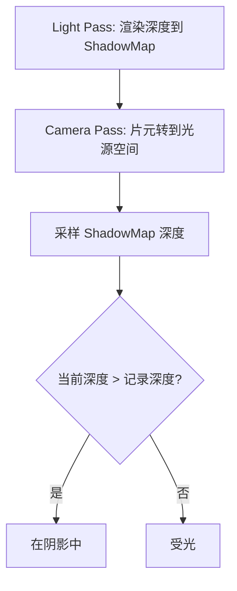
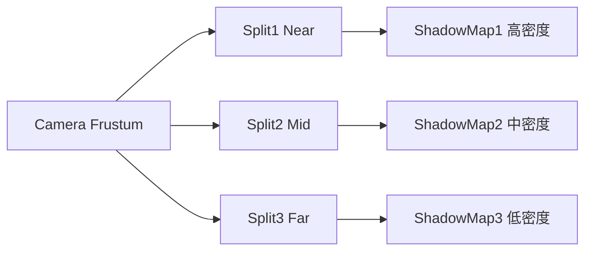
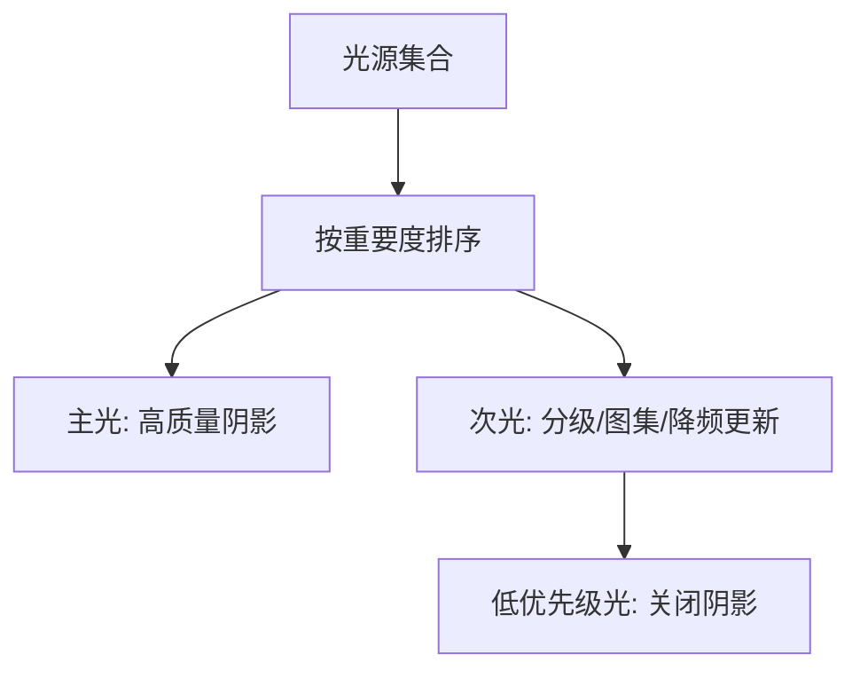

# 图形学基础：2.5 阴影技术

本文覆盖 `面经题目分类汇总.md` 中图形学基础的 `2.5 阴影技术` 全部题目。
每个题目包含：标准准确的说法、通俗易懂的理解、面试回答简版模板、难点深挖。

---

## 题目：Shadow Map的原理和实现？有什么缺点？

### 标准准确的说法
- Shadow Map 基本流程两步：
- 从光源视角渲染场景，记录深度得到阴影贴图。
- 从相机视角渲染时，把当前片元变换到光源空间，与阴影贴图深度比较判断遮挡。
- 常见缺点：
- 走样（锯齿、闪烁）。
- 阴影痤疮（acne）和彼得潘（peter-panning）。
- 分辨率受限，远处质量差。

### 通俗易懂的理解
- 光源先“拍一张深度照片”，主相机渲染时拿这张照片判断像素是否被挡住。

### 面试回答简版模板
`Shadow Map是先从光源渲染深度，再在主渲染里做深度比较。优势是通用易落地，问题主要是精度和采样伪影。`

### 难点深挖

- 追问链路：怎么解决伪影 -> depth bias + PCF + 更合理投影分配。

---

## 题目：CSM(级联阴影)是怎么做的？

### 标准准确的说法
- CSM（Cascaded Shadow Maps）把相机视锥按深度切成多段（级联）。
- 近处级联用更高 texel 密度，远处级联用较低密度，提升整体阴影清晰度分布。
- 每级联使用独立光源投影区域和阴影贴图，渲染时按片元深度选择级联采样。
- 关键工程点：分割策略（线性/对数/混合）、级联稳定化（防抖动）、级联过渡混合。

### 通俗易懂的理解
- 把阴影预算重点花在离相机近的地方，远处就用更粗略阴影。

### 面试回答简版模板
`CSM通过把视锥分级，把有限分辨率优先给近处阴影，显著改善大场景方向光阴影质量。核心难点在级联切分和稳定化。`

### 难点深挖

- 高频追问：为什么 CSM 容易闪烁？
- 因为级联边界与光源投影随相机移动产生采样抖动，需要 texel snapping 等稳定化处理。

---

## 题目：PCF和PCSS的原理？

### 标准准确的说法
- PCF（Percentage Closer Filtering）：对邻域多次深度比较后平均，得到软化边界。
- PCSS（Percentage Closer Soft Shadows）：先估计遮挡体与接收面的关系（blocker search），再根据几何关系自适应扩大过滤核，实现“近硬远软”。
- PCSS 视觉更接近真实软阴影，但采样开销明显更高。

### 通俗易懂的理解
- PCF是“固定模糊阴影边”。
- PCSS是“根据距离动态调整模糊范围”，更像真实半影。

### 面试回答简版模板
`PCF通过多点比较平滑阴影边，PCSS在此基础上做遮挡体搜索和可变核滤波，效果更真实但代价更高。`

### 难点深挖
- 追问：PCSS为什么贵？
- 因为它至少包含 blocker 搜索 + 过滤两个多采样阶段。

---

## 题目：软阴影如何实现？

### 标准准确的说法
- 软阴影目标是模拟面积光源导致的半影过渡。
- 实时常见方案：
- PCF（固定核软化）。
- PCSS（可变核半影）。
- VSM/EVSM/VSSM 等统计或方差类方案。
- 也可用光线追踪路径获得更高真实度。
- 选择取决于性能预算、稳定性要求和伪影容忍度。

### 通俗易懂的理解
- 光源不是点而是有面积时，阴影边缘不会“硬切”，而是有渐变带。

### 面试回答简版模板
`软阴影本质是模拟半影。实时里常用PCF/PCSS或方差类方法做近似，预算足够再走RT阴影。`

### 难点深挖
- 追问建议：分清“视觉接近真实”和“时间稳定性”是两件事。

---

## 题目：大场景的阴影贴图怎么处理？

### 标准准确的说法
- 大场景常见问题是阴影贴图分辨率不够、近远质量差异大。
- 常见策略：
- CSM（方向光主力方案）。
- 距离分级更新（远级联低频更新）。
- 动态分辨率与阴影距离裁剪。
- 重要物体单独高质量阴影通道（角色阴影优先）。
- 目标是把有限阴影预算聚焦到玩家最敏感区域。

### 通俗易懂的理解
- 场景太大时不能“全图都高清”，要按可见性和重要度分配阴影资源。

### 面试回答简版模板
`大场景阴影靠分级和预算管理：近处高质量、远处降采样/降频更新，并对关键物体做优先保障。`

### 难点深挖
- 追问：为什么有时“远处阴影直接关掉”反而更稳定。
- 因为低质量远阴影比无阴影更容易暴露噪声和闪烁。

---

## 题目：阴影自遮挡问题如何解决？

### 标准准确的说法
- 阴影自遮挡（shadow acne）通常因深度精度与比较误差导致表面“误判在阴影中”。
- 常见解决：
- 深度偏移（constant bias + slope-scale bias）。
- 法线偏移（normal offset）。
- 提升深度精度和阴影贴图分辨率。
- 偏移过大又会导致 peter-panning（阴影脱离物体）。

### 通俗易懂的理解
- 深度比较太“严苛”会把自己当成自己前面的遮挡体，所以要给一点合理容差。

### 面试回答简版模板
`自遮挡问题常用depth bias和normal offset解决，但要控制偏移避免彼得潘。核心是精度和偏移平衡。`

### 难点深挖
- 追问：为什么斜面更容易 acne？
- 因为深度梯度更大，量化误差在比较时更敏感。

---

## 题目：VSSM的原理？漏光问题的原因？

### 标准准确的说法
- VSSM（Variance Soft Shadow Mapping）基于统计矩（如一阶/二阶矩）估计阴影概率，并可配合预滤波实现软阴影。
- 优点是滤波友好，可利用硬件纹理过滤。
- 漏光（light leaking）常由概率上界估计过松、分布假设不理想引起，尤其在深度分布多峰或遮挡复杂时明显。
- 常见改进：EVSM、MSM、clamp 策略、分布控制。

### 通俗易懂的理解
- 方差类方法是“用统计近似阴影”，算得快但有时会把本该遮住的地方误判成透光。

### 面试回答简版模板
`VSSM用深度统计量做软阴影近似，优点是可预滤波，缺点是可能漏光；工程上常配EVSM/MSM或钳制策略缓解。`

### 难点深挖
- 追问落点：为什么“滤波越强，漏光可能越明显”。

---

## 题目：多个光源的阴影怎么处理？

### 标准准确的说法
- 多光源阴影开销通常线性甚至超线性增长，不能简单全开最高质量。
- 常见策略：
- 主光（如太阳光）高质量阴影。
- 次要光源按重要度选择是否投影阴影。
- 局部光可用阴影图集（atlas）和分辨率分级。
- 距离/屏幕占比驱动的阴影剔除与更新频率控制。
- 在延迟或 clustered 流程里，结合光源裁剪减少参与阴影计算的光源数。

### 通俗易懂的理解
- 多灯阴影不能“雨露均沾”，要做优先级调度。

### 面试回答简版模板
`多光源阴影是预算问题，通常主光优先、次光按重要度和距离动态分配阴影分辨率与更新频率。`

### 难点深挖

- 追问建议：举例说明“同屏上限阴影光源数”是如何设定的（性能测试驱动）。
