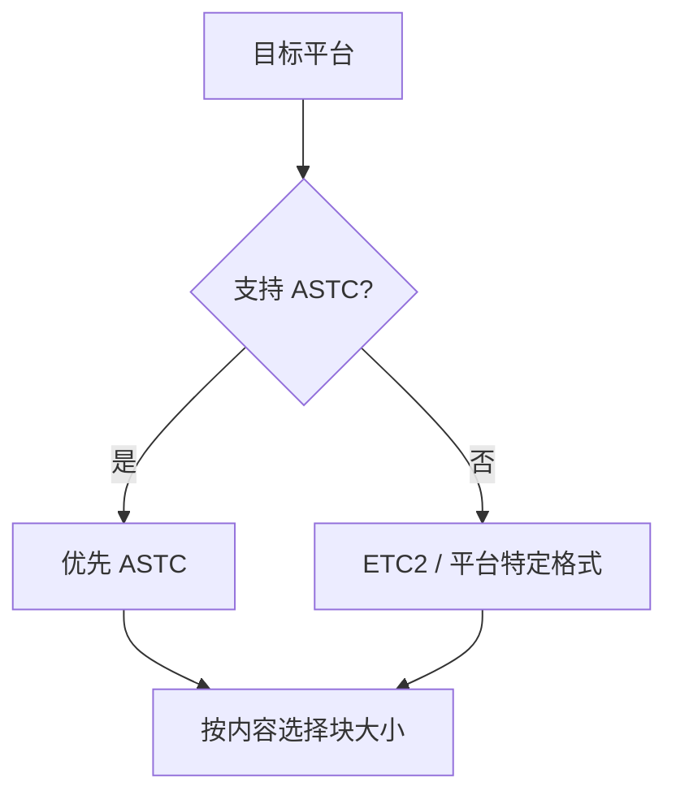

# 图形学基础：2.6 纹理与Mipmap

本文覆盖 `面经题目分类汇总.md` 中图形学基础的 `2.6 纹理与Mipmap` 全部题目。
每个题目包含：标准准确的说法、通俗易懂的理解、面试回答简版模板、难点深挖。

---

## 题目：Mipmap的原理和作用？如何确定使用哪一层？

### 标准准确的说法
- Mipmap 是同一纹理的多分辨率层级链，每级长宽约为上一级一半。
- 作用：
- 减少纹理缩小时的走样和闪烁。
- 改善纹理缓存命中与采样性能。
- 采样时根据纹理坐标在屏幕上的导数（LOD）选择层级，常配合双线性/三线性过滤。
- 典型公式思路：由 `ddx/ddy` 估算 footprint 大小，再映射到 mip level。

### 通俗易懂的理解
- 远处物体没必要采超高清贴图，Mipmap 就是预先准备好的“远景小图版本”。

### 面试回答简版模板
`Mipmap通过多分辨率纹理减少缩小采样走样，LOD通常由像素 footprint 自动估算并选层，常见过滤方式是三线性。`

### 难点深挖

- 追问：为什么有时会手动 bias LOD。
- 用于锐化/抗闪烁平衡，或匹配特定风格需求。

---

## 题目：法线贴图是怎么存储的？为什么是蓝色？

### 标准准确的说法
- 法线贴图通常存切线空间法线，分量范围原本是 `[-1,1]`，存储前映射到 `[0,1]`。
- 常见映射：`encoded = normal * 0.5 + 0.5`。
- 贴图看起来偏蓝是因为多数表面法线朝向“外法线”（z 分量较大正值），映射到 RGB 后 B 通道偏高。
- 解码后需归一化再参与光照。

### 通俗易懂的理解
- 蓝色不是“故意涂蓝”，而是因为法线大多朝外，Z 分量大，落到颜色里就蓝通道偏亮。

### 面试回答简版模板
`法线贴图存的是切线空间法线，通常把[-1,1]映射到[0,1]。之所以常见蓝色，是因为大多数像素法线z分量较大。`

### 难点深挖
- 追问关键词：TBN、一致性切线空间、法线贴图压缩后的重建误差。

---

## 题目：各向异性采样是什么？

### 标准准确的说法
- 各向异性采样用于解决斜视角下纹理被拉伸导致的模糊和细节丢失。
- 相比各向同性过滤，它在主拉伸方向使用更多样本，提高地面、道路等斜角纹理清晰度。
- 代价是采样开销上升，通常有可配置等级（2x/4x/8x/16x）。

### 通俗易懂的理解
- 斜着看地板时纹理会被“压扁拉长”，各向异性采样就是针对这个方向多采几次让细节回来。

### 面试回答简版模板
`各向异性采样针对斜视角footprint拉伸问题，在主方向增加采样以提升清晰度，代价是额外采样成本。`

### 难点深挖
- 追问：为什么通常优先给地面和道路开更高 AF 等级。

---

## 题目：Mipmap的额外存储空间是多少？

### 标准准确的说法
- 对于二维纹理，完整 mip 链总像素数近似是：
- `1 + 1/4 + 1/16 + ...` 倍基准层。
- 收敛到 `4/3`，即额外约 `1/3`（约 33%）显存开销。
- 实际值受纹理尺寸、格式、是否补齐块压缩边界影响。

### 通俗易懂的理解
- 主贴图是 100% 成本，整条 mip 链大约再加 33%。

### 面试回答简版模板
`2D纹理完整Mipmap链总开销约为原图的4/3，所以额外显存大约33%，具体会受格式和尺寸对齐影响。`

### 难点深挖
- 高频追问：3D 纹理或 cube map 的开销怎么估？
- 思路一样，按维度衰减比和面数累加即可。

---

## 题目：纹理压缩有哪些？移动端的纹理压缩？

### 标准准确的说法
- 常见压缩族：
- BCn/DXT（桌面常见）。
- ETC2/EAC（OpenGL ES 常见，移动友好）。
- ASTC（移动端主流高质量可变块压缩）。
- PVRTC（部分移动平台历史常见）。
- 选型需考虑平台支持、质量、码率与解码硬件支持。
- 移动端项目常优先 ASTC（若设备支持），兼容路径使用 ETC2。

### 通俗易懂的理解
- 纹理压缩是用“更省显存和带宽”的方式存图，前提是硬件能快速解码。

### 面试回答简版模板
`纹理压缩选型是平台问题：桌面常见BC，移动端常见ASTC/ETC2。核心目标是降低显存和带宽，同时保证画质可接受。`

### 难点深挖

- 追问：为什么“同样分辨率”不同压缩格式画质差异很大。
- 因为压缩块模型和比特分配策略不同。

---

## 题目：远距离用高分辨率贴图会有什么问题？

### 标准准确的说法
- 远距离继续采高分辨率贴图会带来：
- 明显带宽浪费和缓存压力。
- 可能增加闪烁（高频细节超出采样能力）。
- 提升功耗并降低帧稳定性，移动端更明显。
- 正确做法是依赖 Mipmap、合理 LOD、必要时叠加各向异性采样。

### 通俗易懂的理解
- 远处像素很少，用超清纹理等于“用大卡车送一颗糖”，成本高还不稳定。

### 面试回答简版模板
`远距离高分辨率采样会浪费带宽并增加闪烁风险。应通过Mipmap+LOD控制采样尺度，必要时结合各向异性提升斜视角质量。`

### 难点深挖
- 追问建议：把“画质问题”和“性能问题”一起答，体现工程视角而不是只讲原理。
