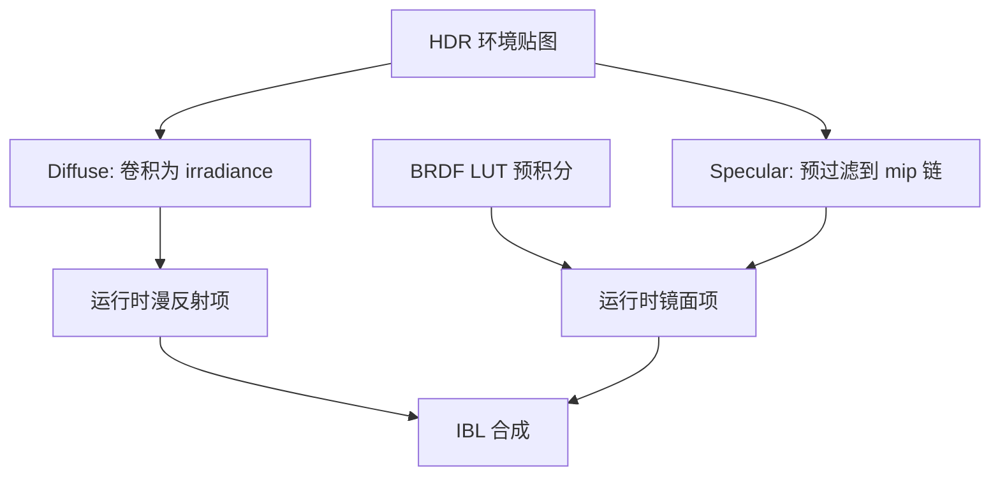
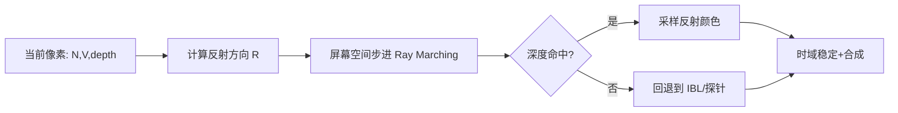
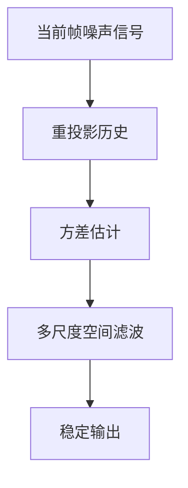

# 图形学基础：2.7 全局光照

本文覆盖 `面经题目分类汇总.md` 中图形学基础的 `2.7 全局光照` 全部题目。
每个题目包含：标准准确的说法、通俗易懂的理解、面试回答简版模板、难点深挖。

---

## 题目：IBL的实现细节？diffuse和specular分别怎么做？

### 标准准确的说法
- IBL（Image Based Lighting）用环境贴图近似场景的间接光照。
- 在实时 PBR 中，通常拆成两部分：
- Diffuse IBL：对环境辐照度做低频积分，常用 irradiance map 或 SH 表示。
- Specular IBL：对环境做预过滤（prefilter env map），并使用 BRDF LUT 近似视角/粗糙度项。
- 常见 runtime 组合是：
- `diffuse = irradiance(N) * albedo * kD`
- `specular = prefilteredEnv(R, roughness) * BRDF_LUT(NdotV, roughness)`
- 关键工程点：贴图分辨率、mip 级别与 roughness 映射、HDR 颜色空间一致性。

### 通俗易懂的理解
- IBL 就是拿环境“全景光照”去照材质。
- 漫反射只要低频环境信息；镜面反射要看方向和粗糙度，所以要多一层预处理。

### 面试回答简版模板
`IBL在实时里通常分diffuse和specular两条路径：diffuse用irradiance近似低频积分，specular用预过滤环境贴图配合BRDF LUT。这样能在可控成本下逼近间接光照。`

### 难点深挖

- 高频追问：为什么 specular IBL 需要 BRDF LUT？
- 因为镜面项同时依赖粗糙度和视角，直接积分太贵，LUT 用于把这部分预积分近似缓存。

---

## 题目：全局光照算法了解哪些？

### 标准准确的说法
- GI 算法可按“物理精度 vs 实时成本”大致分层：
- 离线路径：Path Tracing、Photon Mapping、Radiosity。
- 实时近似：IBL、Light Probe、SSGI、Voxel GI（VXGI）、RSM/LPV、DDGI。
- 混合/现代方案：硬件 RT + 时域积累 + 降噪（如 UE5 Lumen 的部分思路）。
- 实际工程常采用多方案叠加：
- 静态场景烘焙 + 动态补偿。
- 探针/屏幕空间/光追按平台能力切换。

### 通俗易懂的理解
- GI 没有“银弹”：越真实通常越贵，所以项目里基本都是“分层近似 + 混合策略”。

### 面试回答简版模板
`GI方案从离线高精度到实时近似有一整条谱系。游戏里通常采用IBL/探针/屏幕空间/RT混合，按平台预算做分级落地。`

### 难点深挖
- 追问建议答法：
- 先给分类（离线 vs 实时）。
- 再给项目策略（主方案 + 兜底方案 + 平台切换）。

---

## 题目：SSR的实现？Ray Marching是什么？

### 标准准确的说法
- SSR（Screen Space Reflection）在屏幕空间用深度/法线信息沿反射方向搜索交点，近似反射。
- Ray Marching 指沿某个方向以步进方式迭代采样，检测是否与场景（通常深度缓冲）相交。
- SSR 典型流程：
- 从当前像素构造反射向量。
- 在屏幕空间步进采样，和深度缓冲比较。
- 命中后取反射颜色并做衰减/混合。
- 局限：只能反射屏幕内可见信息，易出现缺失、拉伸和噪声。

### 通俗易懂的理解
- SSR 是“在当前画面里找反射来源”，看不到屏幕外物体，所以会有缺口。

### 面试回答简版模板
`SSR通过屏幕空间ray marching在深度图里找反射命中点，成本可控但只利用屏幕内信息，常需和探针或环境贴图混合补洞。`

### 难点深挖

- 追问：SSR 为什么闪烁？
- 因为命中点和可见信息随相机变化剧烈，通常需要时域重投影与滤波稳定。

---

## 题目：光照探针/反射探针是什么？

### 标准准确的说法
- 光照探针（Light Probe）常用于存储局部环境的间接光信息（低频），例如用 SH 表达漫反射辐照度。
- 反射探针（Reflection Probe）通常存储局部环境反射（高频方向信息），常见表示为 cubemap。
- 渲染时根据对象位置在多个探针间插值，获得近似环境光照和反射。
- 关键点：探针布局、更新策略（静态/动态）、过渡混合与漏光控制。

### 通俗易懂的理解
- 探针像在场景里布置很多“光照采样点”，运行时按最近几个点估算当前像素的间接光。

### 面试回答简版模板
`光照探针负责低频间接光，反射探针负责方向性反射。运行时通过空间插值给对象提供局部环境光照近似。`

### 难点深挖
- 高频追问：探针方案最大问题是什么？
- 动态性和精确遮挡不足，容易在复杂室内外边界出现漏光或不连续。

---

## 题目：RSM/LPV/VXGI的原理？

### 标准准确的说法
- RSM（Reflective Shadow Maps）：在光源视角除深度外记录反射属性，用于近似一次间接反射。
- LPV（Light Propagation Volumes）：把光注入体素网格并在体素中传播，近似多次散射。
- VXGI（Voxel Global Illumination）：将场景体素化，在体素结构上做光照传输与查询。
- 三者共同点是“用结构化近似替代昂贵路径积分”，差异在表达域和更新开销。

### 通俗易懂的理解
- 这类方法都在做一件事：把复杂光传播塞进可实时计算的数据结构里。

### 面试回答简版模板
`RSM/LPV/VXGI都是实时GI近似：RSM偏一次反射估计，LPV做体积传播，VXGI走体素化表达，核心是精度与性能取舍。`

### 难点深挖
- 追问建议：强调这类方法在“漏光、分辨率、动态更新成本”上的共性挑战。

---

## 题目：AO(环境光遮蔽)的实现？

### 标准准确的说法
- AO 描述局部几何对环境光的遮蔽程度，本质是可见半球比例估计。
- 常见实时方案：
- SSAO：屏幕空间近似，便宜但仅利用屏幕信息。
- HBAO/GTAO：更高质量方向采样与几何近似。
- RTAO：光追版 AO，质量更高但成本更高。
- AO 不是完整 GI，只补“接触阴影感”和体积层次。

### 通俗易懂的理解
- AO 让缝隙、角落更暗，增强“接触感”，但它不负责真实反弹光。

### 面试回答简版模板
`AO是环境光遮挡近似，不等于完整GI。实时里常用SSAO/GTAO做成本可控增强，预算够可上RTAO。`

### 难点深挖
- 追问：为什么 AO 会“脏”或“发灰”？
- 常因半径过大、法线/深度不稳、时域滤波参数不当导致过遮蔽。

---

## 题目：球谐函数是什么？有什么好处？

### 标准准确的说法
- 球谐函数（SH）可视为球面函数的正交基展开，常用于压缩低频方向光照信息。
- 在图形学中常用低阶 SH（例如 2 阶/3 阶）表示漫反射环境光。
- 好处：
- 表达紧凑（少量系数）。
- 运行时计算便宜。
- 适合探针系统和大规模场景低频光照。
- 局限：不适合表达尖锐高频细节（如镜面高光）。

### 通俗易懂的理解
- SH 像“用几个低频波形概括天空光分布”，省内存也省算力。

### 面试回答简版模板
`SH是球面信号的低频压缩表达，特别适合漫反射环境光和探针系统，但不擅长高频镜面细节。`

### 难点深挖
- 高频追问：为什么 probe diffuse 常用 SH，specular 不直接用 SH。
- 因为 specular 属于高频方向信号，SH 低阶近似会丢失关键细节。

---

## 题目：Lumen的了解？

### 标准准确的说法
- Lumen（以 UE5 为代表）是面向实时动态 GI 与反射的混合系统。
- 核心思路是结合多种数据源和追踪方式（屏幕空间、软件追踪、硬件 RT 等）做分层求解，再配合时域积累与降噪。
- 工程目标是减少烘焙依赖，在大动态场景维持可接受质量与性能。
- 实际效果和成本高度依赖硬件、场景复杂度和质量档位。

### 通俗易懂的理解
- Lumen 不是单一算法，而是一套“多种近似+追踪+稳定化”的组合拳。

### 面试回答简版模板
`Lumen本质是实时GI与反射的混合框架，不靠单算法吃到底，而是按可用信息分层求解并用时域稳定结果。`

### 难点深挖
- 追问建议：回答时强调“系统级组合”，不要把 Lumen 简化成“就是RT”。

---

## 题目：SVGF了解吗？

### 标准准确的说法
- SVGF（Spatiotemporal Variance-Guided Filtering）是面向低采样噪声渲染结果的时空滤波降噪框架。
- 核心步骤通常包括：
- 时域重投影与历史融合。
- 方差估计引导滤波强度。
- 空间级联滤波（通常多尺度）。
- 常用于实时光追噪声抑制，也可用于 SSR/SSGI 等高噪声信号稳定。

### 通俗易懂的理解
- SVGF 是“先借前几帧的信息，再按噪声程度做智能平滑”，让噪点变成稳定图像。

### 面试回答简版模板
`SVGF是时空联合降噪：先重投影做时间积累，再用方差引导空间滤波，在低采样条件下提升稳定性和可用画质。`

### 难点深挖

- 高频追问：为什么会拖影？
- 历史重投影误匹配或响应过慢时，会把旧信息错误保留。
