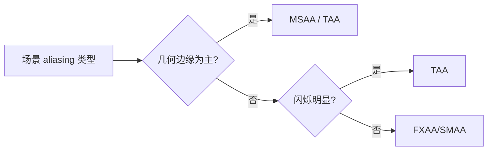
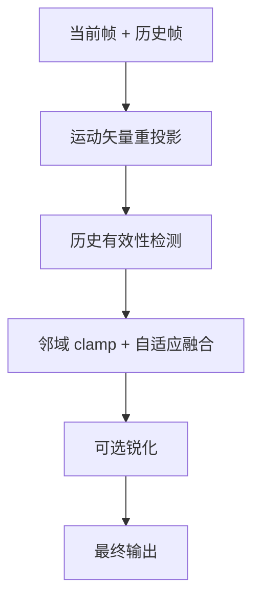

# 图形学基础：2.8 抗锯齿

本文覆盖 `面经题目分类汇总.md` 中图形学基础的 `2.8 抗锯齿` 全部题目。
每个题目包含：标准准确的说法、通俗易懂的理解、面试回答简版模板、难点深挖。

---

## 题目：抗锯齿算法有哪些？MSAA/FXAA/TAA的原理？

### 标准准确的说法
- 抗锯齿目标是抑制离散采样导致的边缘锯齿和闪烁。
- 常见类别：
- 几何采样类：MSAA（多重采样，主打几何边缘）。
- 后处理类：FXAA/SMAA（图像空间边缘检测+平滑）。
- 时域类：TAA（结合抖动采样与历史重投影）。
- MSAA：提高每像素几何覆盖采样，边缘更平滑，但对 shader aliasing 作用有限。
- FXAA：成本低、接入简单，但易导致整体变软。
- TAA：稳定性好、能抑制闪烁，但存在拖影和细节损失风险。

### 通俗易懂的理解
- MSAA 是“多看几次边缘再决定颜色”。
- FXAA 是“事后找边缘抹平”。
- TAA 是“结合前后帧一起消锯齿”。

### 面试回答简版模板
`MSAA偏几何采样，FXAA偏低成本后处理，TAA偏时域稳定。工程里常按平台和画质目标组合使用，而不是单一算法。`

### 难点深挖

- 高频追问：为什么现代项目普遍从“纯MSAA”转向“TAA/TSR类方案”。
- 因为现代渲染中大量 aliasing 来自 shading/temporal，不只几何边缘。

---

## 题目：TAA存在哪些问题？如何解决拖影？

### 标准准确的说法
- TAA 常见问题：
- 拖影（ghosting）：历史信息错误残留。
- 细节变软：过强滤波与历史权重过高。
- 闪烁与噪点：重投影不稳定或样本不足。
- 常见改进：
- 更可靠的运动矢量。
- 历史颜色 clamp（邻域约束，防历史污染）。
- 自适应历史权重（运动大时降低历史权重）。
- 反锐化（sharpen）补偿细节。

### 通俗易懂的理解
- TAA 像“借前几帧帮当前帧变稳”，但借错了就会拖尾发糊。

### 面试回答简版模板
`TAA主要问题是拖影和发糊。治理思路是提升重投影准确性、限制历史污染、按运动自适应权重，并配合适度锐化。`

### 难点深挖

- 追问：为什么透明和细小高频纹理最容易出问题？
- 因为重投影对应关系不稳定，历史一致性弱。

---

## 题目：MSAA和延迟渲染如何结合？

### 标准准确的说法
- 延迟渲染与 MSAA 结合成本高，主要难点在 G-Buffer 多样本存储和解析。
- 常见策略：
- 对几何边缘关键目标启用 MSAA，其他部分依赖后处理 AA。
- 使用 deferred + post AA（TAA/SMAA）替代高倍 MSAA。
- Hybrid：Forward 渲染透明和特定材质，Deferred 渲染不透明主通道。
- 现代引擎中常以 TAA/TSR 为主，MSAA 作为特定场景补充。

### 通俗易懂的理解
- 延迟渲染已经很吃带宽，再叠 MSAA 会更重，所以常改成“混合策略”。

### 面试回答简版模板
`延迟+MSAA可做但代价高，工程上常用Deferred配合TAA，并在必要区域用Forward/MSAA补强边缘质量。`

### 难点深挖
- 高频追问：为什么 forward 在透明通道更常见？
- 因为透明本就不适合标准 deferred，顺便也更容易结合 MSAA。

---

## 题目：8倍MSAA缓冲区需要8倍大吗？

### 标准准确的说法
- 不一定“所有资源都严格 8 倍”，但采样相关存储和带宽通常显著增加。
- MSAA 增加的是每像素样本数：
- 覆盖信息、深度/模板、颜色样本（取决于实现）都会增加开销。
- 一些实现可对不变样本压缩或共享，实际成本可能低于理论线性上限。
- 因此正确答法是“上限接近倍增，实际依赖实现和场景”。

### 通俗易懂的理解
- 8x MSAA 不是简单“整张图内存乘8”一句话能概括，但显存和带宽成本一定明显上升。

### 面试回答简版模板
`8x MSAA会显著增加样本存储和带宽，理论成本可接近倍增，但实际值受硬件压缩、资源格式和渲染路径影响，不必绝对说成整图8倍。`

### 难点深挖
- 追问建议：强调“带宽压力”通常比“静态显存数字”更关键。

---

## 题目：走样产生的原理？

### 标准准确的说法
- 走样本质是采样率不足导致高频信号折叠（aliasing）。
- 图形学中的高频来源包括：
- 几何边缘（空间高频）。
- 高频法线/纹理/高光（着色高频）。
- 动态镜头和细节运动（时间高频）。
- 抗走样策略对应三类：
- 空间采样（MSAA、SSAA）。
- 过滤重建（FXAA/SMAA）。
- 时间域积累（TAA）。

### 通俗易懂的理解
- 屏幕像素太稀，细节太密，就会“看错信号”，表现成锯齿、闪烁和爬动。

### 面试回答简版模板
`走样是采样定理不满足导致的频谱混叠。解决思路是提高采样、做重建滤波、以及时间域稳定化三类方法组合。`

### 难点深挖
- 追问：为什么仅靠后处理 AA 不能彻底解决问题？
- 因为它主要作用在图像空间，难完全恢复真实几何与时域信息。
