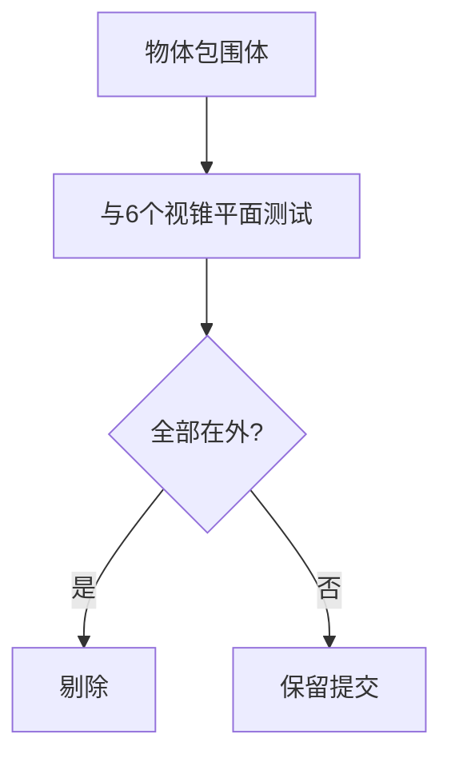
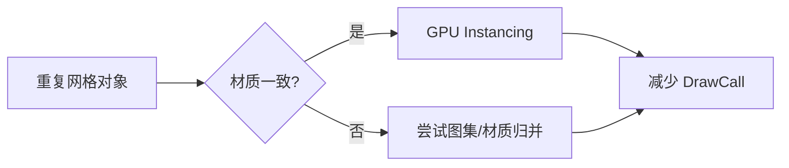
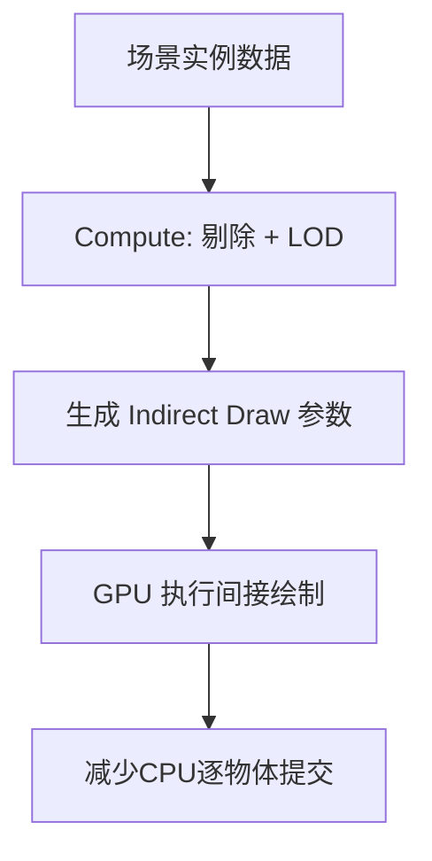

# 图形学基础：2.9 剔除与优化

本文覆盖 `面经题目分类汇总.md` 中图形学基础的 `2.9 剔除与优化` 全部题目。
每个题目包含：标准准确的说法、通俗易懂的理解、面试回答简版模板、难点深挖。

---

## 题目：视锥剔除的计算过程？

### 标准准确的说法
- 视锥剔除（Frustum Culling）用于在提交绘制前剔除相机不可见物体。
- 常见流程：
- 从 VP 矩阵提取视锥六平面（左/右/上/下/近/远）。
- 用包围体（球、AABB、OBB）与六平面做相交测试。
- 全在外侧则剔除，可能相交或全在内则保留。
- 包围球测试更快但更松，AABB 更紧凑但计算略重。

### 通俗易懂的理解
- 先做“粗筛”：看物体包围盒是否在相机视野外，在外面就直接不画。

### 面试回答简版模板
`视锥剔除通常是相机六平面与包围体相交测试。CPU先做粗剔除可显著减少无效DrawCall，是基础优化第一步。`

### 难点深挖

- 追问：为什么还会“看不见但没被剔除”？
- 因为包围体近似本来允许保守误判（宁可多画，不可漏画）。

---

## 题目：BVH和八叉树的区别？各自的适用范围？

### 标准准确的说法
- BVH（Bounding Volume Hierarchy）：
- 层次包围体树，划分更贴合物体分布，适合非均匀场景。
- 在光线追踪、碰撞检测、可见性查询中广泛使用。
- 八叉树（Octree）：
- 按空间规则递归等分，结构简单，适合较均匀空间分区。
- 对稀疏或非均匀分布可能产生大量空节点。
- 选型核心看“场景分布”和“更新成本”。

### 通俗易懂的理解
- BVH 是“按物体聚类建树”，八叉树是“按空间网格切块”。

### 面试回答简版模板
`BVH更适合非均匀复杂场景，层次紧凑；八叉树实现直观但可能空节点多。工程选型看数据分布和动态更新频率。`

### 难点深挖
- 追问建议：如果场景动态对象多，重建/更新代价如何控制（增量更新、分层结构、静动态分离）。

---

## 题目：合批操作有哪些？GPU Instancing？

### 标准准确的说法
- 合批目标是减少 DrawCall 和状态切换开销。
- 常见手段：
- 静态合批：将静态网格合并，减少提交次数。
- 动态合批：运行时合并小物体（需权衡 CPU 成本）。
- 材质合批/纹理图集：降低状态切换。
- GPU Instancing：同网格同材质不同变换的一次多实例绘制。
- Instancing 优势在大量重复物体（草、树、路灯），但实例数据带宽也需控制。

### 通俗易懂的理解
- 合批就是“少说几次话，每次多说点”；Instancing 是“同一句命令画很多同款对象”。

### 面试回答简版模板
`优化提交侧常用静态合批、材质合并和GPU Instancing。Instancing适合大量重复网格，可显著降DrawCall，但要管理实例数据带宽。`

### 难点深挖

- 追问：为什么有时合批后反而慢？
- 可能因过度合并导致剔除粒度变粗、顶点处理浪费增加。

---

## 题目：背面剔除怎么做？

### 标准准确的说法
- 背面剔除（Back-face Culling）根据图元绕序和法线朝向剔除背向相机的三角形。
- 常见 API 配置：设置正面绕序（CW/CCW）和剔除模式（Back/Front/None）。
- 对闭合实体模型可显著减少光栅化和片元开销。
- 透明物体、双面材质、特定效果（树叶、布料）可能需要关闭或特殊处理。

### 通俗易懂的理解
- 看不到物体背面就别画，省掉一半三角形是常见收益。

### 面试回答简版模板
`背面剔除通过面朝向判断去掉背向三角形，通常能降低片元开销；但双面材质和透明对象要按效果需求单独处理。`

### 难点深挖
- 追问：模型导入后“正反面颠倒”怎么排查？
- 通常先检查绕序、法线、坐标系转换和缩放矩阵负号问题。

---

## 题目：GPU Driven了解吗？

### 标准准确的说法
- GPU Driven 指将可见性筛选、实例列表构建、间接绘制参数生成等流程更多放到 GPU 端完成。
- 常见技术组合：
- Compute Shader 做剔除（frustum/occlusion/LOD）。
- 生成 indirect draw buffer（如 MultiDrawIndirect）。
- 结合 cluster/tile/meshlet 组织数据。
- 目标是缓解 CPU 提交瓶颈，提高大规模场景扩展性。

### 通俗易懂的理解
- 以前 CPU 决定“画什么”，GPU Driven 是让 GPU 自己筛选一部分“该画什么”。

### 面试回答简版模板
`GPU Driven把可见性和绘制列表生成下放到GPU，常配合indirect draw，核心收益是减轻CPU提交压力并提升大场景可扩展性。`

### 难点深挖

- 追问：GPU Driven 的难点是什么？
- 调试复杂度、数据同步、跨平台特性差异、可视化排障成本。

---

## 题目：大世界场景需要注意哪些问题？

### 标准准确的说法
- 大世界渲染是系统工程，核心矛盾是“内容规模巨大 vs 单帧预算固定”。
- 常见关键点：
- 空间分块与流式加载（streaming）。
- 多级 LOD（几何、纹理、阴影、动画）。
- 可见性管理（视锥、遮挡、距离剔除）。
- 浮点精度管理（原点重定位、双精度服务端/单精度渲染）。
- 资源预算与异步 IO（避免卡顿尖峰）。
- 平台差异化策略（PC/主机/移动不同质量档）。

### 通俗易懂的理解
- 大世界不是“把所有东西都画出来”，而是“只在当前需要时加载并渲染够用细节”。

### 面试回答简版模板
`大世界重点在分块流式、LOD体系、可见性剔除和异步资源管理。目标是保证镜头周围质量，同时控制CPU/GPU/IO峰值，避免卡顿。`

### 难点深挖
- 推荐回答框架：
- 数据组织：分块 + 索引。
- 渲染策略：LOD + 剔除 + 分级阴影。
- 运行时保障：异步加载 + 预算控制 + 预取策略。
- 追问：为什么“偶发卡顿”在大世界很难彻底消除？
- 因为 IO、解压、上传、脚本和渲染峰值可能在同一帧叠加。
